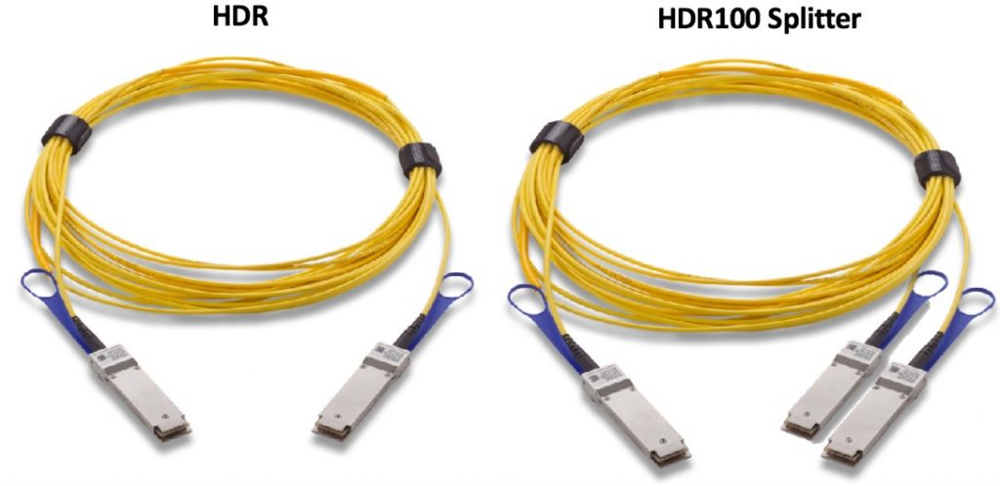
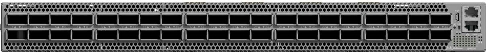
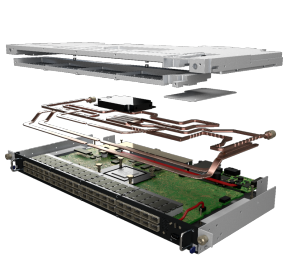

# Network

All of the compute and login nodes of Barbora are interconnected through a [Mellanox][c] [InfiniBand][a] HDR 200 Gbps network and a Gigabit [Ethernet][b] network.

Compute nodes and the service infrastructure is connected by the HDR100 technology that allows one 200Gbps HDR port (aggregation 4x 50Gbps) to be divided into two HDR100 ports with 100Gbps (2x 50Gbps) bandwidth.

The cabling between the L1 and L2 layer is realized by HDR cabling, connecting the end devices is realized by so called Y or splitter cable (1x HRD200 - 2x HDR100).

**The computing network thus implemented fulfills the following parameters**

* 100Gbps
* Latencies less than 10 microseconds (0.6 μs end-to-end, <90ns switch hop)
* Adaptive routing support
* MPI communication support
* IP protocol support (IPoIB)
* Support for SCRATCH Data Storage and NVMe over Fabric Data Storage.

## Mellanox QM8700 40-Ports Switch

**Performance**

* 40x HDR 200Gb/s ports in a 1U switch
* 80x HDR100 100Gb/s ports in a 1U switch
* 16Tb/s aggregate switch throughput
* Up to 15.8 billion messages-per-second
* 90ns switch latency

**Optimized Design**

* 1+1 redundant & hot-swappable power
* 80 gold+ and energy star certified power supplies
* Dual-core x86 CPU

**Advanced Design**

* Adaptive routing
* Collective offloads (Mellanox SHARP technology)
* VL mapping (VL2VL)

## BullSequana XH2000 HDRx WH40 MODULE

* Mellanox QM8700 switch modified for direct liquid cooling (Atos Cold Plate), with form factor for installing the Bull Sequana XH2000 rack

[a]: http://en.wikipedia.org/wiki/InfiniBand
[b]: http://en.wikipedia.org/wiki/Ethernet
[c]: http://www.mellanox.com/
