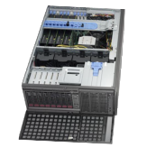

# Visualization Servers

Remote visualization with [VirtualGL][3] is available on two nodes.

* 2 nodes
* 32 cores in total
* 2x Intel Skylake Gold 6130 – 16core@2,1GHz processors per node
* 192 GB DDR4 2667MT/s of physical memory per node (12x 16 GB)
* BullSequana X450-E5 blade servers
* 2150.4 GFLOP/s per compute node
* 1x 1 GB Ethernet and 2x 10 GB Ethernet
* 1x HDR100 IB port
* 2x SSD 240 GB

## NVIDIA Quadro P6000

* GPU Memory: 24 GB GDDR5X
* Memory Interface: 384-bit
* Memory Bandwidth: Up to 432 GB/s
* NVIDIA CUDA® Cores: 3840
* System Interface: PCI Express 3.0 x16
* Max Power Consumption: 250 W
* Thermal Solution: Active
* Form Factor: 4.4”H x 10.5” L, Dual Slot, Full Height
* Display Connectors: 4x DP 1.4 + DVI-D DL
* Max Simultaneous Displays: 4 direct, 4 DP1.4 Multi-Stream
* Max DP 1.4 Resolution: 7680 x 4320 @ 30 Hz
* Max DVI-D DL Resolution: 2560 x 1600 @ 60 Hz
* Graphics APIs: Shader Model 5.1, OpenGL 4.5, DirectX 12.0, Vulkan 1.0,
* Compute APIs: CUDA, DirectCompute, OpenCL™
* Floating-Point Performance-Single Precision: 12.6 TFLOP/s, Peak

## Resource Allocation Policy

| queue | active project | project resources | nodes | min ncpus | priority | authorization | walltime |
|-------|----------------|-------------------|-------|-----------|----------|---------------|----------|
| qviz Visualization queue | yes | none required | 2 | 4 | 150 | no | 1h/8h |

## References

* [Graphical User Interface][1]
* [VPN Access][2]

[1]: ../general/shell-and-data-access.md#graphical-user-interface
[2]: ../general/shell-and-data-access.md#vpn-access
[3]: ../software/viz/vgl.md
