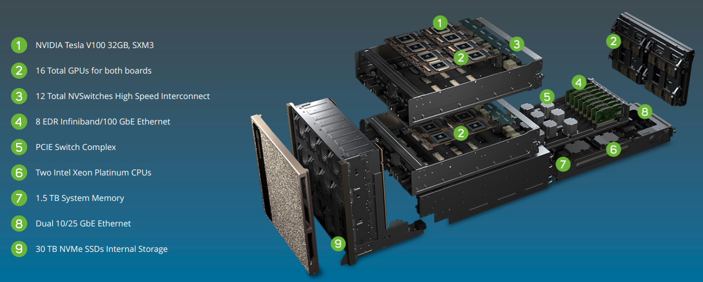
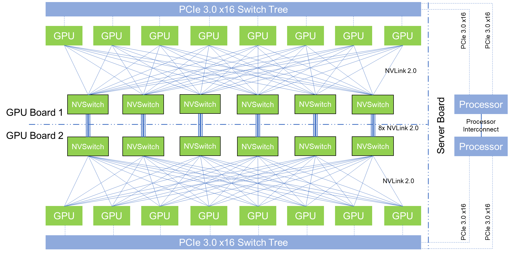

# NVIDIA DGX-2

The DGX-2 is a very powerful computational node, featuring high end x86_64 processors and 16 NVIDIA V100-SXM3 GPUs.

| NVIDIA DGX-2  | |
| --- | --- |
| CPUs | 2 x Intel Xeon Platinum |
| GPUs | 16 x NVIDIA Tesla V100 32GB HBM2 |
| System Memory | Up to 1.5 TB DDR4 |
| GPU Memory | 512 GB HBM2 (16 x 32 GB)	|
| Storage | 30 TB NVMe, Up to 60 TB |
| Networking | 8 x Infiniband or 8 x 100 GbE |
| Power | 10 kW	|
| Size | 350 lbs |
| GPU Throughput | Tensor: 1920 TFLOPs, FP16: 520 TFLOPs, FP32: 260 TFLOPs, FP64: 130 TFLOPs |

The [DGX-2][a] introduces NVIDIA’s new NVSwitch, enabling 300 GB/s chip-to-chip communication at 12 times the speed of PCIe.

With NVLink2, it enables 16x NVIDIA V100-SXM3 GPUs in a single system, for a total bandwidth going beyond 14 TB/s.
Featuring pair of Xeon 8168 CPUs, 1.5 TB of memory, and 30 TB of NVMe storage,
we get a system that consumes 10 kW, weighs 163.29 kg, but offers double precision performance in excess of 130TF.

The DGX-2 is designed to be a powerful server in its own right.
On the storage side, the DGX-2 comes with 30TB of NVMe-based solid state storage.
For clustering or further inter-system communications, it also offers InfiniBand and 100GigE connectivity, up to eight of them.

Further, the [DGX-2][b] offers  a total of ~2 PFLOPs of half precision performance in a single system, when using the tensor cores.

With DGX-2, AlexNET, the network that 'started' the latest machine learning revolution, now takes 18 minutes.

The DGX-2 is able to complete the training process
for FAIRSEQ – a neural network model for language translation – 10x faster than a DGX-1 system,
bringing it down to less than two days total rather than 15 days.

The new NVSwitches means that the PCIe lanes of the CPUs can be redirected elsewhere, most notably towards storage and networking connectivity.
The topology of the DGX-2 means that all 16 GPUs are able to pool their memory into a unified memory space,
though with the usual tradeoffs involved if going off-chip.

[a]: https://www.nvidia.com/content/dam/en-zz/es_em/Solutions/Data-Center/dgx-2/nvidia-dgx-2-datasheet.pdf
[b]: https://www.youtube.com/embed/OTOGw0BRqK0
