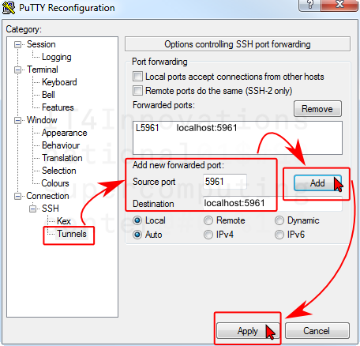
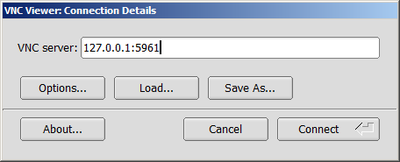
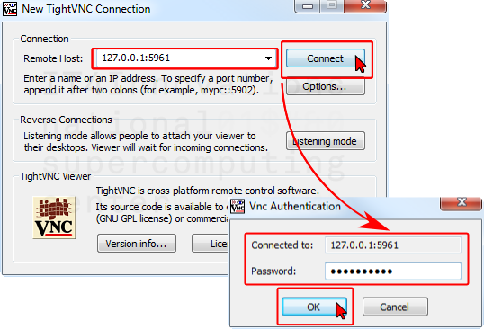
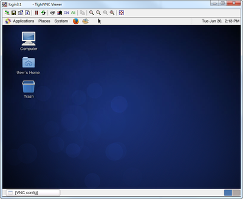
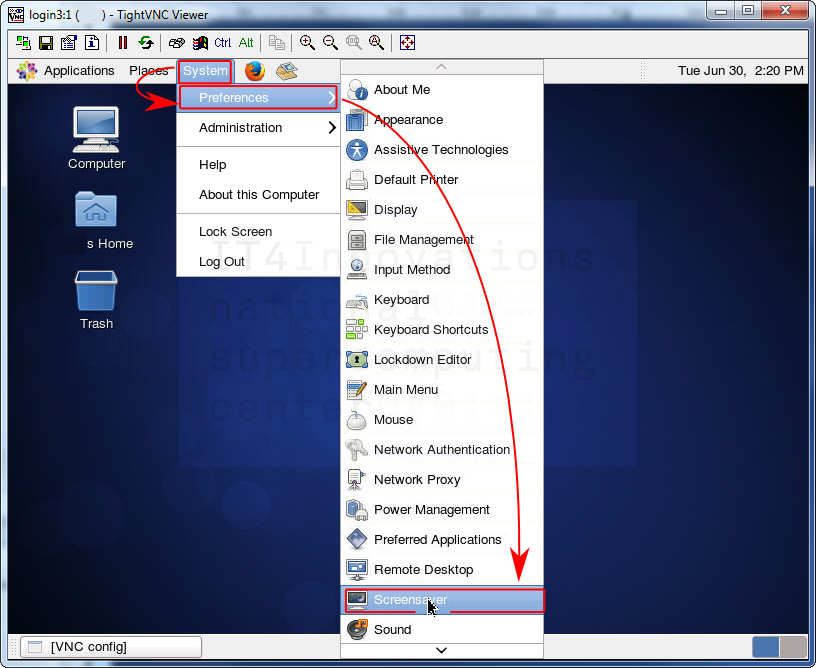
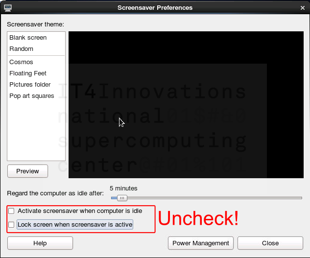
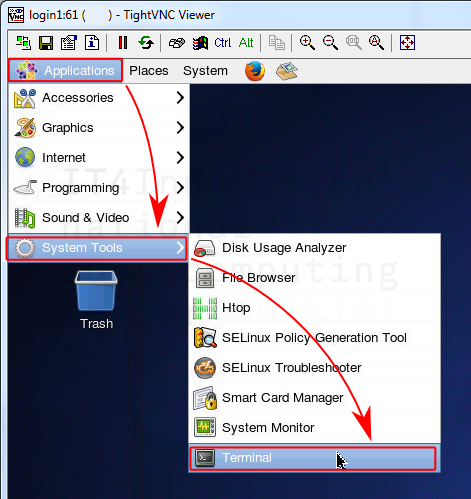
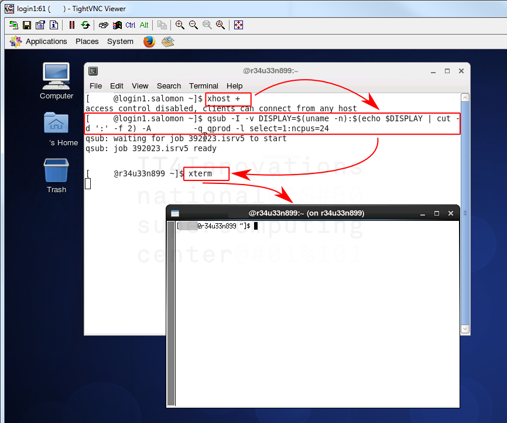

# VNC

Virtual Network Computing (VNC) is a graphical desktop-sharing system that uses the Remote Frame Buffer protocol (RFB) to remotely control another computer. It transmits the keyboard and mouse events from one computer to another, relaying the graphical screen updates back in the other direction, over a network.

VNC-based connections are usually faster (require less network bandwidth) than [X11][1] applications forwarded directly through SSH.

The recommended clients are [TightVNC][b] or [TigerVNC][c] (free, open source, available for almost any platform).

## Create VNC Server Password

!!! note
    VNC server password should be set before the first login. Use a strong password.

```console
$ vncpasswd
Password:
Verify:
```

## Start VNC Server

!!! note
    To access VNC, a remote VNC Server must be started first and a tunnel using SSH port forwarding must be established.

[See below][2] the details on SSH tunnels.

Start by **choosing your display number**.
To choose a free one, you should check currently occupied display numbers - list them using the command:

```console
$ ps aux | grep Xvnc | sed -rn 's/(\s) .*Xvnc (\:[0-9]+) .*/\1 \2/p'
username :79
username :60
.....
```

As you can see above, displays ":79" and ":60" are already occupied.
Generally, you can choose display number freely, *except these occupied numbers*.
Also remember that display number should be lower than or equal to 99.
Based on this requirement, we have chosen the display number 61, as seen in the examples below.

!!! note
    Your situation may be different so the choice of your number may differ, as well. **Choose and use your own display number accordingly!**

Start your remote VNC server on the chosen display number (61):

```console
$ vncserver :61 -geometry 1600x900 -depth 16

New 'login2:1 (username)' desktop is login2:1

Starting applications specified in /home/username/.vnc/xstartup
Log file is /home/username/.vnc/login2:1.log
```

Check whether the VNC server is running on the chosen display number (61):

```console
$ vncserver -list

TigerVNC server sessions:

X DISPLAY #     PROCESS ID
:61              18437
```

Another way to check it:

```console
$  ps aux | grep Xvnc | sed -rn 's/(\s) .*Xvnc (\:[0-9]+) .*/\1 \2/p'

username :61
username :102
```

!!! note
    The VNC server runs on port 59xx, where xx is the display number. To get your port number, simply add 5900 + display number, in our example 5900 + 61 = 5961. Another example for display number 102 is calculation of TCP port 5900 + 102 = 6002, but note that TCP ports above 6000 are often used by X11. **Calculate your own port number and use it instead of 5961 from examples below**.

To access the remote VNC server you have to create a tunnel between the login node using TCP port 5961 and your local  machine using a free TCP port (for simplicity the very same) in next step. See examples for [Linux/Mac OS][2] and [Windows][3].

!!! note
    The tunnel must point to the same login node where you launched the VNC server, e.g. login2. If you use just cluster-name.it4i.cz, the tunnel might point to a different node due to DNS round robin.

## Linux/Mac OS Example of Creating a Tunnel

On your local machine, create the tunnel:

```console
$ ssh -TN -f username@login2.cluster-name.it4i.cz -L 5961:localhost:5961
```

Issue the following command to check the tunnel is established (note the PID 2022 in the last column, it is required for closing the tunnel):

```console
$ netstat -natp | grep 5961
(Not all processes could be identified, non-owned process info
 will not be shown, you would have to be root to see it all.)
tcp        0      0 127.0.0.1:5961          0.0.0.0:*               LISTEN      2022/ssh
tcp6       0      0 ::1:5961                :::*                    LISTEN      2022/ssh
```

Or on Mac OS use this command:

```console
$ lsof -n -i4TCP:5961 | grep LISTEN
ssh 75890 sta545 7u IPv4 0xfb062b5c15a56a3b 0t0 TCP 127.0.0.1:5961 (LISTEN)
```

Connect with the VNC client:

```console
$ vncviewer 127.0.0.1:5961
```

In this example, we connect to remote VNC server on port 5961, via the SSH tunnel. The connection is encrypted and secured. The VNC server listening on port 5961 provides screen of 1600x900 pixels.

You have to close the SSH tunnel which is still running in the background after you finish the work. Use the following command (PID 2022 in this case, see the netstat command above):

```console
kill 2022
```

!!! note
    You can watch the instruction video on how to make a VNC connection between a local Ubuntu desktop and the IT4I cluster [here][e].

## Windows Example of Creating a Tunnel

Start the VNC server using the `vncserver` command described above.

Search for the localhost and port number (in this case 127.0.0.1:5961):

```console
$ netstat -tanp | grep Xvnc
(Not all processes could be identified, non-owned process info
 will not be shown, you would have to be root to see it all.)
tcp        0      0 127.0.0.1:5961              0.0.0.0:*                   LISTEN      24031/Xvnc
```

### PuTTY

On the PuTTY Configuration screen, go to _Connection -> SSH -> Tunnels_ to set up the tunnel.

Fill the _Source port_ and _Destination_ fields. **Do not forget to click the _Add_ button**.



### WSL (Bash on Windows)

[Windows Subsystem for Linux][d] is another way to run Linux software in a Windows environment.

At your machine, create the tunnel:

```console
$ ssh username@login2.cluster-name.it4i.cz -L 5961:localhost:5961
```

## Example of Starting VNC Client

Run the VNC client of your choice, select the VNC server 127.0.0.1, port 5961 and connect using the VNC password.

### TigerVNC Viewer



In this example, we connect to remote the VNC server on port 5961, via the SSH tunnel, using the TigerVNC viewer. The connection is encrypted and secured. The VNC server listening on port 5961 provides a screen of 1600x900 pixels.

### TightVNC Viewer

Use your VNC password to log using the TightVNC Viewer and start a Gnome Session on the login node.



## Gnome Session

After the successful login, you should see the following screen:



### Disable Your Gnome Session Screensaver

Open the Screensaver preferences dialog:



Uncheck both options below the slider:



### Kill Screensaver if Locked Screen

If the screen gets locked, you have to kill the screensaver. Do not forget to disable the screensaver then.

```console
$ ps aux | grep screen
username     1503 0.0 0.0 103244   892 pts/4    S+   14:37   0:00 grep screen
username     24316 0.0 0.0 270564 3528 ?        Ss   14:12   0:00 gnome-screensaver

[username@login2 .vnc]$ kill 24316
```

## Kill VNC Server After Finished Work

You should kill your VNC server using the command:

```console
$ vncserver -kill :61
Killing Xvnc process ID 7074
Xvnc process ID 7074 already killed
```

or:

```console
$ pkill vnc
```

!!! note
    Also, do not forget to terminate the SSH tunnel, if it was used. For details, see the end of [this section][2].

## GUI Applications on Compute Nodes Over VNC

The very same methods as described above may be used to run the GUI applications on compute nodes. However, for maximum performance, follow these steps:

Open a Terminal (_Applications -> System Tools -> Terminal_). Run all the following commands in the terminal.



Allow incoming X11 graphics from the compute nodes at the login node:

```console
$ xhost +
```

Get an interactive session on a compute node (for more detailed info [look here][4]). Use the `-v DISPLAY` option to propagate the DISPLAY on the compute node. In this example, we want a complete node (16 cores in this example) from the production queue:

```console
$ qsub -I -v DISPLAY=$(uname -n):$(echo $DISPLAY | cut -d ':' -f 2) -A PROJECT_ID -q qprod -l select=1:ncpus=16
```

Test that the DISPLAY redirection into your VNC session works, by running an X11 application (e.g. XTerm) on the assigned compute node:

```console
$ xterm
```

The example described above:



[b]: http://www.tightvnc.com
[c]: http://sourceforge.net/apps/mediawiki/tigervnc/index.php?title=Main_Page
[d]: http://docs.microsoft.com/en-us/windows/wsl
[e]: https://www.youtube.com/watch?v=b9Ez9UN2uL0

[1]: x-window-system.md
[2]: #linuxmac-os-example-of-creating-a-tunnel
[3]: #windows-example-of-creating-a-tunnel
[4]: ../../job-submission-and-execution.md
