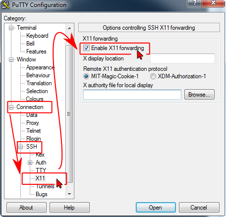

# X Window System

The X Window system is a principal way to get GUI access to the clusters. The **X Window System** (commonly known as **X11**, based on its current major version being 11, or shortened to simply **X**, and sometimes informally **X-Windows**) is a computer software system and network protocol that provides a basis for graphical user interfaces (GUIs) and rich input device capability for networked computers.

!!! tip
    The X display forwarding must be activated and the X server running on client side

## X Display

### Linux Example

In order to display the GUI of various software tools, you need to enable the X display forwarding. On Linux and Mac, log in using the `-X` option in the SSH client:

```console
 local $ ssh -X username@cluster-name.it4i.cz
```

### PuTTY on Windows

On Windows, use the PuTTY client to enable X11 forwarding. In PuTTY menu, go to _Connection > SSH > X11_ and check the _Enable X11 forwarding_ checkbox before logging in. Then log in as usual.



### WSL (Bash on Windows)

To run Linux GuI on WSL, download, for example, [VcXsrv][a].

1. After installation, run XLaunch and during the initial setup, check the `Disable access control`.

    !!! tip
        Save the configuration and launch VcXsrv using the `config.xlaunch` file, so you won't have to check the option on every run.

1. Allow VcXsrv in your firewall to communicate on private and public networks.

1. Set the `DISPLAY` environment variable, using the following command:

    ```console
        export DISPLAY="`grep nameserver /etc/resolv.conf | sed 's/nameserver //'`:0"
    ```

    !!! tip
        Include the command at the end of the `/etc/bash.bashrc`, so you don't have to run it every time you run WSL.

1. Test the configuration by running `echo $DISPLAY`:

    ```code
     user@nb-user:/$ echo $DISPLAY
     172.26.240.1:0
    ```

To enable the X display forwarding, log in using the `-X` option in the SSH client:

```console
 local $ ssh -X username@cluster-name.it4i.cz
```

!!! tip
    If you are getting the "cannot open display" error message, try to export the DISPLAY variable, before attempting to log in:

```console
 local $ export DISPLAY=localhost:0.0
```

## Verify the Forwarding

To verify the forwarding, type:

```console
$ echo $DISPLAY
```

if you receive something like:

```console
localhost:10.0
```

then the X11 forwarding is enabled.

## X Server

In order to display the GUI of various software tools, you need a running X server on your desktop computer. For Linux users, no action is required as the X server is the default GUI environment on most Linux distributions. Mac and Windows users need to install and run the X server on their workstations.

### X Server on OS X

Mac OS users need to install [XQuartz server][d].

### X Server on Windows

There is a variety of X servers available for the Windows environment. The commercial Xwin32 is very stable and feature-rich. The Cygwin environment provides fully featured open-source XWin X server. For simplicity, we recommend the open-source X server by the [Xming project][e]. For stability and full features, we recommend the [XWin][f] X server by Cygwin

| How to use Xwin | How to use Xming |
|--- | --- |
| [Install Cygwin][g]. Find and execute XWin.exe to start the X server on Windows desktop computer. | Use Xlaunch to configure Xming. Run Xming to start the X server on a Windows desktop computer. |

## Running GUI Enabled Applications

!!! note
    Make sure that X forwarding is activated and the X server is running.

Then launch the application as usual. Use the `&` to run the application in background:

```console
$ ml intel (idb and gvim not installed yet)
$ gvim &
```

```console
$ xterm
```

In this example, we activate the Intel programing environment tools and then start the graphical gvim editor.

## GUI Applications on Compute Nodes

Allocate the compute nodes using the `-X` option on the `qsub` command:

```console
$ qsub -q qexp -l select=2:ncpus=24 -X -I
```

In this example, we allocate 2 nodes via qexp queue, interactively. We request X11 forwarding with the `-X` option. It will be possible to run the GUI enabled applications directly on the first compute node.

For **better performance**, log on the allocated compute node via SSH, using the `-X` option.

```console
$ ssh -X r24u35n680
```

In this example, we log on the r24u35n680 compute node, with the X11 forwarding enabled.

## Gnome GUI Environment

The Gnome 2.28 GUI environment is available on the clusters. We recommend using a separate X server window for displaying the Gnome environment.

### Gnome on Linux and OS X

To run the remote Gnome session in a window on a Linux/OS X computer, you need to install Xephyr. Ubuntu package is
xserver-xephyr, on OS X it is part of [XQuartz][i]. First, launch Xephyr on local machine:

```console
local $ Xephyr -ac -screen 1024x768 -br -reset -terminate :1 &
```

This will open a new X window of size 1024x768 at DISPLAY :1. Next, connect via SSH to the cluster with the `DISPLAY` environment variable set and launch a gnome-session:

```console
local $ DISPLAY=:1.0 ssh -XC yourname@cluster-name.it4i.cz -i ~/.ssh/path_to_your_key
... cluster-name MOTD...
yourname@login1.cluster-namen.it4i.cz $ gnome-session &
```

On older systems where Xephyr is not available, you may also try Xnest instead of Xephyr. Another option is to launch a new X server in a separate console via:

```console
xinit /usr/bin/ssh -XT -i .ssh/path_to_your_key yourname@cluster-namen.it4i.cz gnome-session -- :1 vt12
```

However, this method does not seem to work with recent Linux distributions and you will need to manually source
/etc/profile to properly set environment variables for PBS.

### Gnome on Windows

Use XLaunch to start the Xming server or run the XWin.exe. Select the "One window" mode.

Log in to the cluster using [PuTTY][2] or [Bash on Windows][3]. On the cluster, run the gnome-session command.

```console
$ gnome-session &
```

This way, we run a remote gnome session on the cluster, displaying it in the local X server.

Use System-Log Out to close the gnome-session.

[1]: #if-no-able-to-forward-x11-using-putty-to-cygwinx
[2]: #putty-on-windows
[3]: #wsl-bash-on-windows

[a]: https://sourceforge.net/projects/vcxsrv/
[d]: https://www.xquartz.org
[e]: http://sourceforge.net/projects/xming/
[f]: http://x.cygwin.com/
[g]: http://x.cygwin.com/
[i]: http://xquartz.macosforge.org/landing/
