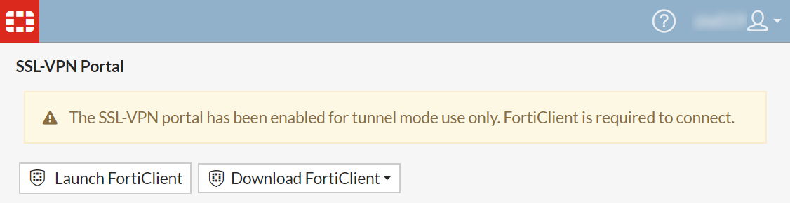
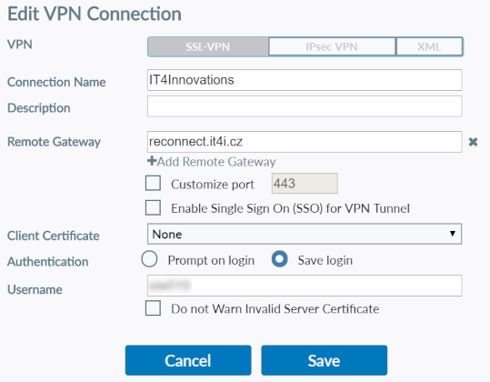
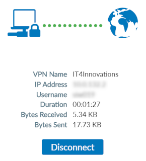

# VPN Access

## Accessing IT4Innovations Internal Resources via VPN

To access IT4Innovations' resources and licenses, it is necessary to connect to its local network via VPN. IT4Innovations uses the FortiClient VPN software. For the list of supported operating systems, see the [FortiClient Administration Guide][a].

## Windows/Mac VPN Client Installation

To install the VPN client from the web interface, log in to [reconnect.it4i.cz][b] with your [IT4I credentials][1].

Click the Download FortiClient button and select your OS.

!!! note
    Download just the FortiClient VPN, not the full FortiClient.

After successful installation, run FortiClient either directly, or by returning to the SSL-VPN Portal
and clicking the Launch FortiClient button.

## Working With Windows/Mac VPN Client

Before the first login, you must configure the VPN. In the New VPN Connection section, provide the name of your VPN connection and the following settings:

Name                | Value
:-------------------|:------------------
VPN                 | SSL-VPN
Remote Gateway      | reconnect.it4i.cz
Port                | 443
Client Certificate  | None

Optionally, you can describe the VPN connection and select Save Login under Authentication.

Save the settings, enter your login credentials and click Connect.

!!! note
    Make sure your username and password are correct. If you enter invalid credentials, FortiClient VPN returns a general warning (-14).

## Linux Client

You may use any open version of FortiClient VPN, although OpenFortiGUI seems to work the best. Connection will work with following settings:

Name         | Value
:------------|:----------------------
VPN-Server   | reconnect.it4i.cz
VPN-Port     | 443
Set-Routes   | Enabled
Set-DNS      | Enabled
DNS Servers  | 10.5.8.11, 10.5.8.22

Linux VPN clients need to run under root. OpenFortiGUI uses sudo by default, be sure, that your user is allowed to use sudo.

[1]: ../../general/obtaining-login-credentials/obtaining-login-credentials.md#login-credentials

[a]: http://docs.fortinet.com/document/forticlient/latest/administration-guide/646779/installation-requirements
[b]: https://reconnect.it4i.cz
