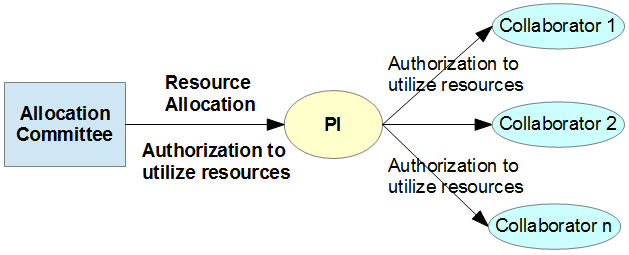

# Get Project

The computational resources of IT4I are allocated by the Allocation Committee via several [allocation mechanisms][a] to a project investigated by a Primary Investigator. By allocating the computational resources, the Allocation Committee is authorizing the PI to access and use the clusters. The PI may decide to authorize a number of their collaborators to access and use the clusters to consume the resources allocated to their Project. These collaborators will be associated to the Project. The Figure below is depicting the authorization chain:



**Allocation Mechanisms:**

* Academic researchers may apply via Open Access Competitions.
* Commercial and non-commercial institutions may also apply via the Directors Discretion.
* Foreign (mostly European) users can obtain computational resources via the [PRACE (DECI) program][d].

In all cases, IT4Innovations’ access mechanisms are aimed at distributing computational resources while taking into account the development and application of supercomputing methods and their benefits and usefulness for society. The applicants are expected to submit a proposal. In the proposal, the applicants **apply for a particular amount of core-hours** of computational resources. The requested core-hours should be substantiated by scientific excellence of the proposal, its computational maturity and expected impacts. The allocation decision is based on the scientific, technical, and economic evaluation of the proposal.

## Becoming Primary Investigator

Once you create an account, log in to the [IT4I Information System][e] and apply for a project.
You will be informed by IT4I about the Allocation Committee decision.
Once approved by the Allocation Committee, you become the Primary Investigator (PI) for the project
and are authorized to use the clusters and any allocated resources as well as authorize collaborators for your project.

## Authorize Collaborators for Your Project

As a PI, you can approve or deny users' requests to join your project. There are two methods of authorizing collaborators:

### Authorization by Web

This is a preferred method if you have an IT4I or e-INFRA CZ account.

Log in to the [IT4I SCS portal][e] using your credentials and go to the **Authorization Requests** section.
Here you can authorize collaborators for your project.

### Authorization by Email (An Alternative Approach)

In order to authorize a Collaborator to utilize the allocated resources, the PI should contact the [IT4I support][f] (email: [support\[at\]it4i.cz][g]) and provide the following information:

1. Identify their project by project ID.
1. Provide a list of people, including themself, who are authorized to use the resources allocated to the project. The list must include the full name, email and affiliation. If collaborators' login access already exists in the IT4I systems, provide their usernames as well.
1. Include "Authorization to IT4Innovations" into the subject line.

!!! warning
    Should the above information be provided by email, the email **must be** digitally signed. Read more on [digital signatures][2] below.

Example (except the subject line which must be in English, you may use Czech or Slovak language for communication with us):

```console
Subject: Authorization to IT4Innovations

Dear support,

Please include my collaborators to project OPEN-0-0.

John Smith, john.smith@myemail.com, Department of Chemistry, MIT, US
Jonas Johansson, jjohansson@otheremail.se, Department of Physics, RIT, Sweden
Luisa Fibonacci, lf@emailitalia.it, Department of Mathematics, National Research Council, Italy

Thank you,
PI
(Digitally signed)
```

!!! note
    Web-based email interfaces cannot be used for secure communication; external application, such as Thunderbird or Outlook must be used. This way, your new credentials will be visible only in applications that have access to your certificate.

[1]: obtaining-login-credentials/obtaining-login-credentials.md
[2]: https://docs.it4i.cz/general/obtaining-login-credentials/obtaining-login-credentials/#certificates-for-digital-signatures

[a]: https://www.it4i.cz/en/for-users/computing-resources-allocation
[b]: http://www.it4i.cz/open-access-competition/?lang=en&lang=en
[c]: http://www.it4i.cz/obtaining-computational-resources-through-directors-discretion/?lang=en&lang=en
[d]: https://prace-ri.eu/hpc-access/deci-access/deci-access-information-for-applicants/
[e]: https://scs.it4i.cz
[f]: https://support.it4i.cz/rt/
[g]: mailto:support@it4i.cz
