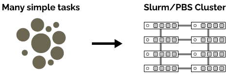
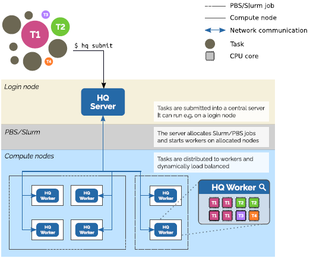

# Capacity Computing

## Introduction

In many cases, it is useful to submit a huge (>100) number of computational jobs into the PBS queue system. A huge number of (small) jobs is one of the most effective ways to execute embarrassingly parallel calculations, achieving the best runtime, throughput, and computer utilization.

However, executing a huge number of jobs via the PBS queue may strain the system. This strain may result in slow response to commands, inefficient scheduling, and overall degradation of performance and user experience for all users. For this reason, the number of jobs is **limited to 100 jobs per user, 4,000 jobs and subjobs per user, 1,500 subjobs per job array**.

!!! note
    Follow one of the procedures below, in case you wish to schedule more than 100 jobs at a time.

* Use [Job arrays][1] when running a huge number of multithread (bound to one node only) or multinode (multithread across several nodes) jobs.
* Use [HyperQueue][3] when running a huge number of multithread jobs. HyperQueue can help overcome the limits of job arrays.

## Policy

1. A user is allowed to submit at most 100 jobs. Each job may be [a job array][1].
1. The array size is at most 1,000 subjobs.

## Job Arrays

!!! note
    A huge number of jobs may easily be submitted and managed as a job array.

A job array is a compact representation of many jobs called subjobs. Subjobs share the same job script, and have the same values for all attributes and resources, with the following exceptions:

* each subjob has a unique index, $PBS_ARRAY_INDEX
* job Identifiers of subjobs only differ by their indices
* the state of subjobs can differ (R, Q, etc.)

All subjobs within a job array have the same scheduling priority and schedule as independent jobs. An entire job array is submitted through a single `qsub` command and may be managed by `qdel`, `qalter`, `qhold`, `qrls`, and `qsig` commands as a single job.

### Shared Jobscript

All subjobs in a job array use the very same single jobscript. Each subjob runs its own instance of the jobscript. The instances execute different work controlled by the `$PBS_ARRAY_INDEX` variable.

Example:

Assume we have 900 input files with the name of each beginning with "file" (e.g. file001, ..., file900). Assume we would like to use each of these input files with myprog.x program executable, each as a separate job.

First, we create a tasklist file (or subjobs list), listing all tasks (subjobs) - all input files in our example:

```console
$ find . -name 'file*' > tasklist
```

Then we create a jobscript:

#### Salomon

```bash
#!/bin/bash
#PBS -A PROJECT_ID
#PBS -q qprod
#PBS -l select=1:ncpus=24,walltime=02:00:00

# change to scratch directory
SCR=/scratch/work/user/$USER/$PBS_JOBID
mkdir -p $SCR ; cd $SCR || exit

# get individual tasks from tasklist with index from PBS JOB ARRAY
TASK=$(sed -n "${PBS_ARRAY_INDEX}p" $PBS_O_WORKDIR/tasklist)

# copy input file and executable to scratch
cp $PBS_O_WORKDIR/$TASK input ; cp $PBS_O_WORKDIR/myprog.x .

# execute the calculation
./myprog.x < input > output

# copy output file to submit directory
cp output $PBS_O_WORKDIR/$TASK.out
```

In this example, the submit directory contains the 900 input files, the myprog.x executable, and the jobscript file. As an input for each run, we take the filename of the input file from the created tasklist file. We copy the input file to the local scratch memory `/lscratch/$PBS_JOBID`, execute the myprog.x and copy the output file back to the submit directory, under the `$TASK.out` name. The myprog.x executable runs on one node only and must use threads to run in parallel. Be aware, that if the myprog.x **is not multithreaded**, then all the **jobs are run as single-thread programs in a sequential manner**. Due to the allocation of the whole node, the accounted time is equal to the usage of the whole node, while using only 1/16 of the node.

If running a huge number of parallel multicore (in means of multinode multithread, e.g. MPI enabled) jobs is needed, then a job array approach should be used. The main difference, as compared to the previous examples using one node, is that the local scratch memory should not be used (as it is not shared between nodes) and MPI or other techniques for parallel multinode processing has to be used properly.

### Submit the Job Array

To submit the job array, use the `qsub -J` command. The 900 jobs of the [example above][5] may be submitted like this:

#### Salomon

```console
$ qsub -N JOBNAME -J 1-900 jobscript
506493[].isrv5
```

In this example, we submit a job array of 900 subjobs. Each subjob will run on one full node and is assumed to take less than 2 hours (note the #PBS directives in the beginning of the jobscript file, do not forget to set your valid PROJECT_ID and desired queue).

Sometimes for testing purposes, you may need to submit a one-element only array. This is not allowed by PBSPro, but there is a workaround:

```console
$ qsub -N JOBNAME -J 9-10:2 jobscript
```

This will only choose the lower index (9 in this example) for submitting/running your job.

### Manage the Job Array

Check status of the job array using the `qstat` command.

```console
$ qstat -a 12345[].dm2

dm2:
                                                            Req'd Req'd   Elap
Job ID          Username Queue    Jobname    SessID NDS TSK Memory Time S Time
--------------- -------- --  |---|---| ------ --- --- ------ ----- - -----
12345[].dm2     user2    qprod    xx          13516   1 16    --  00:50 B 00:02
```

When the status is B, it means that some subjobs are already running.
Check the status of the first 100 subjobs using the `qstat` command.

```console
$ qstat -a 12345[1-100].dm2

dm2:
                                                            Req'd Req'd   Elap
Job ID          Username Queue    Jobname    SessID NDS TSK Memory Time S Time
--------------- -------- --  |---|---| ------ --- --- ------ ----- - -----
12345[1].dm2    user2    qprod    xx          13516   1 16    --  00:50 R 00:02
12345[2].dm2    user2    qprod    xx          13516   1 16    --  00:50 R 00:02
12345[3].dm2    user2    qprod    xx          13516   1 16    --  00:50 R 00:01
12345[4].dm2    user2    qprod    xx          13516   1 16    --  00:50 Q   --
     .             .        .      .             .    .   .     .    .   .    .
     ,             .        .      .             .    .   .     .    .   .    .
12345[100].dm2 user2    qprod    xx          13516   1 16    --  00:50 Q   --
```

Delete the entire job array. Running subjobs will be killed, queueing subjobs will be deleted.

```console
$ qdel 12345[].dm2
```

Deleting large job arrays may take a while.
Display status information for all user's jobs, job arrays, and subjobs.

```console
$ qstat -u $USER -t
```

Display status information for all user's subjobs.

```console
$ qstat -u $USER -tJ
```

For more information on job arrays, see the [PBSPro Users guide][6].

### Examples

Download the examples in [capacity.zip][9], illustrating the above listed ways to run a huge number of jobs. We recommend trying out the examples before using this for running production jobs.

Unzip the archive in an empty directory on cluster and follow the instructions in the README file-

```console
$ unzip capacity.zip
$ cat README
```

## HyperQueue

HyperQueue lets you build a computation plan consisting of a large amount of tasks and then execute it transparently over a system like SLURM/PBS.
It dynamically groups tasks into PBS jobs and distributes them to fully utilize allocated nodes.
You thus do not have to manually aggregate your tasks into PBS jobs. See the [project repository][a].



### Features

* **Transparent task execution on top of a Slurm/PBS cluster**

    Automatic task distribution amongst jobs, nodes, and cores

* **Dynamic load balancing across jobs**

    Work-stealing scheduler<br>NUMA-aware, core planning, task priorities, task arrays<br> Nodes and tasks may be added/removed on the fly

* **Scalable**

    Low overhead per task (~100μs)<br>Handles hundreds of nodes and millions of tasks<br>Output streaming avoids creating many files on network filesystems

* **Easy deployment**

    Single binary, no installation, depends only on *libc*<br>No elevated privileges required

### Installation

* On Barbora and Karolina, you can simply load the HyperQueue module:

`$ ml HyperQueue`

* If you want to install/compile HyperQueue manually, follow the steps on the [official webpage][b].

### Usage

#### Starting the Server

To use HyperQueue, you first have to start the HyperQueue server. It is a long-lived process that
is supposed to be running on a login node. You can start it with the following command:

`$ hq server start`

#### Submitting Computation

Once the HyperQueue server is running, you can submit jobs into it. Here are a few examples of job submissions.
You can find more information in the [documentation][2].

* Submit a simple job (command `echo 'Hello world'` in this case)

    `$ hq submit echo 'Hello world'`

* Submit a job with 10000 tasks

    `$ hq submit --array 1-10000 my-script.sh`

Once you start some jobs, you can observe their status using the following commands:

```
# Display status of a single job
$ hq job <job-id>

# Display status of all jobs
$ hq jobs
```

!!! important
    Before the jobs can start executing, you have to provide HyperQueue with some computational resources.

#### Providing Computational Resources

Before HyperQueue can execute your jobs, it needs to have access to some computational resources.
You can provide these by starting HyperQueue *workers* which connect to the server and execute your jobs.
The workers should run on computing nodes, so you can start them using PBS.

* Start a worker on a single PBS node:

    ``$ qsub <qsub-params> -- `which hq` worker start``

* Start a worker on all allocated PBS nodes:

    ``$ qsub <qsub-params> -- `which pbsdsh` `which hq` worker start``

In an upcoming version, HyperQueue will be able to automatically submit PBS jobs with workers
on your behalf.

!!! tip
    For debugging purposes, you can also start the worker, e.g. on a login using simply by running
    `$ hq worker start`. Do not use such worker for any long-running computations.

### Architecture

Here you can see the architecture of HyperQueue.
The user submits jobs into the server which schedules them onto a set of workers running on compute nodes.



[1]: #job-arrays
[2]: https://it4innovations.github.io/hyperqueue/jobs/
[3]: #hyperqueue
[5]: #shared-jobscript
[6]: ../pbspro.md
[9]: capacity.zip

[a]: https://github.com/It4innovations/hyperqueue
[b]: https://it4innovations.github.io/hyperqueue/install/
