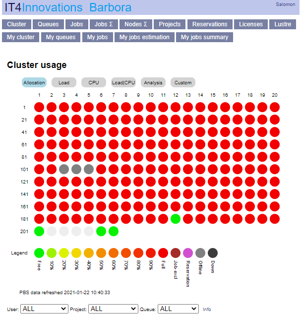

# Resources Allocation Policy

## Job Queue Policies

Resources are allocated to jobs in a fair-share fashion, subject to constraints set by the queue and the resources available to the project. The fair-share system ensures that individual users may consume approximately equal amounts of resources per week. Detailed information can be found in the [Job scheduling][1] section. Resources are accessible via several queues for queueing the jobs. The queues provide prioritized and exclusive access to the computational resources. The following table provides the queue partitioning overview:

!!! hint
    The qexp queue is configured to run one job and accept five jobs in a queue per user.

!!! note
    **The qfree queue is not free of charge**. [Normal accounting][2] applies. However, it allows for utilization of free resources, once a project has exhausted all its allocated computational resources. This does not apply to Director's Discretion projects (DD projects) by default. Usage of qfree after exhaustion of DD projects' computational resources is allowed after request for this queue.

!!! note
    **The qexp queue is equipped with nodes that do not have exactly the same CPU clock speed.** Should you need the nodes to have exactly the same CPU speed, you have to select the proper nodes during the PSB job submission.

### Karolina

| queue     | active project | project resources    | nodes                                                         | min ncpus | priority | authorization | walltime  |
| --------- | -------------- | -------------------- | ------------------------------------------------------------- | --------- | -------- | ------------- | --------- |
| **qexp**  | no             | none required        | 756 nodes, max 2 nodes per user                               | 128       | 150      | no            | 1 / 1h    |
| **qprod** | yes            | > 0                  | 756 nodes                                                     | 128       | 0        | no            | 24 / 48h  |
| **qlong** | yes            | > 0                  | 200 nodes, max 20 nodes per job, only non-accelerated nodes allowed | 128 | 0        | no            | 72 / 144h |
| **qnvidia** | yes          | > 0                  | 72 nodes                                                      | 128       | 0        | yes           | 24 / 48h  |
| **qfat**  | yes            | > 0                  | 1 (sdf1)                                                      | 24        | 200      | yes           | 24 / 48h  |
| **qfree** | yes            | < 120% of allocation | 756 nodes, max 8 nodes per job                                | 128       | -1024    | no            | 12 / 12h  |
| **qviz**  | yes            | none required        | 2 nodes (with NVIDIA® Quadro RTX™ 6000)                       | 8         | 150      | no            | 1 / 8h    |

* **qexp**, Express queue: This queue is dedicated for testing and running very small jobs. It is not required to specify a project to enter the qexp. There are 2 nodes always reserved for this queue (w/o accelerators), a maximum 8 nodes are available via the qexp for a particular user. The nodes may be allocated on a per core basis. No special authorization is required to use the queue. Maximum runtime is 1 hour.
* **qprod**, Production queue: This queue is intended for normal production runs. It is required that active project with nonzero remaining resources is specified to enter the qprod. All nodes may be accessed via the qprod queue. Full nodes, 128 cores per node are allocated. The queue runs with medium priority and no special authorization is required to use it. Maximum runtime is 48 hours.
* **qlong**, Long queue: This queue is intended for long production runs. It is required that active project with nonzero remaining resources is specified to enter the qlong. Only 200 nodes without acceleration may be accessed via the qlong queue. Full nodes, 128 cores per node are allocated. The queue runs with medium priority and no special authorization is required to use it. Maximum runtime is 144 hours (3 \* qprod time)
* **qnvidia** Dedicated queue: This queue is dedicated to accessing the NVIDIA accelerated nodes. It is required that an active project with nonzero remaining resources is specified to enter this queue. It utilizes 8x NVIDIA A100 with 320GB HBM2 memory per node. Full nodes, 128 cores per node, are allocated. The queue runs with a very high priority. The PI needs to explicitly ask support for authorization to enter the queue for all users associated with their project.
* **qfat**, HPE Superdome Flex queue. This queue is dedicated to access the fat HPE Superdome Flex machine. The machine (sdf1) has 768 Intel® Xeon® Platinum cores at 2.9GHz and 24TB RAM. The PI needs to explicitly ask support for authorization to enter the queue for all users associated to their Project.
* **qfree**, Free resource queue: The queue qfree is intended for utilization of free resources, after a Project exhausted all its allocated computational resources. (Does not apply to DD projects by default. DD projects have to request for permission on qfree after exhaustion of computational resources.) It is required that an active project is specified to enter the queue. Consumed resources will be accounted to the Project. Access to the qfree queue is automatically removed if consumed resources exceed 120% of the resources allocated to the Project. Only 756 nodes without accelerator may be accessed from this queue. Full nodes, 128 cores per node are allocated. The queue runs with very low priority and no special authorization is required to use it. The maximum runtime in qfree is 12 hours.
* **qviz**, Visualization queue: Intended for pre-/post-processing using OpenGL accelerated graphics. Currently when accessing the node, each user gets 8 cores of a CPU allocated, thus approximately 64 GB of RAM and 1/8 of the GPU capacity (default "chunk"). If more GPU power or RAM is required, it is recommended to allocate more chunks (with 8 cores each) up to one whole node per user, so that all 64 cores, 256 GB RAM and a whole GPU is exclusive. This is currently also the maximum allowed allocation per one user. One hour of work is allocated by default, the user may ask for 2 hours maximum.

### Barbora

| queue   | active project | project resources    | nodes                     | min ncpus | priority | authorization | walltime |
| ------- | -------------- | -------------------- | ------------------------- | --------- | -------- | ------------- | -------- |
| qexp    | no             | none required        | 189 nodes                 | 36        | 150      | no            | 1 h      |
| qprod   | yes            | > 0                  | 187 nodes w/o accelerator | 36        | 0        | no            | 24/48 h  |
| qlong   | yes            | > 0                  | 20 nodes w/o accelerator  | 36        | 0        | no            | 72/144 h |
| qnvidia | yes            | > 0                  | 8 NVIDIA nodes            | 24        | 200      | yes           | 24/48 h  |
| qfat    | yes            | > 0                  | 1 fat node                | 8         | 200      | yes           | 24/144 h |
| qfree   | yes            | < 120% of allocation | 189 w/o accelerator       | 36        | -1024    | no            | 12 h     |

* **qexp**, Express queue: This queue is dedicated for testing and running very small jobs. It is not required to specify a project to enter the qexp. There are 2 nodes always reserved for this queue (w/o accelerators), a maximum 8 nodes are available via the qexp for a particular user. The nodes may be allocated on a per core basis. No special authorization is required to use the queue. The maximum runtime in qexp is 1 hour.
* **qprod**, Production queue: This queue is intended for normal production runs. It is required that an active project with nonzero remaining resources is specified to enter the qprod. All nodes may be accessed via the qprod queue, except the reserved ones. 187 nodes without accelerators are included. Full nodes, 36 cores per node, are allocated. The queue runs with medium priority and no special authorization is required to use it. The maximum runtime in qprod is 48 hours.
* **qlong**, Long queue: This queue is intended for long production runs. It is required that an active project with nonzero remaining resources is specified to enter the qlong. Only 20 nodes without acceleration may be accessed via the qlong queue. Full nodes, 36 cores per node, are allocated. The queue runs with medium priority and no special authorization is required to use it. The maximum runtime in qlong is 144 hours (three times that of the standard qprod time - 3 x 48 h).
* **qnvidia**, **qfat**, Dedicated queues: The queue qnvidia is dedicated to accessing the Nvidia accelerated nodes and qfat the Fat nodes. It is required that an active project with nonzero remaining resources is specified to enter these queues. Included are 8 NVIDIA (4 NVIDIA cards per node) and 1 fat nodes. Full nodes, 24 cores per node, are allocated. The queues run with very high priority. The PI needs to explicitly ask [support][a] for authorization to enter the dedicated queues for all users associated with their project.
* **qfree**, Free resource queue: The queue qfree is intended for utilization of free resources, after a project has exhausted all of its allocated computational resources (Does not apply to DD projects by default; DD projects have to request permission to use qfree after exhaustion of computational resources). It is required that an active project is specified to enter the queue. Consumed resources will be accounted to the Project. Access to the qfree queue is automatically removed if consumed resources exceed 120% of the resources allocated to the Project. Only 189 nodes without accelerators may be accessed from this queue. Full nodes, 16 cores per node, are allocated. The queue runs with very low priority and no special authorization is required to use it. The maximum runtime in qfree is 12 hours.

## Queue Notes

The job wall clock time defaults to **half the maximum time**, see the table above. Longer wall time limits can be [set manually, see examples][3].

Jobs that exceed the reserved wall clock time (Req'd Time) get killed automatically. The wall clock time limit can be changed for queuing jobs (state Q) using the `qalter` command, however it cannot be changed for a running job (state R).

You can check the current queue configuration on rsweb: [Barbora][b].

## Queue Status

!!! tip
    Check the status of jobs, queues and compute nodes [here][c].



Display the queue status:

```console
$ qstat -q
```

The PBS allocation overview may also be obtained using the `rspbs` command:

```console
$ rspbs
Usage: rspbs [options]

Options:
  --version             show program's version number and exit
  -h, --help            show this help message and exit
  --get-server-details  Print server
  --get-queues          Print queues
  --get-queues-details  Print queues details
  --get-reservations    Print reservations
  --get-reservations-details
                        Print reservations details
  --get-nodes           Print nodes of PBS complex
  --get-nodeset         Print nodeset of PBS complex
  --get-nodes-details   Print nodes details
  --get-vnodes          Print vnodes of PBS complex
  --get-vnodeset        Print vnodes nodeset of PBS complex
  --get-vnodes-details  Print vnodes details
  --get-jobs            Print jobs
  --get-jobs-details    Print jobs details
  --get-job-nodes       Print job nodes
  --get-job-nodeset     Print job nodeset
  --get-job-vnodes      Print job vnodes
  --get-job-vnodeset    Print job vnodes nodeset
  --get-jobs-check-params
                        Print jobid, job state, session_id, user, nodes
  --get-users           Print users of jobs
  --get-allocated-nodes
                        Print nodes allocated by jobs
  --get-allocated-nodeset
                        Print nodeset allocated by jobs
  --get-allocated-vnodes
                        Print vnodes allocated by jobs
  --get-allocated-vnodeset
                        Print vnodes nodeset allocated by jobs
  --get-node-users      Print node users
  --get-node-jobs       Print node jobs
  --get-node-ncpus      Print number of cpus per node
  --get-node-naccelerators
                        Print number of accelerators per node
  --get-node-allocated-ncpus
                        Print number of allocated cpus per node
  --get-node-allocated-naccelerators
                        Print number of allocated accelerators per node
  --get-node-qlist      Print node qlist
  --get-node-ibswitch   Print node ibswitch
  --get-vnode-users     Print vnode users
  --get-vnode-jobs      Print vnode jobs
  --get-vnode-ncpus     Print number of cpus per vnode
  --get-vnode-naccelerators
                        Print number of naccelerators per vnode
  --get-vnode-allocated-ncpus
                        Print number of allocated cpus per vnode
  --get-vnode-allocated-naccelerators
                        Print number of allocated accelerators per vnode
  --get-vnode-qlist     Print vnode qlist
  --get-vnode-ibswitch  Print vnode ibswitch
  --get-user-nodes      Print user nodes
  --get-user-nodeset    Print user nodeset
  --get-user-vnodes     Print user vnodes
  --get-user-vnodeset   Print user vnodes nodeset
  --get-user-jobs       Print user jobs
  --get-user-job-count  Print number of jobs per user
  --get-user-node-count
                        Print number of allocated nodes per user
  --get-user-vnode-count
                        Print number of allocated vnodes per user
  --get-user-ncpus      Print number of allocated ncpus per user
  --get-qlist-nodes     Print qlist nodes
  --get-qlist-nodeset   Print qlist nodeset
  --get-qlist-vnodes    Print qlist vnodes
  --get-qlist-vnodeset  Print qlist vnodes nodeset
  --get-ibswitch-nodes  Print ibswitch nodes
  --get-ibswitch-nodeset
                        Print ibswitch nodeset
  --get-ibswitch-vnodes
                        Print ibswitch vnodes
  --get-ibswitch-vnodeset
                        Print ibswitch vnodes nodeset
  --last-job            Print expected time of last running job
  --summary             Print summary
  --get-node-ncpu-chart
                        Obsolete. Print chart of allocated ncpus per node
  --server=SERVER       Use given PBS server
  --state=STATE         Only for given job state
  --jobid=JOBID         Only for given job ID
  --user=USER           Only for given user
  --node=NODE           Only for given node
  --vnode=VNODE         Only for given vnode
  --nodestate=NODESTATE
                        Only for given node state (affects only --get-node*
                        --get-vnode* --get-qlist-* --get-ibswitch-* actions)
  --incl-finished       Include finished jobs
  --walltime-exceeded-used-walltime
                        Job walltime exceeded - resources_used.walltime
  --walltime-exceeded-real-runtime
                        Job walltime exceeded - real runtime
  --backend-sqlite      Use SQLite backend - experimental
```

---8<--- "resource_accounting.md"

---8<--- "mathjax.md"

[1]: job-priority.md
[2]: #resource-accounting-policy
[3]: job-submission-and-execution.md

[a]: https://support.it4i.cz/rt/
[b]: https://extranet.it4i.cz/rsweb/barbora/queues
[c]: https://extranet.it4i.cz/rsweb
[d]: https://extranet.it4i.cz/rsweb
