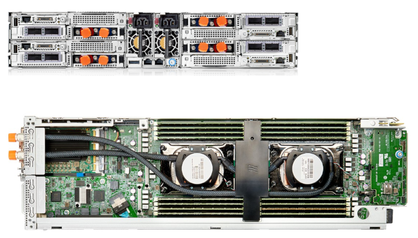
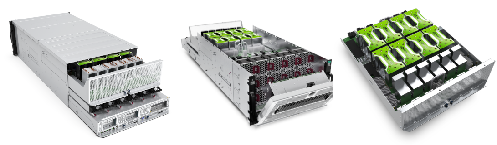
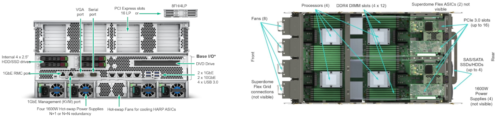

# Compute Nodes

Karolina is a cluster of x86-64 AMD- and Intel-based nodes built with the HPE technology. The cluster contains four types of compute nodes.

## Compute Nodes Without Accelerators

Standard compute nodes without accelerators (such as GPUs or FPGAs) are based on the x86 CPU architecture and provide quick accessibility for the users and their existing codes.

* 720 nodes
* 92,160 cores in total
* 2x AMD EPYC™ 7H12, 64-core, 2.6 GHz processors per node
* 256 GB DDR4 3200MT/s of physical memory per node
* 5,324.8 GFLOP/s per compute node
* 1x 100 Gb/s Ethernet
* 1x 100 Gb/s IB port
* Cn[001-720]

## Compute Nodes With a GPU Accelerator

Accelerated compute nodes deliver most of the compute power usable for HPC as well as excellent performance in HPDA and AI workloads, especially in the learning phase of Deep Neural Networks.

* 72 nodes
* 9,216 cores in total
* 2x AMD EPYC™ 7763, 64-core, 2.45 GHz processors per node
* 1024 GB DDR4 3200MT/s of physical memory per node
* 8x GPU accelerator NVIDIA A100 per node
* 5,017.6 GFLOP/s per compute node
* 4x 200 Gb/s Ethernet
* 4x 200 Gb/s IB port
* Acn[01-72]

## Data Analytics Compute Node

Data analytics compute node is oriented on supporting huge memory jobs by implementing a NUMA SMP system with large cache coherent memory.

* 1x HPE Superdome Flex server
* 768 cores in total
* 32x Intel® Xeon® Platinum, 24-core, 2.9 GHz, 205W
* 24 TB DDR4 2993MT/s of physical memory per node
* 2x 200 Gb/s Ethernet
* 2x 200 Gb/s IB port
* 71.2704 TFLOP/s
* DAcn1

## Cloud Compute Node

Cloud compute nodes support both the research and operation of the Infrastructure/HPC as a Service. It is intended for provision and operation of cloud technologies like OpenStack and Kubernetes.

* 36 nodes
* 4,608 cores in total
* 2x AMD EPYC™ 7H12, 64-core, 2.6 GHz processors per node
* 256 GB DDR4 3200MT/s of physical memory per node
* HPE ProLiant XL225n Gen10 Plus servers
* 5,324.8 GFLOP/s per compute node
* 1x 100 Gb/s Ethernet
* 1x 100 Gb/s IB port
* CLn[01-36]

## Compute Node Summary

| Node type                    | Count | Range       | Memory  | Cores          | Queues (?)                  |
| ---------------------------- | ----- | ----------- | ------  | -----------    | -------------------------- |
| Nodes without an accelerator | 720   | Cn[001-720]  | 256 GB  | 128 @ 2.6 GHz  | qexp, qprod, qlong, qfree  |
| Nodes with a GPU accelerator | 72    | Acn[01-72]   | 1024 GB  | 64 @ 2.45 GHz  | qnvidia                    |
| Data analytics nodes         | 1     | DAcn1        | 24 TB   | 768 @ 2.9 GHz  | qfat                       |
| Cloud partiton               | 36    | CLn[01-36]   | 256 GB  | 128 @ 2.6 GHz  |                            |

## Processor Architecture

Karolina is equipped with AMD EPYC™ 7H12 (nodes without accelerators, Cloud partiton), AMD EPYC™ 7763 (nodes with accelerators), and Intel Cascade Lake Xeon-SC 8268 (Data analytics partition).

### AMD [Epyc™ 7H12][d]

EPYC™ 7H12 is a 64-bit 64-core x86 server microprocessor designed and introduced by AMD in late 2019. This multi-chip processor, which is based on the Zen 2 microarchitecture, incorporates logic fabricated TSMC 7 nm process and I/O fabricated on GlobalFoundries 14 nm process. The 7H12 has a TDP of 280 W with a base frequency of 2.6 GHz and a boost frequency of up to 3.3 GHz. This processor supports up to two-way SMP and up to 4 TiB of eight channels DDR4-3200 memory per socket.

* **Family**: EPYC™
* **Cores**: 64
* **Threads**: 128
* **L1I Cache**: 2 MiB, 64x32 KiB, 8-way set associative
* **L1D Cache**: 2 MiB, 64x32 KiB, 8-way set associative
* **L2 Cache**: 32 MiB, 64x512 KiB, 8-way set associative, write-back
* **L3 Cache**: 256 MiB, 16x16 MiB
* **Instructions**(?): x86-64, MOVBE, MMX, SSE, SSE2, SSE3, SSSE3, SSE4.1, SSE4.2, POPCNT, AVX, AVX2, AES, PCLMUL, FSGSBASE, RDRND, FMA3, F16C, BMI, BMI2, VT-x, VT-d, TXT, TSX, RDSEED, ADCX, PREFETCHW, CLFLUSHOPT, XSAVE, SGX, MPX, AVX-512 (New instructions for [Vector Neural Network Instructions][c])
* **Frequency**: 2.6 GHz
* **Max turbo**: 3.3 GHz
* **Process**: 7 nm, 14 nm
* **TDP**: 280 W

### AMD [Epyc™ 7763][e]

EPYC 7763 is a 64-bit 64-core x86 server microprocessor designed and introduced by AMD in March 2021. This multi-chip processor, which is based on the Zen 3 microarchitecture, incorporates eight Core Complex Dies fabricated on a TSMC advanced 7 nm process and a large I/O die manufactured by GlobalFoundries. The 7763 has a TDP of 280 W with a base frequency of 2.45 GHz and a boost frequency of up to 3.5 GHz. This processor supports up to two-way SMP and up to 4 TiB of eight channel DDR4-3200 memory per socket.

* **Family**: EPYC™
* **Cores**: 64
* **Threads**: 128
* **L1I Cache**: 2 MiB, 64x32 KiB, 8-way set associative, write-back
* **L1D Cache**: 2 MiB,	64x32 KiB, 8-way set associative, write-back
* **L2 Cache**: 32 MiB, 64x512 KiB, 8-way set associative, write-back
* **L3 Cache**: 256 MiB, 8x32 MiB, 16-way set associative, write-back
* **Instructions**: x86-16, x86-32, x86-64, MMX, EMMX, SSE, SSE2, SSE3, SSSE3, SSE4.1, SSE4.2, SSE4a, AVX, AVX2, AES, CLMUL, RdRanD, FMA3, F16C, ABM, BMI1, BMI2, AMD-Vi, AMD-V, SHA, ADX, Real, Protected, SMM, FPU, NX, SMT, SME, TSME, SEV, SenseMI
* **Frequency**: 2.45 GHz
* **Max turbo**: 3.5 GHz
* **Process**: 7 nm
* **TDP**: 280 W

### Intel [Skylake Platinum 8268][f]

Xeon Platinum 8268 is a 64-bit 24-core x86 high-performance server microprocessor introduced by Intel in early 2019. The Platinum 8268 is based on the Cascade Lake microarchitecture and is manufactured on a 14 nm process. This chip supports 8-way multiprocessing, sports 2 AVX-512 FMA units as well as three Ultra Path Interconnect links. This microprocessor supports up 1 TiB of hexa-channel DDR4-2933 memory, operates at 2.9 GHz with a TDP of 205 W and features a turbo boost frequency of up to 3.9 GHz.

* **Family**: Xeon Platinum
* **Cores**: 24
* **Threads**: 48
* **L1I Cache**: 768 KiB, 24x32 KiB, 8-way set associative
* **L1D Cache**: 768 KiB, 24x32 KiB, 8-way set associative, write-back
* **L2 Cache**: 24 MiB, 24x1 MiB, 16-way set associative, write-back
* **L3 Cache**: 35.75 MiB, 26x1.375 MiB, 11-way set associative, write-back
* **Instructions**: x86-64, MOVBE, MMX, SSE, SSE2, SSE3, SSSE3, SSE4.1, SSE4.2, POPCNT, AVX, AVX2, AES, PCLMUL, FSGSBASE, RDRND, FMA3, F16C, BMI, BMI2, VT-x, VT-d, TXT, TSX, RDSEED, ADCX, PREFETCHW, CLFLUSHOPT, XSAVE, SGX, MPX, AVX-512
* **Frequency**: 2.9 GHz
* **Max turbo**: 3.9 GHz
* **Process**: 14 nm
* **TDP**: 205 W

## GPU Accelerator

Karolina is equipped with an [NVIDIA A100][g] accelerator.

|NVIDIA A100||
| --- | --- |
| GPU Architecture | NVIDIA Ampere |
| NVIDIA Tensor| Cores: 432 |
| NVIDIA CUDA® Cores | 6912 |
| Double-Precision Performance | 9.7 TFLOP/s |
| Single-Precision Performance | 19.5 TFLOP/s |
| Tensor Performance | 312 TFLOP/s |
| GPU Memory | 40 GB HBM2 |
| Memory Bandwidth | 1555 GB/sec |
| ECC | Yes |
| Interconnect Bandwidth | 600 GB/sec |
| System Interface | NVIDIA NVLink |
| Form Factor | SXM4 | (sxm 8?)
| Max Power Consumption | 400 W |
| Thermal Solution | Passive |
| Compute APIs | CUDA, DirectCompute,OpenCLTM, OpenACC | (?)

[c]: https://en.wikichip.org/wiki/x86/avx512vnni
[d]: https://en.wikichip.org/wiki/amd/epyc/7h12
[e]: https://en.wikichip.org/wiki/amd/epyc/7763
[f]: https://en.wikichip.org/wiki/intel/xeon_platinum/8268
[g]: https://www.nvidia.com/content/dam/en-zz/Solutions/Data-Center/a100/pdf/a100-80gb-datasheet-update-nvidia-us-1521051-r2-web.pdf
