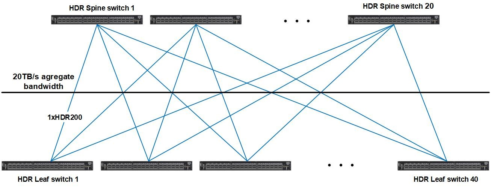

# Network

All of the compute and login nodes of Karolina are interconnected through a [Mellanox][c] [InfiniBand][a] HDR 200 Gbps network and a Gigabit Ethernet network.

The Compute network is configured as a non-blocking Fat Tree which consists of 60 x 40-ports Mellanox Quantum™ HDR switches (40 Leaf HDR switches and 20 Spine HDR switches).

Compute nodes and the service infrastructure is connected by the HDR100 technology that allows one 200Gbps HDR port (aggregation 4x 50Gbps) divided into 2 HDR100 ports with 100Gbps (2x 50Gbps) bandwidth. The cabling between the L1 and L2 layer is realized by HDR cabling, connecting the end devices is realized by so called Y or splitter cable (1x HDR200 - 2x HDR100).

**The compute network has the following parameters**

* 100Gbps
* Latencies less than 10 microseconds (0.6 μs end-to-end, <90ns switch hop)
* Adaptive routing support
* MPI communication support
* IP protocol support (IPoIB)
* Support for SCRATCH Data Storage and NVMe over Fabric Data Storage.

## Mellanox Quantum™ QM8790 40-Ports Switch

Mellanox provides the world’s smartest switch, enabling in-network computing through the Co-Design Scalable Hierarchical Aggregation and Reduction Protocol (SHARP)™ technology.
QM8790 has the highest fabric performance available in the market with up to 16Tb/s of non-blocking bandwidth with sub-130ns port-to-port latency

**Performance**

* 40 x HDR200 200Gb/s ports in a 1U switch
* 80 x HDR100 100Gb/s ports (using splitter cables)
* 16Tb/s aggregate switch throughput
* Sub-130ns switch latency – Optimized design

**Optimized Design**

* 1+1 redundant & hot-swappable power
* N+1 redundant & hot-swappable fans
* 80 gold+ and energy star certified power supplies

**Advanced Design**

* Adaptive routing
* Congestion control
* Collective offloads (Mellanox SHARP™ technology)
* VL mapping (VL2VL)

[a]: http://en.wikipedia.org/wiki/InfiniBand
[c]: http://www.mellanox.com/
