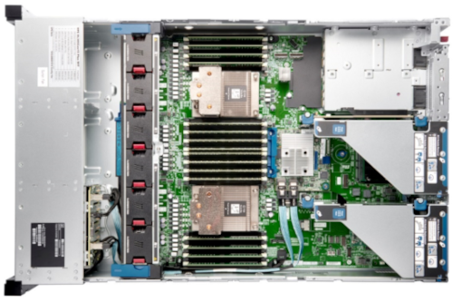
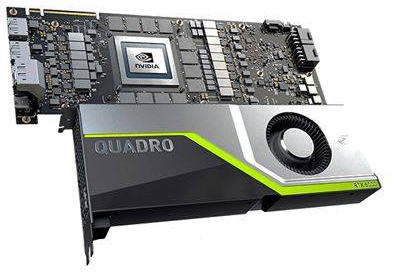

# Visualization Servers

Karolina includes two nodes for remote visualization with [VirtualGL 2][3] and TurboVNC 2.

* 64 cores in total
* 2x AMD EPYC™ 7452 32-core, 2.35 GHz processors per node
* 256GiB DDR4 RAM, 3200MT/s, ECC of physical memory per node (12x 16 GB)
* HPE ProLiant DL385 Gen10 Plus servers
* 2406.4 GFLOP/s per compute node
* NVIDIA Quadro RTX 6000 card with OpenGL support
* 2x 100 GB Ethernet and 1x 1 GB Ethernet
* 1x HDR100 IB port
* 2x SSD 480 GB in RAID1

## NVIDIA® Quadro RTX™ 6000

* GPU Memory: 24 GB GDDR6
* Memory Interface: 384-bit
* Memory Bandwidth: Up to 672 GB/s
* NVIDIA® CUDA® Cores: 4,608
* NVIDIA® Tensor Cores: 576
* NVIDIA® RT Cores: 72
* System Interface: PCI Express 3.0 x16
* Max Power Consumption: 295 W
* Thermal Solution: Active
* Form Factor: 111 mm W x 267 mm L, Dual Slot, Full Height
* Display Connectors: 4x DP 1.4 + DVI-D DL
* Graphics APIs: Shader Model 5.1, OpenGL 4.6, DirectX 12.0, Vulkan 1.1,
* Compute APIs: CUDA, DirectCompute, OpenCL™
* Floating-Point Performance-Single Precision: 16.3 TFLOP/s, Peak
* Tensor Performance: 130.5 TFLOP/s

## Resource Allocation Policy ??

| queue | active project | project resources | nodes | min ncpus | priority | authorization | walltime |
|-------|----------------|-------------------|-------|-----------|----------|---------------|----------|
| qviz Visualization queue | yes | none required | - | - | 150 | no | 1h/8h |

## References

* [Graphical User Interface][1]
* [VPN Access][2]

[1]: ../general/shell-and-data-access.md#graphical-user-interface
[2]: ../general/shell-and-data-access.md#vpn-access
[3]: ../software/viz/vgl.md
