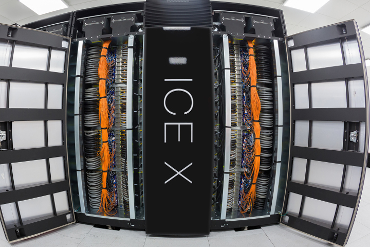
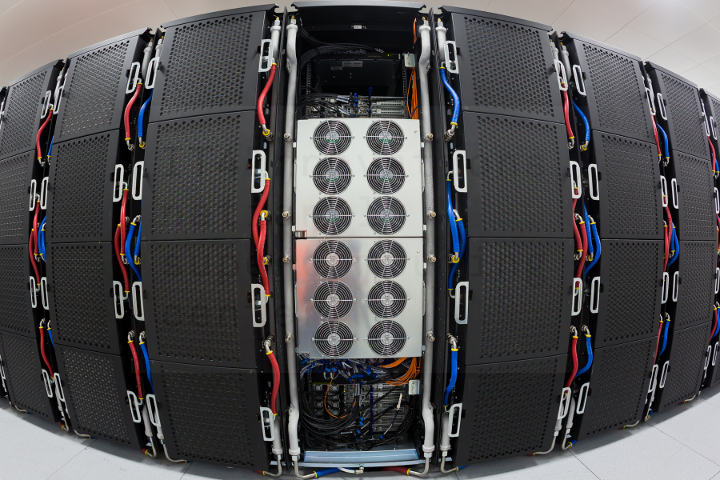
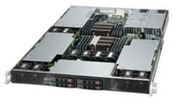
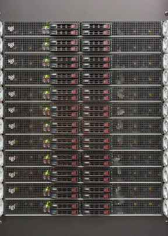

# Compute Nodes

## Nodes Configuration

Salomon is cluster of x86-64 Intel-based nodes. The cluster contains two types of compute nodes of the same processor type and memory size.
Compute nodes with MIC accelerator **contain two Intel Xeon Phi 7120P accelerators.**

[More about][1] schematic representation of the Salomon cluster compute nodes IB topology.

### Compute Nodes Without Accelerator

* codename "grafton"
* 576 nodes
* 13 824 cores in total
* two Intel Xeon E5-2680v3, 12-core, 2.5 GHz processors per node
* 128 GB of physical memory per node

### Compute Nodes With MIC Accelerator

* codename "perrin"
* 432 nodes
* 10 368 cores in total
* two Intel Xeon E5-2680v3, 12-core, 2.5 GHz processors per node
* 128 GB of physical memory per node
* MIC accelerator 2 x Intel Xeon Phi 7120P per node, 61-cores, 16 GB per accelerator

### Uv 2000

* codename "UV2000"
* 1 node
* 112 cores in total
* 14 x Intel Xeon E5-4627v2, 8-core, 3.3 GHz processors, in 14 NUMA nodes
* 3328 GB of physical memory per node
* 1 x NVIDIA GM200 (GeForce GTX TITAN X), 12 GB RAM

### Compute Nodes Summary

| Node type                  | Count | Memory            | Cores                               |
| -------------------------- | ----- | ----------------- | ----------------------------------- |
| Nodes without accelerator  | 576   | 128 GB            | 24 @ 2.5GHz                         |
| Nodes with MIC accelerator | 432   | 128 GB, MIC 32GB  | 24 @ 2.5GHz, MIC 61 @ 1.238 GHz     |
| UV2000 SMP node            | 1     | 3328GB            | 112 @ 3.3GHz                        |

## Processor Architecture

Salomon is equipped with Intel Xeon processors Intel Xeon E5-2680v3. Processors support Advanced Vector Extensions 2.0 (AVX2) 256-bit instruction set.

### Intel Xeon E5-2680v3 Processor

* 12-core
* speed: 2.5 GHz, up to 3.3 GHz using Turbo Boost Technology
* peak performance:  40 GFLOP/s per core @ 2.5 GHz
* caches:
  * Intel® Smart Cache:  30 MB
* memory bandwidth at the level of the processor: 68 GB/s

### MIC Accelerator Intel Xeon Phi 7120P Processor

* 61-core
* speed:  1.238
    GHz, up to 1.333 GHz using Turbo Boost Technology
* peak performance:  18.4 GFLOP/s per core
* caches:
  * L2:  30.5 MB
* memory bandwidth at the level of the processor:  352 GB/s

## Memory Architecture

Memory is equally distributed across all CPUs and cores for optimal performance. Memory is composed of memory modules of the same size and evenly distributed across all memory controllers and memory channels.

### Compute Node Without Accelerator

* 2 sockets
* Memory Controllers are integrated into processors.
  * 8 DDR4 DIMMs per node
  * 4 DDR4 DIMMs per CPU
  * 1 DDR4 DIMMs per channel
* Populated memory: 8 x 16 GB DDR4 DIMM >2133 MHz

### Compute Node With MIC Accelerator

2 sockets
Memory Controllers are integrated into processors.

* 8 DDR4 DIMMs per node
* 4 DDR4 DIMMs per CPU
* 1 DDR4 DIMMs per channel

Populated memory: 8 x 16 GB DDR4 DIMM 2133 MHz
MIC Accelerator Intel Xeon Phi 7120P Processor

* 2 sockets
* Memory Controllers are connected via an
    Interprocessor Network (IPN) ring.
  * 16 GDDR5 DIMMs per node
  * 8 GDDR5 DIMMs per CPU
  * 2 GDDR5 DIMMs per channel

[1]: ib-single-plane-topology.md
