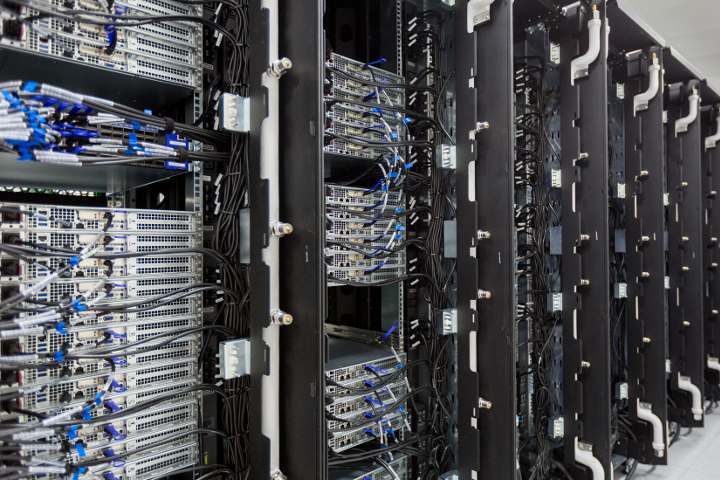
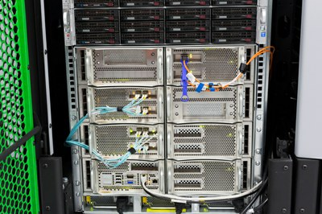

# Hardware Overview

## Introduction

The Salomon cluster consists of 1008 computational nodes of which 576 are regular compute nodes and 432 accelerated nodes. Each node is a powerful x86-64 computer equipped with 24 cores (two twelve-core Intel Xeon processors) and 128 GB RAM. The nodes are interlinked by high speed InfiniBand and Ethernet networks. All nodes share 0.5 PB /home NFS disk storage to store the user files. Users may use a DDN Lustre shared storage with capacity of 1.69 PB which is available for the scratch project data. User access to the Salomon cluster is provided by four login nodes.

[More about][1] schematic representation of the Salomon cluster compute nodes IB topology.

The parameters are summarized in the following tables:

## General Information

| **In general**                              |                                             |
| ------------------------------------------- | ------------------------------------------- |
| Primary purpose                             | High Performance Computing                  |
| Architecture of compute nodes               | x86-64                                      |
| Operating system                            | CentOS 7.x Linux                            |
| [**Compute nodes**][2]                      |                                             |
| Totally                                     | 1008                                        |
| Processor                                   | 2 x Intel Xeon E5-2680v3, 2.5 GHz, 12 cores |
| RAM                                         | 128GB, 5.3 GB per core, DDR4@2133 MHz       |
| Local disk drive                            | no                                          |
| Compute network / Topology                  | InfiniBand FDR56 / 7D Enhanced hypercube    |
| w/o accelerator                             | 576                                         |
| MIC accelerated                             | 432                                         |
| **In total**                                |                                             |
| Total theoretical peak performance  (Rpeak) | 2011 TFLOP/s                                |
| Total amount of RAM                         | 129.024 TB                                  |

## Compute Nodes

| Node            | Count | Processor                         | Cores | Memory | Accelerator                                   |
| --------------- | ----- | --------------------------------- | ----- | ------ | --------------------------------------------- |
| w/o accelerator | 576   | 2 x Intel Xeon E5-2680v3, 2.5 GHz | 24    | 128 GB | -                                             |
| MIC accelerated | 432   | 2 x Intel Xeon E5-2680v3, 2.5 GHz | 24    | 128 GB | 2 x Intel Xeon Phi 7120P, 61 cores, 16 GB RAM |

For more details, refer to the [Compute nodes][2] section.

## Remote Visualization Nodes

For remote visualization, two nodes with NICE DCV software are available each configured:

| Node          | Count | Processor                         | Cores | Memory | GPU Accelerator               |
| ------------- | ----- | --------------------------------- | ----- | ------ | ----------------------------- |
| visualization | 2     | 2 x Intel Xeon E5-2695v3, 2.3 GHz | 28    | 512 GB | NVIDIA QUADRO K5000, 4 GB RAM |

## SGI Uv 2000

For large memory computations, a special SMP/NUMA SGI UV 2000 server is available:

| Node   | Count | Processor                                   | Cores | Memory                | Extra HW                                                                 |
| ------ | ----- | ------------------------------------------- | ----- | --------------------- | ------------------------------------------------------------------------ |
| UV2000 | 1     | 14 x Intel Xeon E5-4627v2, 3.3 GHz, 8 cores | 112   | 3328 GB DDR3@1866 MHz | 2 x 400GB local SSD, 1x NVIDIA GM200 (GeForce GTX TITAN X), 12 GB RAM |

[1]: ib-single-plane-topology.md
[2]: compute-nodes.md
