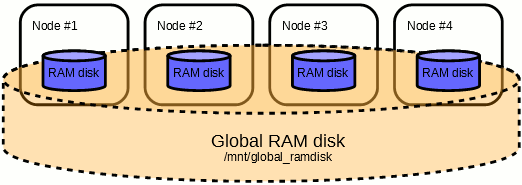

# Storage

## Introduction

There are two main shared file systems on Salomon cluster: [HOME][1] and [SCRATCH][2].

All login and compute nodes may access same data on shared file systems. Compute nodes are also equipped with local (non-shared) scratch, ramdisk, and tmp file systems.

## Policy (In a Nutshell)

!!! note

    * Use [HOME][1] for your most valuable data and programs.
    * Use [WORK][3] for your large project files.
    * Use [TEMP][4] for large scratch data.

!!! warning
    Do not use for [archiving][5]!

## Archiving

Do not use shared file systems as a backup for large amount of data or long-term archiving mean. The academic staff and students of research institutions in the Czech Republic can use [CESNET storage service][6], which is available via SSHFS.

## Shared File Systems

Salomon computer provides two main shared file systems, the [HOME file system][7] and the [SCRATCH file system][8]. The SCRATCH file system is partitioned to [WORK and TEMP workspaces][9]. The HOME file system is realized as a tiered NFS disk storage. The SCRATCH file system is realized as a parallel Lustre file system. Both shared file systems are accessible via the Infiniband network. Extended ACLs are provided on both HOME/SCRATCH file systems for sharing data with other users using fine-grained control.

### HOME File System

The HOME file system is realized as a Tiered file system, exported via NFS. The first tier has the capacity of 100 TB, second tier has the capacity of 400 TB. The file system is available on all login and computational nodes. The Home file system hosts the [HOME workspace][1].

### SCRATCH File System

The architecture of Lustre on Salomon is composed of two metadata servers (MDS) and six data/object storage servers (OSS). Accessible capacity is 1.69 PB, shared among all users. The SCRATCH file system hosts the [WORK and TEMP workspaces][9].

Configuration of the SCRATCH Lustre storage

* SCRATCH Lustre object storage
  * Disk array SFA12KX
  * 540 x 4 TB SAS 7.2krpm disk
  * 54 x OST of 10 disks in RAID6 (8+2)
  * 15 x hot-spare disk
  * 4 x 400 GB SSD cache
* SCRATCH Lustre metadata storage
  * Disk array EF3015
  * 12 x 600 GB SAS 15 krpm disk

### Understanding the Lustre File Systems

A user file on the Lustre file system can be divided into multiple chunks (stripes) and stored across a subset of the object storage targets (OSTs) (disks). The stripes are distributed among the OSTs in a round-robin fashion to ensure load balancing.

When a client (a compute node from your job) needs to create or access a file, the client queries the metadata server (MDS) and the metadata target (MDT) for the layout and location of the file's stripes. Once the file is opened and the client obtains the striping information, the MDS is no longer involved in the file I/O process. The client interacts directly with the object storage servers (OSSes) and OSTs to perform I/O operations such as locking, disk allocation, storage, and retrieval.

If multiple clients try to read and write the same part of a file at the same time, the Lustre distributed lock manager enforces coherency so that all clients see consistent results.

## Disk Usage and Quota Commands

Disk usage and user quotas can be checked and reviewed using the following command:

```console
$ it4i-disk-usage
```

Example for Salomon:

```console
$ it4i-disk-usage -h
# Using human-readable format
# Using power of 1000 for space
# Using power of 1000 for entries

Filesystem:    /home
Space used:    110GB
Space limit:   250GB
Entries:       40K
Entries limit: 500K
# based on filesystem quota

Filesystem:    /scratch
Space used:    377GB
Space limit:   100TB
Entries:       14K
Entries limit: 10M
# based on Lustre quota

Filesystem:    /scratch
Space used:    377GB
Entries:       14K
# based on Robinhood

Filesystem:    /scratch/work
Space used:    377GB
Entries:       14K
Entries:       40K
Entries limit: 1.0M
# based on Robinhood

Filesystem:    /scratch/temp
Space used:    12K
Entries:       6
# based on Robinhood
```

In this example, we view current size limits and space occupied on the /home and /scratch filesystem, for a particular user executing the command.
Note that limits are imposed also on number of objects (files, directories, links, etc.) that the user is allowed to create.

To have a better understanding of where the space is exactly used, use the following command:

```console
$ du -hs dir
```

Example for your HOME directory:

```console
$ cd /home
$ du -hs * .[a-zA-z0-9]* | grep -E "[0-9]*G|[0-9]*M" | sort -hr
258M     cuda-samples
15M      .cache
13M      .mozilla
5,5M     .eclipse
2,7M     .idb_13.0_linux_intel64_app
```

This will list all directories with megabytes or gigabytes of consumed space in your actual (in this example HOME) directory. List is sorted in descending order from largest to smallest files/directories.

To have a better understanding of the previous commands, read the man pages:

```console
$ man lfs
```

```console
$ man du
```

## Extended Access Control List (ACL)

Extended ACLs provide another security mechanism beside the standard POSIX ACLs which are defined by three entries (for owner/group/others). Extended ACLs have more than the three basic entries. In addition, they also contain a mask entry and may contain any number of named user and named group entries.

ACLs on a Lustre file system work exactly like ACLs on any Linux file system. They are manipulated with the standard tools in the standard manner. Below, we create a directory and allow a specific user access.

```console
[vop999@login1.salomon ~]$ umask 027
[vop999@login1.salomon ~]$ mkdir test
[vop999@login1.salomon ~]$ ls -ld test
drwxr-x--- 2 vop999 vop999 4096 Nov 5 14:17 test
[vop999@login1.salomon ~]$ getfacl test
# file: test
# owner: vop999
# group: vop999
user::rwx
group::r-x
other::---

[vop999@login1.salomon ~]$ setfacl -m user:johnsm:rwx test
[vop999@login1.salomon ~]$ ls -ld test
drwxrwx---+ 2 vop999 vop999 4096 Nov 5 14:17 test
[vop999@login1.salomon ~]$ getfacl test
# file: test
# owner: vop999
# group: vop999
user::rwx
user:johnsm:rwx
group::r-x
mask::rwx
other::---
```

Default ACL mechanism can be used to replace setuid/setgid permissions on directories. Setting a default ACL on a directory (-d flag to setfacl) will cause the ACL permissions to be inherited by any newly created file or subdirectory within the directory. Refer to this page for more information on Linux ACL at [Red Hat guide][c].

## Shared Workspaces

### Home

Users home directories /home/username reside on HOME file system. Accessible capacity is 0.5 PB, shared among all users. Individual users are restricted by file system usage quotas, set to 250 GB per user. If 250 GB should prove as insufficient for particular user, contact [support][d], the quota may be lifted upon request.

!!! note
    The HOME file system is intended for preparation, evaluation, processing and storage of data generated by active Projects.

The HOME should not be used to archive data of past Projects or other unrelated data.

The files on HOME will not be deleted until end of the [user's lifecycle][10].

The workspace is backed up, such that it can be restored in case of catastrophic failure resulting in significant data loss. This backup however is not intended to restore old versions of user data or to restore (accidentally) deleted files.

| HOME workspace    |                |
| ----------------- | -------------- |
| Accesspoint       | /home/username |
| Capacity          | 500TB          |
| Throughput        | 6GB/s          |
| User space quota  | 250GB          |
| User inodes quota | 500K           |
| Protocol          | NFS, 2-Tier    |

### Scratch

The SCRATCH is realized as Lustre parallel file system and is available from all login and computational nodes. There are 54 OSTs dedicated for the SCRATCH file system.

Accessible capacity is 1.6PB, shared among all users on TEMP and WORK. Individual users are restricted by file system usage quotas, set to 10M inodes and 100 TB per user. The purpose of this quota is to prevent runaway programs from filling the entire file system and deny service to other users. Should 100TB of space or 10M inodes prove insufficient, contact [support][d], the quota may be lifted upon request.

#### Work

The WORK workspace resides on SCRATCH file system. Users may create subdirectories and files in the **/scratch/work/project/projectid** directory. The directory is accessible to all users involved in the `projectid` project.

!!! note
    The WORK workspace is intended to store users project data as well as for high performance access to input and output files. All project data should be removed once the project is finished. The data on the WORK workspace are not backed up.

    Files on the WORK file system are **persistent** (not automatically deleted) throughout duration of the project.

#### Temp

The TEMP workspace resides on SCRATCH file system. The TEMP workspace accesspoint is  /scratch/temp.  Users may freely create subdirectories and files on the workspace. Accessible capacity is 1.6 PB, shared among all users on TEMP and WORK.

!!! note
    The TEMP workspace is intended for temporary scratch data generated during the calculation as well as for high performance access to input and output files. All I/O intensive jobs must use the TEMP workspace as their working directory.

    Users are advised to save the necessary data from the TEMP workspace to HOME or WORK after the calculations and clean up the scratch files.

!!! warning
    Files on the TEMP file system that are **not accessed for more than 90 days** will be automatically **deleted**.

<table>
  <tr>
    <td style="background-color: rgba(0, 0, 0, 0.54); color: white;"></td>
    <td style="background-color: rgba(0, 0, 0, 0.54); color: white;">WORK workspace</td>
    <td style="background-color: rgba(0, 0, 0, 0.54); color: white;">TEMP workspace</td>
  </tr>
  <tr>
    <td style="vertical-align : middle">Accesspoints</td>
    <td>/scratch/work/user/projectid</td>
    <td>/scratch/temp</td>
  </tr>
  <tr>
    <td>Capacity</td>
    <td colspan="2" style="vertical-align : middle;text-align:center;">1.6PB</td>
  </tr>
  <tr>
    <td>Throughput</td>
    <td colspan="2" style="vertical-align : middle;text-align:center;">30GB/s</td>
  </tr>
  <tr>
    <td>User space quota</td>
    <td colspan="2" style="vertical-align : middle;text-align:center;">100TB</td>
  </tr>
  <tr>
    <td>User inodes quota</td>
    <td colspan="2" style="vertical-align : middle;text-align:center;">10M</td>
  </tr>
  <tr>
    <td>Number of OSTs</td>
    <td colspan="2" style="vertical-align : middle;text-align:center;">54</td>
  </tr>
  <tr>
    <td>Protocol</td>
    <td colspan="2" style="vertical-align : middle;text-align:center;">Lustre</td>
  </tr>
</table>

## RAM Disk

### Local RAM Disk

Every computational node is equipped with file system realized in memory, so called RAM disk.

The local RAM disk is mounted as /ramdisk and is accessible to user at /ramdisk/$PBS_JOBID directory.

The RAM disk is private to a job and local to node, created when the job starts and deleted at the job end.

!!! note
    The local RAM disk directory /ramdisk/$PBS_JOBID will be deleted immediately after the calculation end. Users should take care to save the output data from within the jobscript.

The local RAM disk file system is intended for  temporary scratch data generated during the calculation as well as
for high-performance access to input and output files. Size of RAM disk file system is limited.
It is not recommended to allocate large amount of memory and use large amount of data in RAM disk file system at the same time.

!!! warning
     Be very careful, use of RAM disk file system is at the expense of operational memory.

| Local RAM disk    |                                                                                                   |
| ----------- | ------------------------------------------------------------------------------------------------------- |
| Mountpoint  | /ramdisk                                                                                                |
| Accesspoint | /ramdisk/$PBS_JOBID                                                                                     |
| Capacity    | 110GB                                                                                                   |
| Throughput  | over 1.5GB/s write, over 5GB/s read, single thread, over 10GB/s write, over 50GB/s read, 16 threads     |
| User quota  | none                                                                                                    |

### Global RAM Disk

The Global RAM disk spans the local RAM disks of all the nodes within a single job.



The Global RAM disk deploys
BeeGFS On Demand parallel filesystem, using local RAM disks as a storage backend.

The Global RAM disk is mounted at /mnt/global_ramdisk.

!!! note
    The global RAM disk is on-demand. It has to be activated by **global_ramdisk=true** in the qsub command.

```console
$ qsub -q qprod -l select=4,global_ramdisk=true ./jobscript
```

This command would submit 4 node job in qprod queue, once running a 440GB RAM disk shared across the 4 nodes will be created.
The RAM disk will be accessible at /mnt/global_ramdisk, files written to this RAM disk will be visible on all 4 nodes.

The file system is private to a job and shared among the nodes, created when the job starts and deleted at the job end.

!!! note
    The Global RAM disk will be deleted immediately after the calculation end. Users should take care to save the output data from within the jobscript.

The files on the Global RAM disk will be equally striped across all the nodes, using 512k stripe size.
Check the Global RAM disk status:

```console
$ beegfs-df -p /mnt/global_ramdisk
$ beegfs-ctl --mount=/mnt/global_ramdisk --getentryinfo /mnt/global_ramdisk
```

Use Global RAM disk in case you need very large RAM disk space. The Global RAM disk allows for high performance sharing of data among compute nodes
within a job.

!!! warning
     Be very careful, use of Global RAM disk file system is at the expense of operational memory.

| Global RAM disk    |                                                                           |
| ------------------ | --------------------------------------------------------------------------|
| Mountpoint         | /mnt/global_ramdisk                                                       |
| Accesspoint        | /mnt/global_ramdisk                                                       |
| Capacity           | (N*110)GB                                                                 |
| Throughput         | 3*(N+1)GB/s, 2GB/s single POSIX thread                                    |
| User quota         | none                                                                      |

N = number of compute nodes in the job.

## Summary

<table>
  <tr>
    <td style="background-color: rgba(0, 0, 0, 0.54); color: white;">Mountpoint</td>
    <td style="background-color: rgba(0, 0, 0, 0.54); color: white;">Usage</td>
    <td style="background-color: rgba(0, 0, 0, 0.54); color: white;">Protocol</td>
    <td style="background-color: rgba(0, 0, 0, 0.54); color: white;">Net Capacity</td>
    <td style="background-color: rgba(0, 0, 0, 0.54); color: white;">Throughput</td>
    <td style="background-color: rgba(0, 0, 0, 0.54); color: white;">Space/Inodes quota</td>
    <td style="background-color: rgba(0, 0, 0, 0.54); color: white;">Access</td>
    <td style="background-color: rgba(0, 0, 0, 0.54); color: white;">Service</td>
  </tr>
  <tr>
    <td>/home</td>
    <td>home directory</td>
    <td>NFS, 2-Tier</td>
    <td>500TB</td>
    <td>6GB/s</td>
    <td>250GB / 500K</td>
    <td>Compute and login nodes</td>
    <td>backed up</td>
  </tr>
  <tr>
    <td style="background-color: #D3D3D3;">/scratch/work</td>
    <td style="background-color: #D3D3D3;">large project files</td>
    <td rowspan="2" style="background-color: #D3D3D3; vertical-align : middle;text-align:center;">Lustre</td>
    <td rowspan="2" style="background-color: #D3D3D3; vertical-align : middle;text-align:center;">1.69PB</td>
    <td rowspan="2" style="background-color: #D3D3D3; vertical-align : middle;text-align:center;">30GB/s</td>
    <td rowspan="2" style="background-color: #D3D3D3; vertical-align : middle;text-align:center;">100TB / 10M</td>
    <td style="background-color: #D3D3D3;">Compute and login nodes</td>
    <td style="background-color: #D3D3D3;">none</td>
  </tr>
  <tr>
    <td style="background-color: #D3D3D3;">/scratch/temp</td>
    <td style="background-color: #D3D3D3;">job temporary data</td>
    <td style="background-color: #D3D3D3;">Compute and login nodes</td>
    <td style="background-color: #D3D3D3;">files older 90 days removed</td>
  </tr>
  <tr>
    <td>/ramdisk</td>
    <td>job temporary data, node local</td>
    <td>tmpfs</td>
    <td>110GB</td>
    <td>90GB/s</td>
    <td>none / none</td>
    <td>Compute nodes, node local</td>
    <td>purged after job ends</td>
  </tr>
  <tr>
    <td style="background-color: #D3D3D3;">/mnt/global_ramdisk</td>
    <td style="background-color: #D3D3D3;">job temporary data</td>
    <td style="background-color: #D3D3D3;">BeeGFS</td>
    <td style="background-color: #D3D3D3;">(N*110)GB</td>
    <td style="background-color: #D3D3D3;">3*(N+1)GB/s</td>
    <td style="background-color: #D3D3D3;">none / none</td>
    <td style="background-color: #D3D3D3;">Compute nodes, job shared</td>
    <td style="background-color: #D3D3D3;">purged after job ends</td>
  </tr>
</table>

N = number of compute nodes in the job.

[1]: #home
[2]: #shared-filesystems
[3]: #work
[4]: #temp
[5]: #archiving
[6]: ../storage/cesnet-storage.md
[7]: #home-filesystem
[8]: #scratch-filesystem
[9]: #shared-workspaces
[10]: ../general/obtaining-login-credentials/obtaining-login-credentials.md

[c]: https://access.redhat.com/documentation/en-US/Red_Hat_Storage/2.0/html/Administration_Guide/ch09s05.html
[d]: https://support.it4i.cz/rt
