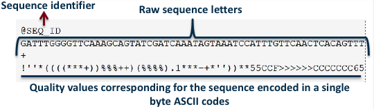
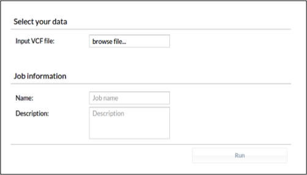
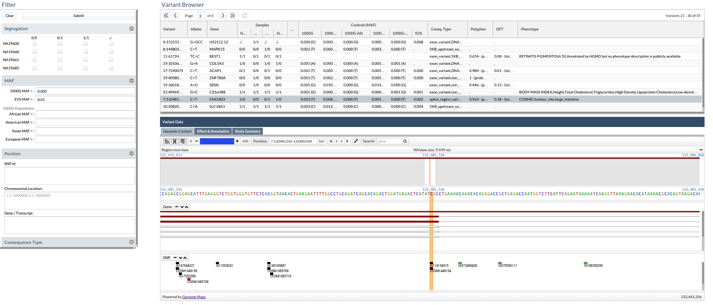

# Overview

A human NGS data processing solution.

## Introduction

The scope of this OMICS MASTER solution is restricted to human genomics research (disease causing gene discovery in the whole human genome or exome) or diagnosis (panel sequencing), although it could be extended to other usages in the future.

The pipeline inputs the raw data produced by the sequencing machines and undergoes a processing procedure that consists of a quality control, the mapping and variant calling steps that result in a file containing the set of variants in the sample. From this point, the prioritization component or the diagnostic component can be launched.

![OMICS MASTER solution overview. Data is produced in the external labs and comes to IT4I (represented by the blue dashed line). The data pre-processor converts raw data into a list of variants and annotations for each sequenced patient. These lists files together with primary and secondary (alignment) data files are stored in IT4I sequence DB and uploaded to the discovery (candidate priorization) or diagnostic component where they can be analysed directly by the user that produced
them, depending of the experimental design carried out.](../../../img/fig1.png)

Figure 1. OMICS MASTER solution overview. Data is produced in the external labs and comes to IT4I (represented by the blue dashed line). The data pre-processor converts raw data into a list of variants and annotations for each sequenced patient. These lists files together with primary and secondary (alignment) data files are stored in IT4I sequence DB and uploaded to the discovery (candidate prioritization) or diagnostic component where they can be analyzed directly by the user that produced them, depending of the experimental design carried out.

Typical genomics pipelines are composed by several components that need to be launched manually. The advantage of OMICS MASTER pipeline is that all these components are invoked sequentially in an automated way.

OMICS MASTER pipeline inputs a FASTQ file and outputs an enriched VCF file. This pipeline is able to queue all the jobs to PBS by only launching a process taking all the necessary input files and creates the intermediate and final folders

Let us see each of the OMICS MASTER solution components:

## Components

### Processing

This component is composed by a set of programs that carry out quality controls, alignment, realignment, variant calling and variant annotation. It turns raw data from the sequencing machine into files containing lists of variants (VCF) that once annotated, can be used by the following components (discovery and diagnosis).

We distinguish three types of sequencing instruments: bench sequencers (MySeq, IonTorrent, and Roche Junior, although the last one is being discontinued), which produce relatively Genomes in the clinic.

Low throughput (tens of million reads), and high-end sequencers, which produce high throughput (hundreds of million reads) among which we have Illumina HiSeq 2000 (and new models) and SOLiD. All of them but SOLiD produce data in sequence format. SOLiD produces data in a special format called color space that require specific software for the mapping process. Once the mapping has been done, the rest of the pipeline is identical. SOLiD is a technology which is also being discontinued by the manufacturer, so this type of data will be scarce in the future.

#### Quality Control, Preprocessing and Statistics for FASTQ

FastQC& FastQC.

These steps are carried out over the original FASTQ file with optimized scripts and includes the following steps: sequence cleansing, estimation of base quality scores, elimination of duplicates, and statistics.

Input: FASTQ file.

Output: FASTQ file plus an HTML file containing statistics on the data.

FASTQ format represents the nucleotide sequence and its corresponding quality scores.


Figure 2.FASTQ file.

#### Mapping

Component: Hpg-aligner.

Sequence reads are mapped over the human reference genome. SOLiD reads are not covered by this solution; they should be mapped with specific software (among the few available options, SHRiMP seems to be the best one). For the rest of NGS machine outputs we use HPG Aligner. HPG-Aligner is an innovative solution, based on a combination of mapping with BWT and local alignment with Smith-Waterman (SW), that drastically increases mapping accuracy (97% versus 62-70% by current mappers, in the most common scenarios). This proposal provides a simple and fast solution that maps almost all the reads, even those containing a high number of mismatches or indels.

Input: FASTQ file.

Output: Aligned file in BAM format.

#### Sequence Alignment/Map (SAM)

It is a human readable tab-delimited format in which each read and its alignment is represented on a single line. The format can represent unmapped reads, reads that are mapped to unique locations, and reads that are mapped to multiple locations.

The SAM format (1) consists of one header section and one alignment section. The lines in the header section start with the ‘@’ character, and lines in the alignment section do not. All lines are TAB delimited.

In SAM, each alignment line has 11 mandatory fields and a variable number of optional fields. The mandatory fields are briefly described in Table 1. They must be present but their value can be a ‘\’ or a zero (depending on the field) if the
corresponding information is unavailable.

|  No.      |  Name      |  Description                                          |
| --------- | ---------- | ----------------------------------------------------- |
| 1         | QNAME      | Query NAME of the read or the read pai                |
| 2         | FLAG       | Bitwise FLAG (pairing,strand,mate strand,etc.)        |
| 3         | RNAME      | Reference sequence NAME                               |
| 4         | POS        | 1-Based leftmost POSition of clipped alignment        |
| 5         | MAPQ       | MAPping Quality (Phred-scaled)                        |
| 6         | CIGAR      | Extended CIGAR string (operations:MIDNSHP)            |
| 7         | MRNM       | Mate REference NaMe ('=' if same RNAME)               |
| 8         | MPOS       | 1-Based leftmost Mate POSition                        |
| 9         | ISIZE      | Inferred Insert SIZE                                  |
| 10        | SEQ        | Query SEQuence on the same strand as the reference    |
| 11        | QUAL       | Query QUALity (ASCII-33=Phred base quality)           |

 Table 1. Mandatory fields in the SAM format.

The standard CIGAR description of pairwise alignment defines three operations: ‘M’ for match/mismatch, ‘I’ for insertion compared with the reference and ‘D’ for deletion. The extended CIGAR proposed in SAM added four more operations: ‘N’ for skipped bases on the reference, ‘S’ for soft clipping, ‘H’ for hard clipping and ‘P’ for padding. These support splicing, clipping, multi-part and padded alignments. Figure 3 shows examples of CIGAR strings for different types of alignments.

![SAM format file. The ‘@SQ’ line in the header section gives the order of reference sequences. Notably, r001 is the name of a read pair. According to FLAG 163 (=1+2+32+128), the read mapped to position 7 is the second read in the pair (128) and regarded as properly paired (1 + 2); its mate is mapped to 37 on the reverse strand (32). Read r002 has three soft-clipped (unaligned) bases. The coordinate shown in SAM is the position of the first aligned base. The CIGAR string for this alignment contains a P (padding) operation which correctly aligns the inserted sequences. Padding operations can be absent when an aligner does not support multiple sequence alignment. The last six bases of read r003 map to position 9, and the first five to position 29 on the reverse strand. The hard clipping operation H indicates that the clipped sequence is not present in the sequence field. The NM tag gives the number of mismatches. Read r004 is aligned across an intron, indicated by the N operation.](../../../img/fig3.png)

 Figure 3. SAM format file. The ‘@SQ’ line in the header section gives the order of reference sequences. Notably, r001 is the name of a read pair. According to FLAG 163 (=1+2+32+128), the read mapped to position 7 is the second read in the pair (128) and regarded as properly paired (1 + 2); its mate is mapped to 37 on the reverse strand (32). Read r002 has three soft-clipped (unaligned) bases. The coordinate shown in SAM is the position of the first aligned base. The CIGAR string for this alignment contains a P (padding) operation, which correctly aligns the inserted sequences. Padding operations can be absent when an aligner does not support multiple sequence alignment. The last six bases of read r003 map to position 9, and the first five to position 29 on the reverse strand. The hard clipping operation H indicates that the clipped sequence is not present in the sequence field. The NM tag gives the number of mismatches. Read r004 is aligned across an intron, indicated by the N operation.

##### Binary Alignment/Map (BAM)

BAM is the binary representation of SAM and keeps exactly the same information as SAM. BAM uses lossless compression to reduce the size of the data by about 75% and provides an indexing system that allows reads that overlap a region of the genome to be retrieved and rapidly traversed.

#### Quality Control, Preprocessing and Statistics for BAM

Component: Hpg-Fastq & FastQC.

Some features

 Quality control
   reads with N errors
   reads with multiple mappings
   strand bias
   paired-end insert
 Filtering: by number of errors, number of hits
   Comparator: stats, intersection, etc.

Input: BAM file.

Output: BAM file plus an HTML file containing statistics.

#### Variant Calling

Component: GATK.

Identification of single nucleotide variants and indels on the alignments is performed using the Genome Analysis Toolkit (GATK). GATK (2) is a software package developed at the Broad Institute to analyze high-throughput sequencing data. The toolkit offers a wide variety of tools, with a primary focus on variant discovery and genotyping as well as strong emphasis on data quality assurance.

Input: BAM

Output:VCF

Variant Call Format (VCF)

VCF (3) is a standardized format for storing the most prevalent types of sequence variation, including SNPs, indels and larger structural variants, together with rich annotations. The format was developed with the primary intention to represent human genetic variation, but its use is not restricted to diploid genomes and can be used in different contexts as well. Its flexibility and user extensibility allows representation of a wide variety of genomic variation with respect to a single reference sequence.

A VCF file consists of a header section and a data section. The header contains an arbitrary number of metainformation lines, each starting with characters ‘##’, and a TAB delimited field definition line, starting with a single ‘#’ character. The meta-information header lines provide a standardized description of tags and annotations used in the data section. The use of meta-information allows the information stored within a VCF file to be tailored to the dataset in question. It can be also used to provide information about the means of file creation, date of creation, version of the reference sequence, software used and any other information relevant to the history of the file. The field definition line names eight mandatory columns, corresponding to data columns representing the chromosome (CHROM), a 1-based position of the start of the variant (POS), unique identifiers of the variant (ID), the reference allele (REF), a comma separated list of alternate non-reference alleles (ALT), a phred-scaled quality score (QUAL), site filtering information (FILTER) and a semicolon separated list of additional, user extensible annotation (INFO). In addition, if samples are present in the file, the mandatory header columns are followed by a FORMAT column and an arbitrary number of sample IDs that define the samples included in the VCF file. The FORMAT column is used to define the information contained within each subsequent genotype column, which consists of a colon separated list of fields. For example, the FORMAT field GT:GQ:DP in the fourth data entry of Figure 1a indicates that the subsequent entries contain information regarding the genotype, genotype quality and read depth for each sample. All data lines are TAB delimited and the number of fields in each data line must match the number of fields in the header line. It is strongly recommended that all annotation tags used are declared in the VCF header section.

![a) Example of valid VCF. The header lines ##fileformat and #CHROM are mandatory, the rest is optional but strongly recommended. Each line of the body describes variants present in the sampled population at one genomic position or region. All alternate alleles are listed in the ALT column and referenced from the genotype fields as 1-based indexes to this list; the reference haplotype is designated as 0. For multiploid data, the separator indicates whether the data are phased (|) or unphased (/). Thus, the two alleles C and G at the positions 2 and 5 in this figure occur on the same chromosome in SAMPLE1. The first data line shows an example of a deletion (present in SAMPLE1) and a replacement of two bases by another base (SAMPLE2); the second line shows a SNP and an insertion; the third a SNP; the fourth a large structural variant described by the annotation in the INFO column, the coordinate is that of the base before the variant. (b–f ) Alignments and VCF representations of different sequence variants: SNP, insertion, deletion, replacement, and a large deletion. The REF columns shows the reference bases replaced by the haplotype in the ALT column. The coordinate refers to the first reference base. (g) Users are advised to use simplest representation possible and lowest coordinate in cases where the position is ambiguous.](../../../img/fig4.png)

 Figure 4 . (a) Example of valid VCF. The header lines ##fileformat and #CHROM are mandatory, the rest is optional but strongly recommended. Each line of the body describes variants present in the sampled population at one genomic position or region. All alternate alleles are listed in the ALT column and referenced from the genotype fields as 1-based indexes to this list; the reference haplotype is designated as 0. For multiploid data, the separator indicates whether the data are phased (|) or unphased (/). Thus, the two alleles C and G at the positions 2 and 5 in this figure occur on the same chromosome in SAMPLE1. The first data line shows an example of a deletion (present in SAMPLE1) and a replacement of two bases by another base (SAMPLE2); the second line shows a SNP and an insertion; the third a SNP; the fourth a large structural variant described by the annotation in the INFO column, the coordinate is that of the base before the variant. (b–f ) Alignments and VCF representations of different sequence variants: SNP, insertion, deletion, replacement, and a large deletion. The REF columns shows the reference bases replaced by the haplotype in the ALT column. The coordinate refers to the first reference base. (g) Users are advised to use simplest representation possible and lowest coordinate in cases where the position is ambiguous.

### Annotating

Component: HPG-Variant

The functional consequences of every variant found are then annotated using the HPG-Variant software, which extracts from CellBase, the Knowledge database, all the information relevant on the predicted pathologic effect of the variants.

VARIANT (VARIant Analysis Tool) (4) reports information on the variants found that include consequence type and annotations taken from different databases and repositories (SNPs and variants from dbSNP and 1000 genomes, and disease-related variants from the Genome-Wide Association Study (GWAS) catalog, Online Mendelian Inheritance in Man (OMIM), Catalog of Somatic Mutations in Cancer (COSMIC) mutations, etc. VARIANT also produces a rich variety of annotations that include information on the regulatory (transcription factor or miRNAbinding sites, etc.) or structural roles, or on the selective pressures on the sites affected by the variation. This information allows extending the conventional reports beyond the coding regions and expands the knowledge on the contribution of non-coding or synonymous variants to the phenotype studied.

 Input: VCF

 Output: The output of this step is the Variant Calling Format (VCF) file, which contains changes with respect to the reference genome with the corresponding QC and functional annotations.

#### CellBase

CellBase(5) is a relational database integrates biological information from different sources and includes:

Core features

We took genome sequences, genes, transcripts, exons, cytobands or cross references (xrefs) identifiers (IDs) from Ensembl (6). Protein information including sequences, xrefs or protein features (natural variants, mutagenesis sites, post-translational modifications, etc.) were imported from UniProt (7).

Regulatory

CellBase imports miRNA from miRBase (8); curated and non-curated miRNA targets from miRecords (9), miRTarBase (10),
TargetScan(11) and microRNA.org (12) and CpG islands and conserved regions from the UCSC database (13).

Functional annotation

OBO Foundry (14) develops many biomedical ontologies that are implemented in OBO format. We designed a SQL schema to store these OBO ontologies and 30 ontologies were imported. OBO ontology term annotations were taken from Ensembl (6). InterPro (15) annotations were also imported.

Variation

CellBase includes SNPs from dbSNP (16)^; SNP population frequencies from HapMap (17), 1000 genomes project (18) and Ensembl (6); phenotypically annotated SNPs were imported from NHRI GWAS Catalog (19),HGMD (20), Open Access GWAS Database (21), UniProt (7) and OMIM (22); mutations from COSMIC (23) and structural variations from Ensembl (6).

Systems biology

We also import systems biology information like interactome information from IntAct (24). Reactome (25) stores pathway and interaction information in BioPAX (26) format. BioPAX data exchange format enables the integration of diverse pathway
resources. We successfully solved the problem of storing data released in BioPAX format into a SQL relational schema, which allowed us importing Reactome in CellBase.

### Diagnostic Component (TEAM)

More detail [here][1].

### Priorization Component (BiERApp)

More detail [here][2].

## Usage

First, we should load ngsPipeline module:

```console
$ ml ngsPipeline
```

This command will load python/2.7.5 module and all the required modules (hpg-aligner, gatk, etc)

If we launch ngsPipeline with ‘-h’, we will get the usage help:

```console
$ ngsPipeline -h
    Usage: ngsPipeline.py [-h] -i INPUT -o OUTPUT -p PED --project PROJECT --queue
      QUEUE [--stages-path STAGES_PATH] [--email EMAIL]
     [--prefix PREFIX] [-s START] [-e END] --log

    Python pipeline

    optional arguments:
      -h, --help show this help message and exit
      -i INPUT, --input INPUT
      -o OUTPUT, --output OUTPUT
        Output Data directory
      -p PED, --ped PED     Ped file with all individuals
      --project PROJECT     Project Id
      --queue QUEUE         Queue Id
      --stages-path STAGES_PATH
        Custom Stages path
      --email EMAIL         Email
      --prefix PREFIX       Prefix name for Queue Jobs name
      -s START, --start START
        Initial stage
      -e END, --end END     Final stage
      --log       Log to file
```

Let us see a brief description of the arguments:

```console
      -h --help. Show the help.

      -i, --input. The input data directory. This directory must to have a special structure. We have to create one folder per sample (with the same name). These folders will host the fastq files. These fastq files must have the following pattern “sampleName” + “_” + “1 or 2” + “.fq”. 1 for the first pair (in paired-end sequences), and 2 for the
second one.

      -o , --output. The output folder. This folder will contain all the intermediate and final folders. When the pipeline will be executed completely, we could remove the intermediate folders and keep only the final one (with the VCF file containing all the variants)

      -p , --ped. The ped file with the pedigree. This file contains all the sample names. These names must coincide with the names of the input folders. If our input folder contains more samples than the .ped file, the pipeline will use only the samples from the .ped file.

      --email. Email for PBS notifications.

      --prefix. Prefix for PBS Job names.

      -s, --start & -e, --end. Initial and final stage. If we want to launch the pipeline in a specific stage we must use -s. If we want to end the pipeline in a specific stage we must use -e.

      --log. Using log argument NGSpipeline will prompt all the logs to this file.

      --project>. Project ID of your supercomputer allocation.

      --queue. [Queue][3] to run the jobs in.
```

Input, output and ped arguments are mandatory. If the output folder does not exist, the pipeline will create it.

## Examples

This is an example usage of NGSpipeline:

We have a folder with the following structure in

```console
/apps/bio/omics/1.0/sample_data/ >:

    /apps/bio/omics/1.0/sample_data
    └── data
        ├── file.ped
        ├── sample1
        │   ├── sample1_1.fq
        │   └── sample1_2.fq
        └── sample2
  ├── sample2_1.fq
  └── sample2_2.fq
```

The ped file (file.ped) contains the following info:

```console
    #family_ID sample_ID parental_ID maternal_ID sex phenotype
    FAM sample_A 0 0 1 1
    FAM sample_B 0 0 2 2
```

Now, let us load the NGSPipeline module and copy the sample data to a [scratch directory][4]:

```console
$ ml ngsPipeline
$ mkdir -p /scratch/$USER/omics/results
$ cp -r /apps/bio/omics/1.0/sample_data /scratch/$USER/omics/
```

Now, we can launch the pipeline (replace OPEN-0-0 with your Project ID):

```console
$ ngsPipeline -i /scratch/$USER/omics/sample_data/data -o /scratch/$USER/omics/results -p /scratch/$USER/omics/sample_data/data/file.ped --project OPEN-0-0 --queue qprod
```

This command submits the processing [jobs to the queue][5].

If we want to re-launch the pipeline from stage 4 until stage 20, we should use the next command:

```console
$ ngsPipeline -i /scratch/$USER/omics/sample_data/data -o /scratch/$USER/omics/results -p /scratch/$USER/omics/sample_data/data/file.ped -s 4 -e 20 --project OPEN-0-0 --queue qprod
```

## Details on the Pipeline

The pipeline calls the following tools

 [fastqc][a], quality control tool for high throughput sequence data.
 [gatk][b], The Genome Analysis Toolkit or GATK is a software package developed at the Broad Institute to analyze high-throughput sequencing data. The toolkit offers a wide variety of tools, with a primary focus on variant discovery and genotyping as well as strong emphasis on data quality assurance. Its robust architecture, powerful processing engine and high-performance computing features make it capable of taking on projects of any size.
 [hpg-aligner][c], HPG Aligner has been designed to align short and long reads with high sensitivity, therefore any number of mismatches or indels are allowed. HPG Aligner implements and combines two well known algorithms: _Burrows-Wheeler Transform_ (BWT) to speed-up mapping high-quality reads, and _Smith-Waterman_> (SW) to increase sensitivity when reads cannot be mapped using BWT.
 [hpg-fastq][d], a quality control tool for high throughput sequence data.
 [hpg-variant][e], The HPG Variant suite is an ambitious project aimed to provide a complete suite of tools to work with genomic variation data, from VCF tools to variant profiling or genomic statistics. It is being implemented using High Performance Computing technologies to provide the best performance possible.
 [picard][f], Picard comprises Java-based command-line utilities that manipulate SAM files, and a Java API (HTSJDK) for creating new programs that read and write SAM files. Both SAM text format and SAM binary (BAM) format are supported.
 [samtools][g], SAM Tools provide various utilities for manipulating alignments in the SAM format, including sorting, merging, indexing and generating alignments in a per-position format.
 [snpEff][h], Genetic variant annotation and effect prediction toolbox.

This listing show which tools are used in each step of the pipeline

 stage-00: fastqc
 stage-01: hpg_fastq
 stage-02: fastqc
 stage-03: hpg_aligner and samtools
 stage-04: samtools
 stage-05: samtools
 stage-06: fastqc
 stage-07: picard
 stage-08: fastqc
 stage-09: picard
 stage-10: gatk
 stage-11: gatk
 stage-12: gatk
 stage-13: gatk
 stage-14: gatk
 stage-15: gatk
 stage-16: samtools
 stage-17: samtools
 stage-18: fastqc
 stage-19: gatk
 stage-20: gatk
 stage-21: gatk
 stage-22: gatk
 stage-23: gatk
 stage-24: hpg-variant
 stage-25: hpg-variant
 stage-26: snpEff
 stage-27: snpEff
 stage-28: hpg-variant

## Interpretation

The output folder contains all the subfolders with the intermediate data. This folder contains the final VCF with all the variants. This file can be uploaded into [TEAM][1] by using the VCF file button. It is important to note here that the entire management of the VCF file is local: no patient’s sequence data is sent over the Internet thus avoiding any problem of data privacy or confidentiality.

![TEAM upload panel. Once the file has been uploaded, a panel must be chosen from the Panel list. Then, pressing the Run button the diagnostic process starts.]\((../../img/fig7.png)

 Figure 7. _TEAM upload panel._ _Once the file has been uploaded, a panel must be chosen from the Panel_ list. Then, pressing the Run button the diagnostic process starts.

Once the file has been uploaded, a panel must be chosen from the Panel list. Then, pressing the Run button the diagnostic process starts. TEAM searches first for known diagnostic mutation(s) taken from four databases: HGMD-public (20), [HUMSAVAR][i], ClinVar (29) and COSMIC (23).

![The panel manager. The elements used to define a panel are (A) disease terms, (B) diagnostic mutations and (C) genes. Arrows represent actions that can be taken in the panel manager. Panels can be defined by using the known mutations and genes of a particular disease. This can be done by dragging them to the Primary Diagnostic box (action D). This action, in addition to defining the diseases in the Primary Diagnostic box, automatically adds the corresponding genes to the Genes box. The panels can be customized by adding new genes (action F) or removing undesired genes (action G). New disease mutations can be added independently or associated to an already existing disease term (action E). Disease terms can be removed by simply dragging them back (action H).](../../../img/fig7x.png)

 Figure 7. The panel manager. The elements used to define a panel are ( A ) disease terms, ( B ) diagnostic mutations and ( C ) genes. Arrows represent actions that can be taken in the panel manager. Panels can be defined by using the known mutations and genes of a particular disease. This can be done by dragging them to the Primary Diagnostic box (action D). This action, in addition to defining the diseases in the Primary Diagnostic box, automatically adds the corresponding genes to the Genes box. The panels can be customized by adding new genes (action F) or removing undesired genes (action G). New disease mutations can be added independently or associated to an already existing disease term (action E). Disease terms can be removed by simply dragging them back (action H).

For variant discovering/filtering we should upload the VCF file into BierApp by using the following form:

\

 Figure 8. \BierApp VCF upload panel. It is recommended to choose a name for the job as well as a description \\.

Each prioritization (‘job’) has three associated screens that facilitate the filtering steps. The first one, the ‘Summary’ tab, displays a statistic of the data set analyzed, containing the samples analyzed, the number and types of variants found and its distribution according to consequence types. The second screen, in the ‘Variants and effect’ tab, is the actual filtering tool, and the third one, the ‘Genome view’ tab, offers a representation of the selected variants within the genomic context provided by an embedded version of the Genome Maps Tool (30).



 Figure 9. This picture shows all the information associated to the variants. If a variant has an associated phenotype we could see it in the last column. In this case, the variant 7:132481242 CT is associated to the phenotype: large intestine tumor.

## References

1. Heng Li, Bob Handsaker, Alec Wysoker, Tim Fennell, Jue Ruan, Nils Homer, Gabor Marth5, Goncalo Abecasis6, Richard Durbin and 1000 Genome Project Data Processing Subgroup: The Sequence Alignment/Map format and SAMtools. Bioinformatics 2009, 25: 2078-2079.
1. McKenna A, Hanna M, Banks E, Sivachenko A, Cibulskis K, Kernytsky A, Garimella K, Altshuler D, Gabriel S, Daly M, DePristo MA: The Genome Analysis Toolkit: a MapReduce framework for analyzing next-generation DNA sequencing data. _Genome Res_ >2010, 20:1297-1303.
1. Petr Danecek, Adam Auton, Goncalo Abecasis, Cornelis A. Albers, Eric Banks, Mark A. DePristo, Robert E. Handsaker, Gerton Lunter, Gabor T. Marth, Stephen T. Sherry, Gilean McVean, Richard Durbin, and 1000 Genomes Project Analysis Group. The variant call format and VCFtools. Bioinformatics 2011, 27: 2156-2158.
1. Medina I, De Maria A, Bleda M, Salavert F, Alonso R, Gonzalez CY, Dopazo J: VARIANT: Command Line, Web service and Web interface for fast and accurate functional characterization of variants found by Next-Generation Sequencing. Nucleic Acids Res 2012, 40:W54-58.
1. Bleda M, Tarraga J, de Maria A, Salavert F, Garcia-Alonso L, Celma M, Martin A, Dopazo J, Medina I: CellBase, a comprehensive collection of RESTful web services for retrieving relevant biological information from heterogeneous sources. Nucleic Acids Res 2012, 40:W609-614.
1. Flicek,P., Amode,M.R., Barrell,D., Beal,K., Brent,S., Carvalho-Silva,D., Clapham,P., Coates,G., Fairley,S., Fitzgerald,S. et al. (2012) Ensembl 2012. Nucleic Acids Res., 40, D84–D90.
1. UniProt Consortium. (2012) Reorganizing the protein space at the Universal Protein Resource (UniProt). Nucleic Acids Res., 40, D71–D75.
1. Kozomara,A. and Griffiths-Jones,S. (2011) miRBase: integrating microRNA annotation and deep-sequencing data. Nucleic Acids Res., 39, D152–D157.
1. Xiao,F., Zuo,Z., Cai,G., Kang,S., Gao,X. and Li,T. (2009) miRecords: an integrated resource for microRNA-target interactions. Nucleic Acids Res., 37, D105–D110.
1. Hsu,S.D., Lin,F.M., Wu,W.Y., Liang,C., Huang,W.C., Chan,W.L., Tsai,W.T., Chen,G.Z., Lee,C.J., Chiu,C.M. et al. (2011) miRTarBase: a database curates experimentally validated microRNA-target interactions. Nucleic Acids Res., 39, D163–D169.
1. Friedman,R.C., Farh,K.K., Burge,C.B. and Bartel,D.P. (2009) Most mammalian mRNAs are conserved targets of microRNAs. Genome Res., 19, 92–105. 12. Betel,D., Wilson,M., Gabow,A., Marks,D.S. and Sander,C. (2008) The microRNA.org resource: targets and expression. Nucleic Acids Res., 36, D149–D153.
1. Dreszer,T.R., Karolchik,D., Zweig,A.S., Hinrichs,A.S., Raney,B.J., Kuhn,R.M., Meyer,L.R., Wong,M., Sloan,C.A., Rosenbloom,K.R. et al. (2012) The UCSC genome browser database: extensions and updates 2011. Nucleic Acids Res.,40, D918–D923.
1. Smith,B., Ashburner,M., Rosse,C., Bard,J., Bug,W., Ceusters,W., Goldberg,L.J., Eilbeck,K., Ireland,A., Mungall,C.J. et al. (2007) The OBO Foundry: coordinated evolution of ontologies to support biomedical data integration. Nat. Biotechnol., 25, 1251–1255.
1. Hunter,S., Jones,P., Mitchell,A., Apweiler,R., Attwood,T.K.,Bateman,A., Bernard,T., Binns,D., Bork,P., Burge,S. et al. (2012) InterPro in 2011: new developments in the family and domain prediction database. Nucleic Acids Res.,40, D306–D312.
1. Sherry,S.T., Ward,M.H., Kholodov,M., Baker,J., Phan,L., Smigielski,E.M. and Sirotkin,K. (2001) dbSNP: the NCBI database of genetic variation. Nucleic Acids Res., 29, 308–311.
1. Altshuler,D.M., Gibbs,R.A., Peltonen,L., Dermitzakis,E., Schaffner,S.F., Yu,F., Bonnen,P.E., de Bakker,P.I., Deloukas,P., Gabriel,S.B. et al. (2010) Integrating common and rare genetic variation in diverse human populations. Nature, 467, 52–58.
1. 1000 Genomes Project Consortium. (2010) A map of human genome variation from population-scale sequencing. Nature, 467, 1061–1073.
1. Hindorff,L.A., Sethupathy,P., Junkins,H.A., Ramos,E.M., Mehta,J.P., Collins,F.S. and Manolio,T.A. (2009) Potential etiologic and functional implications of genome-wide association loci for human diseases and traits. Proc. Natl Acad. Sci. USA, 106, 9362–9367.
1. Stenson,P.D., Ball,E.V., Mort,M., Phillips,A.D., Shiel,J.A., Thomas,N.S., Abeysinghe,S., Krawczak,M. and Cooper,D.N. (2003) Human gene mutation database (HGMD): 2003 update. Hum. Mutat., 21, 577–581.
1. Johnson,A.D. and O’Donnell,C.J. (2009) An open access database of genome-wide association results. BMC Med. Genet, 10, 6.
1. McKusick,V. (1998) A Catalog of Human Genes and Genetic Disorders, 12th edn. John Hopkins University Press,Baltimore, MD.
1. Forbes,S.A., Bindal,N., Bamford,S., Cole,C., Kok,C.Y., Beare,D., Jia,M., Shepherd,R., Leung,K., Menzies,A. et al. (2011) COSMIC: mining complete cancer genomes in the catalogue of somatic mutations in cancer. Nucleic Acids Res., 39, D945–D950.
1. Kerrien,S., Aranda,B., Breuza,L., Bridge,A., Broackes-Carter,F., Chen,C., Duesbury,M., Dumousseau,M., Feuermann,M., Hinz,U. et al. (2012) The Intact molecular interaction database in 2012. Nucleic Acids Res., 40, D841–D846.
1. Croft,D., O’Kelly,G., Wu,G., Haw,R., Gillespie,M., Matthews,L., Caudy,M., Garapati,P., Gopinath,G., Jassal,B. et al. (2011) Reactome: a database of reactions, pathways and biological processes. Nucleic Acids Res., 39, D691–D697.
1. Demir,E., Cary,M.P., Paley,S., Fukuda,K., Lemer,C., Vastrik,I.,Wu,G., D’Eustachio,P., Schaefer,C., Luciano,J. et al. (2010) The BioPAX community standard for pathway data sharing. Nature Biotechnol., 28, 935–942.
1. Alemán Z, García-García F, Medina I, Dopazo J (2014): A web tool for the design and management of panels of genes for targeted enrichment and massive sequencing for clinical applications. Nucleic Acids Res 42: W83-7.
1. [Alemán A][j], [Garcia-Garcia F][k], [Salavert F][l], [Medina I][m], [Dopazo J][n] (2014). A web-based interactive framework to assist in the prioritization of disease candidate genes in whole-exome sequencing studies. [Nucleic Acids Res.][o], W88-93.
1. Landrum,M.J., Lee,J.M., Riley,G.R., Jang,W., Rubinstein,W.S., Church,D.M. and Maglott,D.R. (2014) ClinVar: public archive of relationships among sequence variation and human phenotype. Nucleic Acids Res., 42, D980–D985.
1. Medina I, Salavert F, Sanchez R, de Maria A, Alonso R, Escobar P, Bleda M, Dopazo J: Genome Maps, a new generation genome browser. Nucleic Acids Res 2013, 41:W41-46.

[1]: diagnostic-component-team.md
[2]: priorization-component-bierapp.md
[3]: ../../../general/resources-allocation-policy.md
[4]: ../../../salomon/storage.md
[5]: ../../../general/job-submission-and-execution.md

[a]: http://www.bioinformatics.babraham.ac.uk/projects/fastqc/
[b]: https://www.broadinstitute.org/gatk/
[c]: https://github.com/opencb-hpg/hpg-aligner
[d]: http://docs.bioinfo.cipf.es/projects/fastqhpc/wiki
[e]: http://docs.bioinfo.cipf.es/projects/hpg-variant/wiki
[f]: http://picard.sourceforge.net/
[g]: http://samtools.sourceforge.net/samtools-c.shtml
[h]: http://snpeff.sourceforge.net/
[i]: http://www.uniprot.org/docs/humsavar
[j]: http://www.ncbi.nlm.nih.gov/pubmed?term=Alem%C3%A1n%20A%5BAuthor%5D&cauthor=true&cauthor_uid=24803668
[k]: http://www.ncbi.nlm.nih.gov/pubmed?term=Garcia-Garcia%20F%5BAuthor%5D&cauthor=true&cauthor_uid=24803668
[l]: http://www.ncbi.nlm.nih.gov/pubmed?term=Salavert%20F%5BAuthor%5D&cauthor=true&cauthor_uid=24803668
[m]: http://www.ncbi.nlm.nih.gov/pubmed?term=Medina%20I%5BAuthor%5D&cauthor=true&cauthor_uid=24803668
[n]: http://www.ncbi.nlm.nih.gov/pubmed?term=Dopazo%20J%5BAuthor%5D&cauthor=true&cauthor_uid=24803668
[o]: http://www.ncbi.nlm.nih.gov/pubmed/?term=BiERapp
