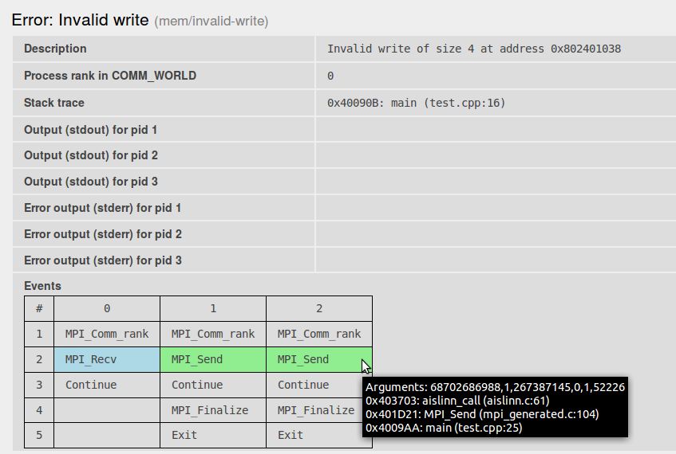

# Aislinn

## Introduction

Aislinn is a dynamic verifier for MPI programs. For a fixed input, it covers all possible runs with respect to nondeterminism introduced by MPI. It allows to detect bugs that very rarely occur in normal runs. It detects problems like invalid memory accesses, deadlocks, misuse of MPI, and resource leaks. Aislinn is an open-source software, so you can use it without any licensing limitations. For more information, visit the project's [web page][a].

!!! note
    Aislinn is developed at IT4Innovations and some parts are still considered experimental. If you have any questions or experience any problems, contact the author: <mailto:stanislav.bohm@vsb.cz>.

## Installed Versions

For the current list of installed versions, use:

```console
$ ml av Aislinn
```

## Usage

Let us have the following program that contains a bug that is not manifested in all runs:

```cpp
#include <mpi.h>
#include <stdlib.h>

int main(int argc, char **argv) {
      int rank;

      MPI_Init(&argc, &argv);
      MPI_Comm_rank(MPI_COMM_WORLD, &rank);

      if (rank == 0) {
              int *mem1 = (int*) malloc(sizeof(int) * 2);
              int *mem2 = (int*) malloc(sizeof(int) * 3);
              int data;
              MPI_Recv(&data, 1, MPI_INT, MPI_ANY_SOURCE, 1,
                      MPI_COMM_WORLD, MPI_STATUS_IGNORE);
              mem1[data] = 10; //                <---------- Possible invalid memory write
              MPI_Recv(&data, 1, MPI_INT, MPI_ANY_SOURCE, 1,
                      MPI_COMM_WORLD, MPI_STATUS_IGNORE);
              mem2[data] = 10;
              free(mem1);
              free(mem2);
      }

      if (rank == 1 || rank == 2) {
              MPI_Send(&rank, 1, MPI_INT, 0, 1, MPI_COMM_WORLD);
      }

      MPI_Finalize();
      return 0;
}
```

The program does the following: process 0 receives two messages from anyone and processes 1 and 2 send a message to process 0. If a message from process 1 is received first, then the run does not expose the error. If a message from process 2 is received first, then invalid memory write occurs at line 16.

To verify this program by Aislinn, we first load Aislinn itself:

```console
$ ml aislinn
```

Now we compile the program by Aislinn implementation of MPI. There are `mpicc` for C programs and `mpicxx` for C++ programs. Only MPI parts of the verified application has to be recompiled; non-MPI parts may remain untouched. Let us assume that our program is in `test.cpp`.

```console
$ mpicc -g test.cpp -o test
```

The `-g` flag is not necessary, but it puts more debugging information into the program, hence Aislinn may provide a more detailed report. The command produces an executable file `test`.

Now we run the Aislinn itself. The argument `-p 3` specifies that we want to verify our program for the case of three MPI processes:

```console
$ aislinn -p 3 ./test
==AN== INFO: Aislinn v0.3.0
==AN== INFO: Found error 'Invalid write'
==AN== INFO: 1 error(s) found
==AN== INFO: Report written into 'report.html'
```

Aislinn found an error and produced an HTML report. To view it, we can use any browser, for example:

```console
$ firefox report.html
```

At the beginning of the report, there are some basic summaries of the verification. In the second part (depicted in the following picture), the error is described.



It shows us:

* Error occurs in process 0 in `test.cpp` on line 16.
* Stdout and stderr streams are empty. (The program does not write anything).
* The last part shows MPI calls for each process that occurs in the invalid run. More detailed information about each call can be obtained by hovering the mouse cursor over the respective MPI call.

### Limitations

Since the verification is a non-trivial process, there are some of limitations.

* The verified process has to terminate in all runs, i.e. we cannot answer the halting problem.
* The verification is a computationally and memory demanding process. We put an effort to make it efficient and it is an important point for further research. However covering all runs will always be more demanding than techniques that examine only a single run. The good practice is to start with small instances and when it is feasible, make them bigger. Aislinn is good for finding bugs that are hard to find because they occur very rarely (only in a rare scheduling). Such bugs often do not need big instances.
* Aislinn expects that your program is a "standard MPI" program, i.e. processes communicate only through MPI, the verified program does not interacts with the system in some unusual ways (e.g. opening sockets).

There are also some limitations bounded to the current version and they will be removed in the future:

* All files containing MPI calls have to be recompiled by MPI implementation provided by Aislinn. The files that do not contain MPI calls, do not have to be recompiled. Aislinn MPI implementation supports many commonly used calls from MPI-2 and MPI-3 related to point-to-point communication, collective communication, and communicator management. Unfortunately, MPI-IO and one-side communication is not implemented yet.
* Each MPI can use only one thread (if you use OpenMP, set `OMP_NUM_THREADS` to 1).
* There are some limitations for using files, but if the program just reads inputs and writes results, it is OK.

[a]: http://verif.cs.vsb.cz/aislinn/
