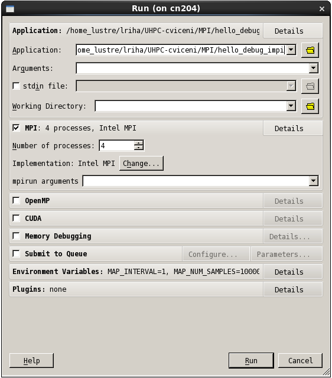

# Allinea Forge (DDT, MAP)

## Introduction

Allinea Forge consist of two tools:

Allinea DDT is a commercial debugger primarily for debugging parallel MPI or OpenMP programs. It also supports for GPU (CUDA) and Intel Xeon Phi accelerators. DDT provides all the standard debugging features (stack trace, breakpoints, watches, view variables, threads, etc.) for every thread running as a part of your program, or for every process - even if these processes are distributed across a cluster using an MPI implementation.

Allinea MAP is a profiler for C/C++/Fortran HPC codes. It is designed for profiling parallel code, which uses pthreads, OpenMP, or MPI.

## Installed Versions

For the current list of installed versions, use:

```console
$ ml av Forge
```

## Compiling Code to Run With DDT

### Modules

Load all necessary modules to compile the code, for example:

```console
$ ml intel
$ ml impi **or** ml OpenMPI/X.X.X-icc
```

Load the Allinea DDT module:

```console
$ ml Forge
```

!!! note
    Loading default modules is [**not** recommended][2].

Compile the code:

```console
$ mpicc -g -O0 -o test_debug test.c
$ mpif90 -g -O0 -o test_debug test.f
```

### Compiler Flags

Before debugging, you need to compile your code with these flags:

!!! note
    `-g`: Generates extra debugging information usable by GDB. `-g3` includes even more debugging information. This option is available for GNU and Intel C/C++ and Fortran compilers.

    `-O0`: Suppresses all optimizations.

## Starting a Job With DDT

Be sure to log in with an X window forwarding enabled. This could mean using the `-X` in the `ssh`:

```console
$ ssh -X username@login1.karolina.it4i.cz
```

Another options is to access the login node using VNC. See the detailed information on how to [use graphic user interface][1].

From the login node, an interactive session **with X windows forwarding** (the `-X` option) can be started by the following command:

```console
$ qsub -I -X -A NONE-0-0 -q qexp -l select=1:ncpus=128:mpiprocs=128,walltime=01:00:00
```

Then launch the debugger with the `ddt` command followed by the name of the executable to debug:

```console
$ ddt test_debug
```

A submission window appears with a prefilled path to the executable to debug. Select the number of MPI processors and/or OpenMP threads on which to run, then press run. Command line arguments to a program can be entered to the Arguments field.



To start the debugging directly without the submission window, the user can specify the debugging and execution parameters from the command line. For example, the number of MPI processes is set by the `-np 4` option. Skipping the dialog is done by the `-start` option. To see the list of the `ddt` command line parameters, run `ddt --help`.

```console
ddt -start -np 4 ./hello_debug_impi
```

## Documentation

Users can find the original User Guide after loading the DDT module:

```console
$DDTPATH/doc/userguide.pdf
```

[1] Discipline, Magic, Inspiration and Science: Best Practice Debugging with Allinea DDT, Workshop conducted at LLNL by Allinea on May 10, 2013, [link][a]

[1]: ../../general/accessing-the-clusters/graphical-user-interface/x-window-system.md
[2]: ../../modules/lmod/#loading-modules

[a]: https://computing.llnl.gov/tutorials/allineaDDT/index.html
