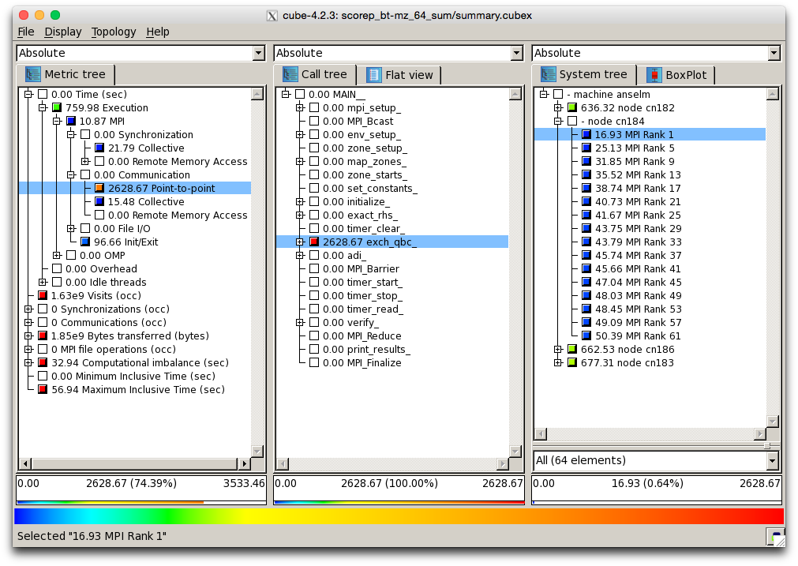

# CUBE

## Introduction

CUBE is a graphical performance report explorer for displaying data from Score-P and Scalasca (and other compatible tools). The name comes from the fact that it displays performance data in three dimensions:

* **performance metric**, where a number of metrics is available, such as communication time or cache misses,
* **call path**, which contains the call tree of your program
* **system resource**, which contains system's nodes, processes and threads, depending on the parallel programming model.

Each dimension is organized in a tree, for example the time performance metric is divided into Execution time and Overhead time, call path dimension is organized by files and routines in your source code, etc.



\*Figure 1. Screenshot of CUBE displaying data from Scalasca.\*

Each node in the tree is colored by severity (the color scheme is displayed at the bottom of the window, ranging from the least severe blue to the most severe being red). For example in Figure 1, we can see that most of the point-to-point MPI communication happens in the `exch_qbc` routine, colored red.

## Installed Versions

For the current list of installed versions, use:

```console
$ ml av Cube
```

## Usage

CUBE is a graphical application. Refer to the Graphical User Interface documentation for a list of methods to launch graphical applications clusters.

!!! note
    Analyzing large data sets can consume large amount of CPU and RAM. Do not perform large analysis on login nodes.

After loading the appropriate module, simply launch the cube command, or alternatively you can use the `scalasca -examine` command to launch the GUI. Note that for Scalasca data sets, if you do not analyze the data with `scalasca -examine` before opening them with CUBE, not all performance data will be available.

References
1\.  [Download link][a]

[1]: ../../modules-matrix.md

[a]: http://www.scalasca.org/software/cube-4.x/download.html
