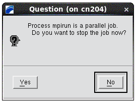
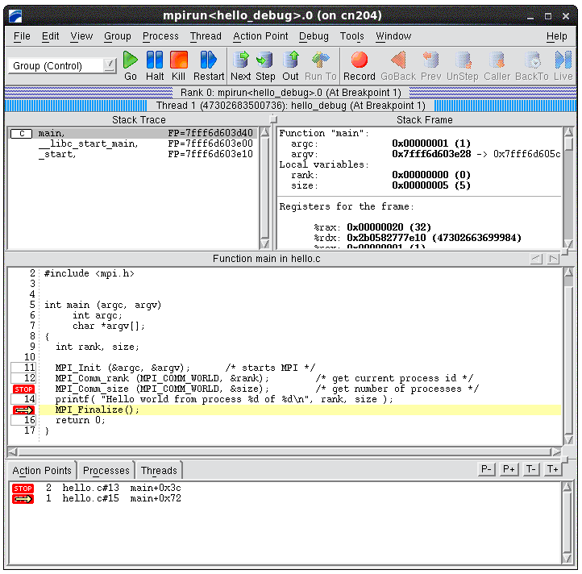

# TotalView

## Introduction

TotalView is a GUI-based source code multi-process, multi-thread debugger.

## Installed Versions

For the current list of installed versions, use:

```console
$ ml av TotalView
```

## License and Limitations for Cluster Users

On the cluster, users can debug OpenMP or MPI code that runs up to 64 parallel processes. This limitation means that 1 user can debug up 64 processes, or 32 users can debug 2 processes, etc.

Debugging of GPU accelerated codes is also supported.

You can check the status of the licenses for [Salomon][a] or [Barbora][b]:

```console
$ cat /apps/user/licenses/totalview_features_state.txt

    # totalview
    # -------------------------------------------------
    # FEATURE                       TOTAL   USED AVAIL
    # -------------------------------------------------
    TotalView_Team                     64      0     64
    Replay                             64      0     64
    CUDA                               64      0     64
```

## Compiling Code to Run With TotalView

### Modules

Load all necessary modules to compile the code. For example:

```console
    ml intel
```

Load the TotalView module:

```console
    ml TotalView
```

Compile the code:

```console
    mpicc -g -O0 -o test_debug test.c
    mpif90 -g -O0 -o test_debug test.f
```

### Compiler Flags

Before debugging, you need to compile your code with theses flags:

!!! note
    `-g` Generates extra debugging information usable by GDB. `-g3` includes additional debugging information. This option is available for GNU, Intel C/C++, and Fortran compilers.

    `-O0` Suppresses all optimizations.

## Starting a Job With TotalView

Be sure to log in with an X window forwarding enabled. This could mean using the `-X` in the `ssh`:

```console
ssh -X username@salomon.it4i.cz
```

Another option is to access the login node using VNC.

From the login node an interactive session with X windows forwarding (`-X` option) can be started by the following command:

```console
$ qsub -I -X -A NONE-0-0 -q qexp -lselect=1:ncpus=24:mpiprocs=24,walltime=01:00:00
```

Then launch the debugger with the totalview command followed by the name of the executable to debug.

### Debugging a Serial Code

To debug a serial code, use:

```console
totalview test_debug
```

### Debugging a Parallel Code - Option 1

To debug a parallel code compiled with **OpenMPI**, you need to setup your TotalView environment:

!!! hint
    To be able to run a parallel debugging procedure from the command line without stopping the debugger in the mpiexec source code, you have to add the following function to your **~/.tvdrc** file.

```console
proc mpi_auto_run_starter {loaded_id} {
    set starter_programs {mpirun mpiexec orterun}
    set executable_name [TV::symbol get $loaded_id full_pathname]
    set file_component [file tail $executable_name]

    if {[lsearch -exact $starter_programs $file_component] != -1} {
        puts "*************************************"
        puts "Automatically starting $file_component"
        puts "*************************************"
        dgo
    }
}

# Append this function to TotalView's image load callbacks so that
# TotalView run this program automatically.

dlappend TV::image_load_callbacks mpi_auto_run_starter
```

The source code of this function can be also found in

```console
$ /apps/all/OpenMPI/1.10.1-GNU-4.9.3-2.25/etc/openmpi-totalview.tcl #Salomon
```

You can also add only following line to your ~/.tvdrc file instead of
the entire function:

```console
$ source /apps/all/OpenMPI/1.10.1-GNU-4.9.3-2.25/etc/openmpi-totalview.tcl #Salomon
```

You need to do this step only once. See also [OpenMPI FAQ entry][c].

Now you can run the parallel debugger using:

```console
$ mpirun -tv -n 5 ./test_debug
```

When the following dialog appears, click on "Yes"



At this point, the main TotalView GUI window will appear and you can insert the breakpoints and start debugging:



### Debugging a Parallel Code - Option 2

Another option to start a new parallel debugging session from a command line is to let TotalView to execute mpirun by itself. In this case, the user has to specify an MPI implementation used to compile the source code.

The following example shows how to start a debugging session with the Intel MPI:

```console
$ ml intel
$ ml TotalView/8.15.4-6-linux-x86-64
$ totalview -mpi "Intel MPI-Hydra" -np 8 ./hello_debug_impi
```

After running the previous command, you will see the same window as shown in the screenshot above.

More information regarding the command line parameters of the TotalView can be foundin the TotalView Reference Guide, Chapter 7: TotalView Command Syntax.

## Documentation

[1] The [TotalView documentation][d] web page is a good source for learning more about some of the advanced TotalView features.

[a]: https://extranet.it4i.cz/rsweb/salomon/license/Totalview
[b]: https://extranet.it4i.cz/rsweb/barbora/license/Totalview
[c]: https://www.open-mpi.org/faq/?category=running#run-with-tv
[d]: http://www.roguewave.com/support/product-documentation/totalview-family.aspx#totalview
