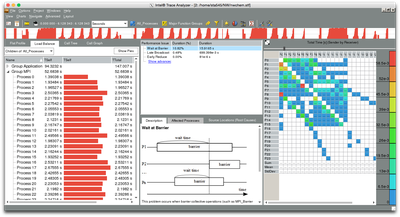

# Intel Trace Analyzer and Collector

## Introduction

Intel Trace Analyzer and Collector (ITAC) is a tool to collect and graphically analyze behavior of MPI applications. It helps you to analyze communication patterns of your application, identify hotspots, perform correctness checking (identify deadlocks, data corruption, etc.), and simulate how your application would run on a different interconnect.

ITAC is an offline analysis tool - first you run your application to collect a trace file, then you can open the trace in a GUI analyzer to view it.

## Installed Versions

For the current list of installed versions, use:

```console
$ ml av itac
```

## Collecting Traces

ITAC can collect traces from applications that are using Intel MPI. To generate a trace, simply add the `-trace` option to your `mpirun` command:

```console
$ ml itac/2020.3.036
$ mpirun -trace myapp
```

The trace will be saved in the myapp.stf file in the current directory.

## Viewing Traces

To view and analyze the trace, open the ITAC GUI in a [graphical environment][1]:

```console
$ ml itac/2020.3.036
$ traceanalyzer
```

The GUI will launch and you can open the produced `*`.stf file.



Refer to the Intel documenation about usage of the GUI tool.

## References

1. [Getting Started with Intel® Trace Analyzer and Collector][a]
1. [Intel® Trace Analyzer and Collector - Documentation][b]

[1]: ../../../general/accessing-the-clusters/graphical-user-interface/x-window-system.md

[a]: https://software.intel.com/en-us/get-started-with-itac-for-linux
[b]: https://software.intel.com/en-us/intel-trace-analyzer
