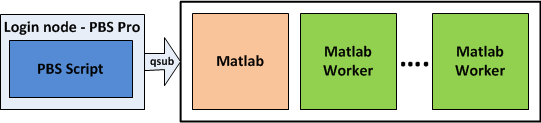

# MATLAB 2013-2014

## Introduction

!!! note
    This document relates to the old versions R2013 and R2014. For MATLAB 2015 use [this documentation instead][1].

MATLAB is available in the latest stable version. There are always two variants of the release:

* Non commercial or so called EDU variant, which can be used for common research and educational purposes.
* Commercial or so called COM variant, which can used also for commercial activities. The licenses for commercial variant are much more expensive, so usually the commercial variant has only subset of features compared to the EDU available.

To load the latest version of MATLAB load the module, use:

```console
$ ml matlab
```

The EDU variant is marked as default. If you need other version or variant, load the particular version. To obtain the list of available versions, use:

```console
$ ml matlab
```

If you need to use the MATLAB GUI to prepare your MATLAB programs, you can use MATLAB directly on the login nodes. However, for all computations, use MATLAB on the compute nodes via the PBS Pro scheduler.

If you require the MATLAB GUI, follow the general information about [running graphical applications][2].

MATLAB GUI is quite slow using the X forwarding built in the PBS (`qsub -X`), so using X11 display redirection either via SSH or directly by `xauth` (see the [GUI Applications on Compute Nodes over VNC][3] section) is recommended.

To run MATLAB with GUI, use:

```console
$ matlab
```

To run MATLAB in text mode, without the MATLAB Desktop GUI environment, use:

```console
$ matlab -nodesktop -nosplash
```

plots, images, etc. will be still available.

## Running Parallel MATLAB Using Distributed Computing Toolbox / Engine

A recommended parallel mode for running parallel MATLAB is the MPIEXEC mode. In this mode, the user allocates resources through PBS prior to starting MATLAB. Once resources are granted, the main MATLAB instance is started on the first compute node assigned to job by PBS and workers are started on all remaining nodes. The user can use both interactive and non-interactive PBS sessions. This mode guarantees that the data processing is not performed on login nodes, but all processing is on compute nodes.



For performance reasons, MATLAB should use system MPI. On our clusters, the supported MPI implementation for MATLAB is Intel MPI. To switch to system MPI, the user has to override default MATLAB setting by creating a new configuration file in its home directory. The path and file name has to be the same as in the following listing:

```matlab
$ vim ~/matlab/mpiLibConf.m

function [lib, extras] = mpiLibConf
%MATLAB MPI Library overloading for Infiniband Networks

mpich = '/opt/intel/impi/4.1.1.036/lib64/';

disp('Using Intel MPI 4.1.1.036 over Infiniband')

lib = strcat(mpich, 'libmpich.so');
mpl = strcat(mpich, 'libmpl.so');
opa = strcat(mpich, 'libopa.so');

extras = {};
```

The system MPI library allows MATLAB to communicate through 40 Gbit/s InfiniBand QDR interconnect instead of a slower 1 Gbit Ethernet network.

!!! note
    The path to MPI library in "mpiLibConf.m" has to match with version of the loaded Intel MPI module. In this example, version 4.1.1.036 of Intel MPI is used by MATLAB and therefore the `impi/4.1.1.036` module has to be loaded prior to starting MATLAB.

### Parallel MATLAB Interactive Session

Once this file is in place, the user can request resources from PBS. The following example shows how to start an interactive session with support for MATLAB GUI. For more information about GUI-based applications, see:

```console
$ xhost +
$ qsub -I -v DISPLAY=$(uname -n):$(echo $DISPLAY | cut -d ':' -f 2) -A NONE-0-0 -q qexp -l select=2:ncpus=16:mpiprocs=16 -l walltime=00:30:00 -l license__matlab-edu__MATLAB=1
```

This qsub command example shows how to run MATLAB with 32 workers in the following configuration: 2 nodes (use 16 cores per node) and 16 workers = `mpiprocs` per node (`-l select=2:ncpus=16:mpiprocs=16`). If the user requires to run smaller number of workers per node then the `mpiprocs` parameter has to be changed.

The second part of the command shows how to request all necessary licenses. In this case, 1 MATLAB-EDU license and 32 Distributed Computing Engines licenses.

Once the access to compute nodes is granted by PBS, the user can load the following modules and start MATLAB:

```console
$ ml matlab/R2013a-EDU
$ ml impi/4.1.1.036
$ matlab &
```

### Parallel MATLAB Batch Job

To run MATLAB in a batch mode, write a MATLAB script, then write a bash jobscript and execute it via the `qsub` command. By default, MATLAB will execute one MATLAB worker instance per allocated core.

```bash
#!/bin/bash
#PBS -A PROJECT ID
#PBS -q qprod
#PBS -l select=2:ncpus=16:mpiprocs=16:ompthreads=1

# change to shared scratch directory
SCR=/scratch/$USER/$PBS_JOBID
mkdir -p $SCR ; cd $SCR || exit

# copy input file to scratch
cp $PBS_O_WORKDIR/matlabcode.m .

# load modules
ml matlab/R2013a-EDU
ml impi/4.1.1.036

# execute the calculation
matlab -nodisplay -r matlabcode > output.out

# copy output file to home
cp output.out $PBS_O_WORKDIR/.
```

This script may be submitted directly to the PBS workload manager via the `qsub` command.  The inputs and MATLAB script are in the matlabcode.m file, outputs in the output.out file. Note the missing .m extension in the `matlab -r matlabcodefile` call, **the .m must not be included**.  Note that the **shared /scratch must be used**. Further, it is **important to include the `quit`** statement at the end of the matlabcode.m script.

Submit the jobscript using qsub:

```console
$ qsub ./jobscript
```

### Parallel MATLAB Program Example

The last part of the configuration is done directly in the user's MATLAB script before Distributed Computing Toolbox is started.

```matlab
sched = findResource('scheduler', 'type', 'mpiexec');
set(sched, 'MpiexecFileName', '/apps/intel/impi/4.1.1/bin/mpirun');
set(sched, 'EnvironmentSetMethod', 'setenv');
```

This script creates a `sched` scheduler object of the type `mpiexec` that starts workers using the `mpirun` tool. To use a correct version of `mpirun`, the second line specifies the path to correct version of the system Intel MPI library.

!!! note
    Every MATLAB script that needs to initialize/use `matlabpool` has to contain these three lines prior to calling the `matlabpool(sched, ...)` function.

The last step is to start `matlabpool` with the `sched` object and a correct number of workers. In this case, `qsub` asked for the total number of 32 cores, therefore the number of workers is also set to `32`.

```console
matlabpool(sched,32);


... parallel code ...


matlabpool close
```

The complete example showing how to use Distributed Computing Toolbox is show here:

```matlab
sched = findResource('scheduler', 'type', 'mpiexec');
set(sched, 'MpiexecFileName', '/apps/intel/impi/4.1.1/bin/mpirun')
set(sched, 'EnvironmentSetMethod', 'setenv')
set(sched, 'SubmitArguments', '')
sched

matlabpool(sched,32);

n=2000;

W = rand(n,n);
W = distributed(W);
x = (1:n)';
x = distributed(x);
spmd
[~, name] = system('hostname')

    T = W*x; % Calculation performed on labs, in parallel.
             % T and W are both codistributed arrays here.
end
T;
whos         % T and W are both distributed arrays here.

matlabpool close
quit
```

You can copy and paste the example in a .m file and execute. Note that the `matlabpool` size should correspond to the **total number of cores** available on allocated nodes.

### Non-Interactive Session and Licenses

If you want to run batch jobs with MATLAB, be sure to request appropriate license features with the PBS Pro scheduler, at least the `-l license__matlab-edu__MATLAB=1` for EDU variant of MATLAB. For more information about how to check the license features states and how to request them with PBS Pro, [look here][4].

In the case of non-interactive session, read the [following information][4] on how to modify the qsub command to test for available licenses prior getting the resource allocation.

### MATLAB Distributed Computing Engines Start Up Time

Starting MATLAB workers is an expensive process that requires certain amount of time. For more information, see the following table:

| compute nodes | number of workers | start-up time[s] |
| ------------- | ----------------- | ---------------- |
| 16            | 256               | 1008             |
| 8             | 128               | 534              |
| 4             | 64                | 333              |
| 2             | 32                | 210              |

[1]: matlab.md
[2]: ../../general/accessing-the-clusters/graphical-user-interface/x-window-system.md
[3]: ../../general/accessing-the-clusters/graphical-user-interface/vnc.md#gui-applications-on-compute-nodes-over-vnc
[4]: ../isv_licenses.md
