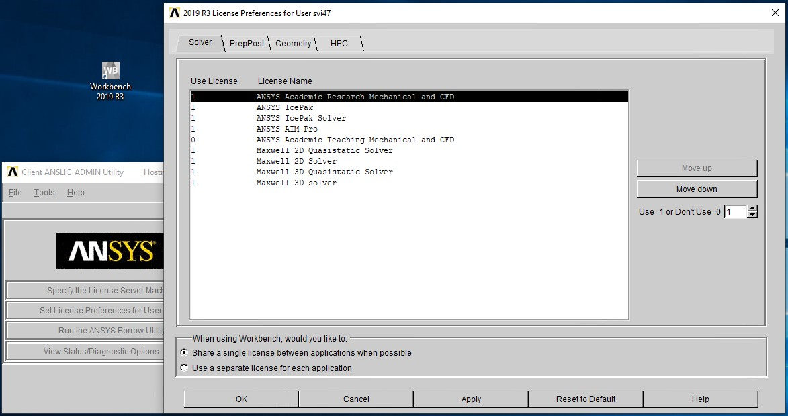

# Licensing and Available Versions

## ANSYS License Can Be Used By:

* all persons in the carrying out of the CE IT4Innovations Project (In addition to the primary licensee, which is VSB - Technical University of Ostrava, users are CE IT4Innovations third parties - CE IT4Innovations project partners, particularly the University of Ostrava, the Brno University of Technology - Faculty of Informatics, the Silesian University in Opava, Institute of Geonics AS CR.)
* all persons who have a valid license
* students of the Technical University

## ANSYS Academic Research

The license intended to be used for science and research, publications, students’ projects (academic license).

## ANSYS COM

The license intended to be used for science and research, publications, students’ projects, and commercial research with no commercial use restrictions.

## Server / Port

lic-ansys.vsb.cz / 1055 (2325)



## Available Versions

* 19.1
* 19.3

``` console
$ ml av ANSYS
---------------- /apps/modules/tools -----------------------
   ANSYS/19.1-intel-2017c (C6)    ANSYS/19.3-intel-2017c (D)

  Where:
   C6:  Old CentOS6 module
   D:   Default Module
```
