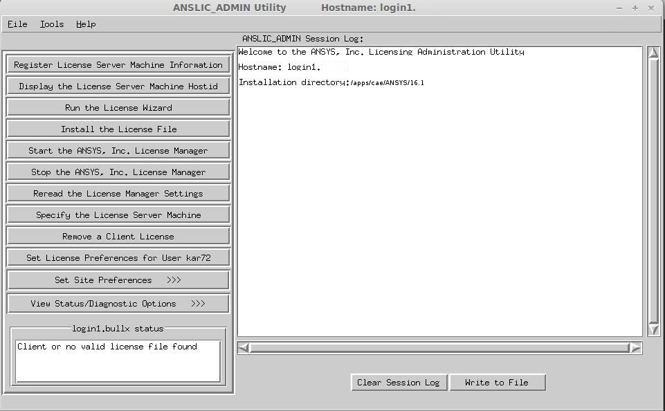
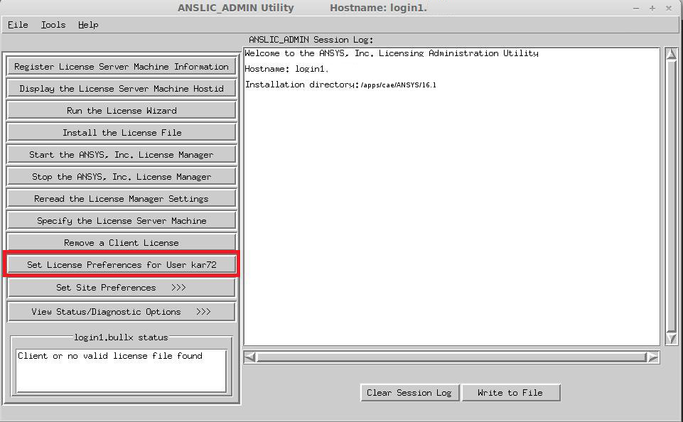
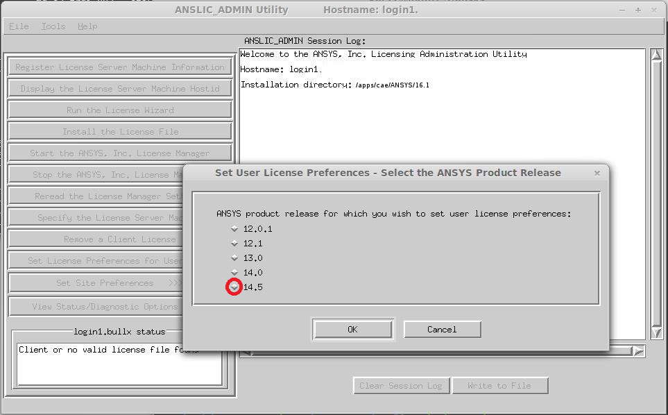
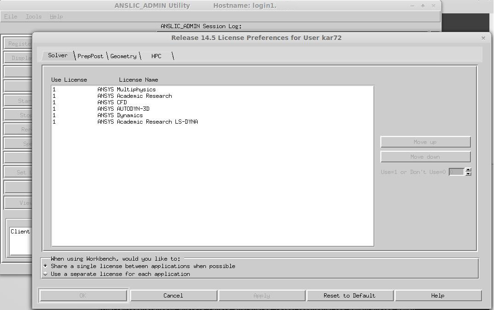

# Setting License Preferences

Some ANSYS tools allow you to explicitly specify usage of academic or commercial licenses in the command line (e.g. ansys161 -p aa_r to select the Academic Research license). However, we have observed that not all tools obey this option and choose the commercial license.

Thus you need to configure preferred license order with ANSLIC_ADMIN. Follow these steps and move the Academic Research license to the top or bottom of the list accordingly.

Launch the ANSLIC_ADMIN utility in a graphical environment:

```console
$ANSYSLIC_DIR/lic_admin/anslic_admin
```

ANSLIC_ADMIN Utility will be run







The ANSYS Academic Research license should be moved up to the top or down to the bottom of the list.


