# In Situ Visualization

## Introduction

In situ visualization allows you to visualize your data while your computation is progressing on multiple nodes of a cluster. It is a visualization pipeline that can be used on the [Salomon][1] supercomputer. The pipeline is based on the [ParaView Catalyst][a] library.

To leverage the possibilities of the in situ visualization by Catalyst library, you have to write an adaptor code that will use the actual data from your simulation and process them in the way they can be passed to ParaView for visualization. We provide a simple example of such simulator/adaptor code that binds together to provide the in situ visualization.

Detailed description of the Catalyst API can be found [here][b]. We restrict ourselves to provide more of an overall description of the code together with specifications for building, and explanation about how to run the code on the cluster.

## Installed Version

For the current list of installed versions, use:

```console
$ ml av CUDA
```

## Usage

All code concerning the simulator/adaptor is available to download from [here][code]. It is a package with the following files: [CMakeLists.txt][cmakelist_txt], [FEAdaptor.h][feadaptor_h], [FEAdaptor.cxx][feadaptor_cxx], [FEDataStructures.h][fedatastructures_h], [FEDataStructures.cxx][fedatastructures_cxx], [FEDriver.cxx][fedriver_cxx], and [feslicescript.py][feslicescript].

After the download, unpack the code:

```console
$ tar xvf package_name
```

Then use CMake to manage the build process, but before that, load the appropriate modules (`CMake`, `ParaView`):

```console
$ ml CMake ParaView/5.6.0-intel-2017a-mpi
```

This module set also loads a necessary Intel compiler within the dependencies:

```console
$ mkdir build
$ cd build
$ cmake ../
```

Now you can build the simulator/adaptor code by using `make`:

```console
$ make
```

It will generate the CxxFullExampleAdaptor executable file. This will be later run together with ParaView and it will provide the in situ visualization example.

## Code Explanation

The provided example is a simple MPI program. Main executing part is written in FEDriver.cxx. It is simulator code that creates computational grid and performs simulator/adaptor interaction (see below).

Dimensions of the computational grid in terms of number of points in x, y, z directions are supplied as input parameters to the `main` function (see lines 22-24 in the code below). Based on the number of MPI ranks, each MPI process creates a different part of the overall grid. This is done by grid initialization (see line 30). The respective code for this is in FEDataStructures.cxx. The parameter nr. 4 in `main` is for the name of the Python script (we use feslicescript.py). It sets up the ParaView-Catalyst pipeline (see line 36). The simulation starts by linearly progressing the `timeStep` value in the `for` loop. Each iteration of the loop upates the grid attributes (Velocity and Pressure) by calling the `UpdateFields` method from the `Attributes` class. Next in the loop, the adaptor's `CoProcess` function is called by using actual parameters (`grid`, `time`). To provide some information about the state of the simulation, the actual time step is printed together with the name of the processor that handles the computation inside the allocated MPI rank. Before the loop ends, appropriate sleep time is used to give some time for visualization to update. After the simulation loop ends, clean up is done by calling the `Finalize` function on adaptor and `MPI_Finalize` on MPI processes.

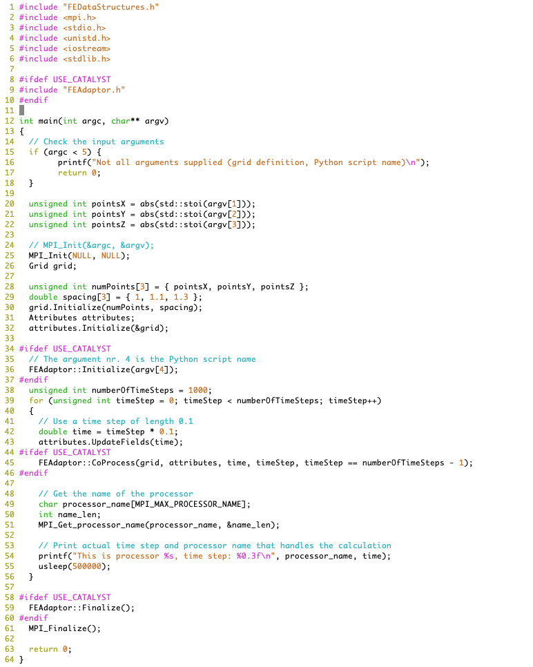

Adaptor's initialization performs several necessary steps, see the code below. It creates vtkCPProcessor using the Catalyst library and adds a pipeline to it. The pipeline is initialized by the reffered Python script:

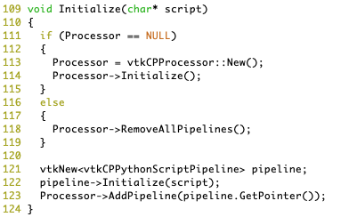

To initialize the Catalyst pipeline, we use the feslicescript.py Python script. You enable the live visualization in here and set the proper connection port. You can also use another commands and functions to configure it for saving the data during the visualization or another tasks that are available from the ParaView environment. For more details, see the [Catalyst guide][catalyst_guide].

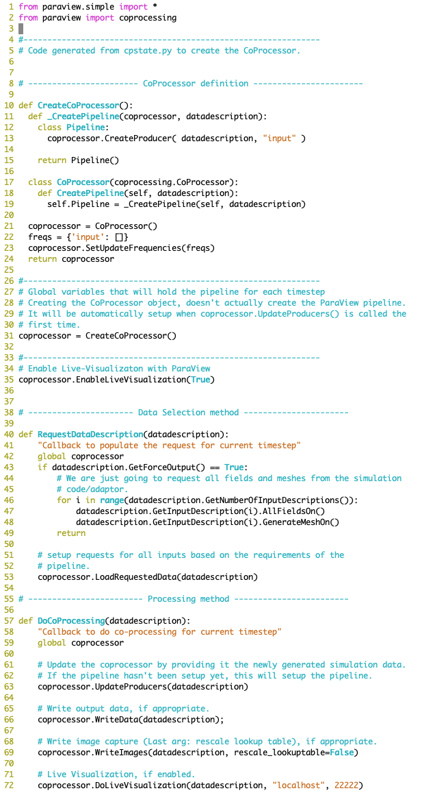

The `UpdateFields` method from the `Attributes` class updates the `velocity` value in respect to the value of `time` and the value of `setting` which depends on the actual MPI rank, see the code below. This way, different processes can be visually distinguished during the simulation.

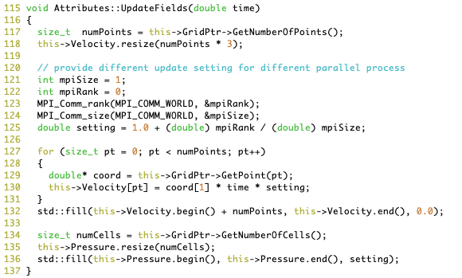

As mentioned before, further in the simulation loop, the adaptor's `CoProcess` function is called by using actual parameters of the `grid`, `time`, and `timeStep`. In the function, proper representation and description of the data is created. Such data is then passed to the Processor that has been created during the adaptor's initialization. The code of the `CoProcess` function is shown below.

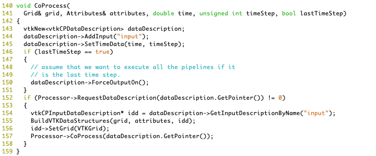

### Launching the Simulator/Adaptor With ParaView

To launch ParaView, you have two standard options on Salomon. You can run ParaView from your local machine in client-server mode by following the information [here][2] or you can connect to the cluster using VNC and the graphical environment by following the information on [VNC][3]. In both cases, we will use ParaView version 5.6.0 and its respective module.

Whether you use the client-server mode or VNC for ParaView, you have to allocate some computing resources. This is done by the console commands below (supply valid Project ID).

For the client-server mode of ParaView we allocate the resources by

```console
$ qsub -I -q qprod -A PROJECT-ID -l select=2
```

In the case of VNC connection, we use X11 forwarding by the `-X` option to allow the graphical environment on the interactive session:

```console
$ qsub -IX -q qprod -A PROJECT-ID -l select=2
```

The issued console commands launch the interactive session on 2 nodes. This is the minimal setup to test that the simulator/adaptor code runs on multiple nodes.

After the interactive session is opened, load the `ParaView` module:

```console
$ ml ParaView/5.6.0-intel-2017a-mpi
```

When the module is loaded and you run the client-server mode, launch the mpirun command for pvserver as used in the description for [ParaView client-server][2] but also use the `&` sign at the end of the command. Then you can use the console later for running the simulator/adaptor code. If you run the VNC session, after loading the ParaView module, set up the environmental parameter for correct keyboard input and then run the ParaView in the background using the `&` sign.

```console
$ export QT_XKB_CONFIG_ROOT=/usr/share/X11/xkb
$ paraview &
```

If you have proceeded to the end in the description for the ParaView client-server mode and run ParaView localy or you have launched ParaView remotely using VNC the further steps are the same for both options. In the ParaView, go to the *Catalyst* -> *Connect* and hit *OK* in the pop up window asking for the connection port. After that, ParaView starts listening for incomming data to the in situ visualization.

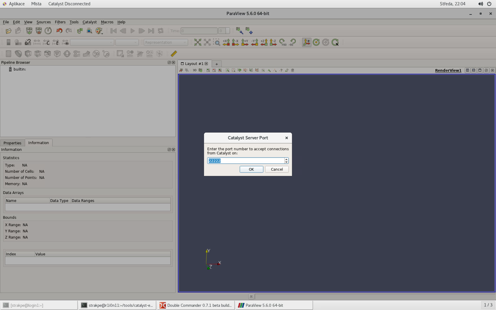

Go to your build directory and run the built simulator/adaptor code from the console:

```console
mpirun -n 2 ./CxxFullExample 30 30 30 ../feslicescript.py
```

The programs starts to compute on the allocated nodes and prints out the response:

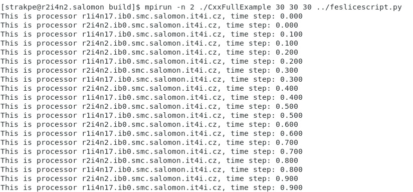

In ParaView, you should see a new pipeline called *input* in the *Pipeline Browser*:

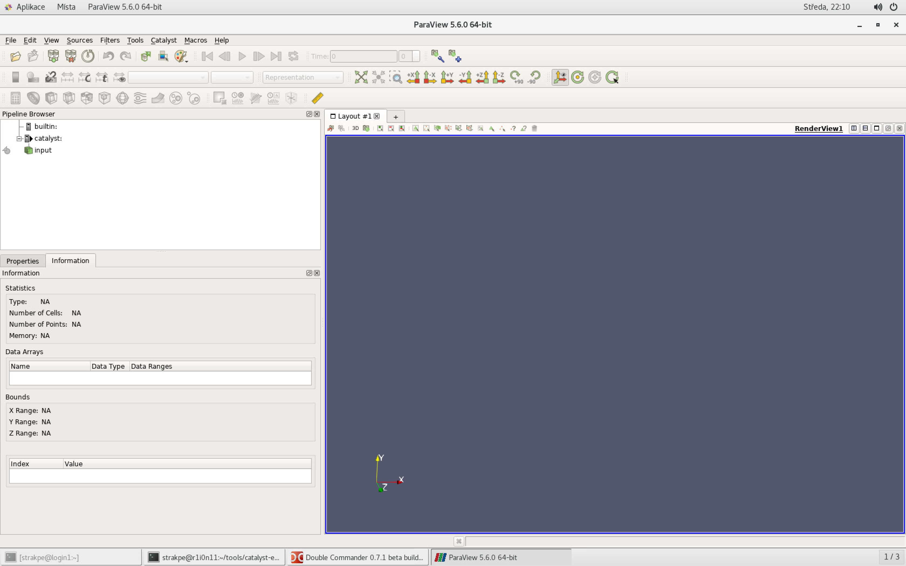

By clicking on it, another item called *Extract: input* is added:

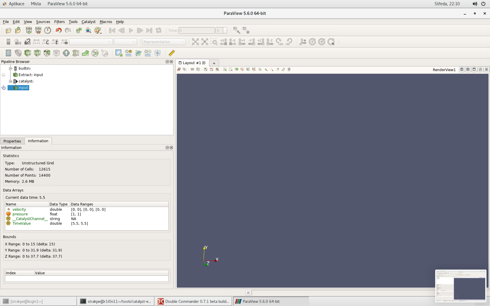

If you click on the eye icon to the left of the *Extract: input* item, the data will appear:


To visualize the velocity property on the geometry, go to the *Properties* tab and choose *velocity* instead of *Solid Color* in the *Coloring* menu:

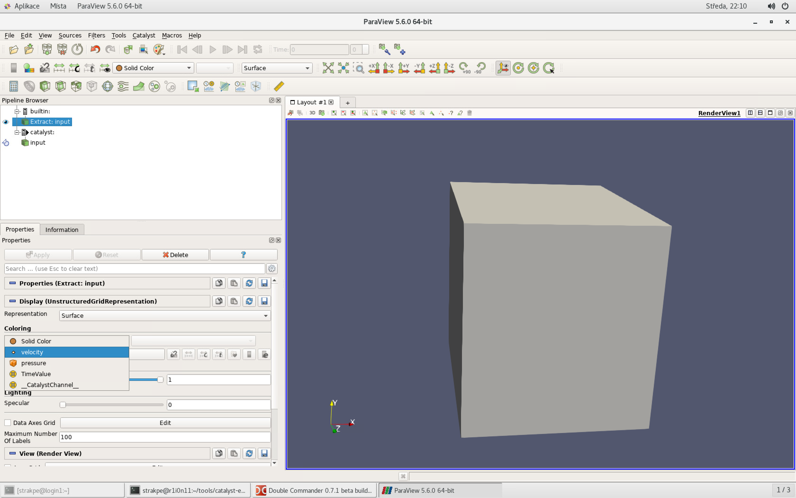

The result will look like in the image below, where different domains dependent on the number of allocated resources can be seen and they will progress through the time:

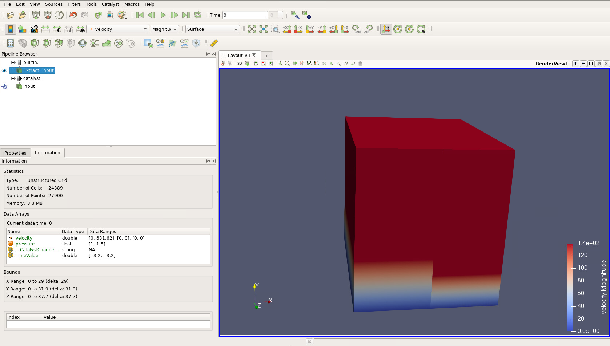

### Cleanup

After you finish the in situ visualization, you should provide a proper cleanup.

Terminate the simulation if it is still running.

In the VNC session, close ParaView and the interactive job. Close the VNC client. Kill the VNC Server as described [here][3].

In the client-server mode of ParaView, disconnect from the server in ParaView and close the interactive job.

[1]: ../../../salomon/introduction/
[2]: ../paraview/
[3]: ../../../general/accessing-the-clusters/graphical-user-interface/vnc/

[a]: https://www.paraview.org/in-situ/
[b]: https://www.paraview.org/files/catalyst/docs/ParaViewCatalystUsersGuide_v2.pdf
[c]: http://www.paraview.org/

[code]: insitu/insitu.tar.gz
[cmakelist_txt]: insitu/CMakeLists.txt
[feadaptor_h]: insitu/FEAdaptor.h
[feadaptor_cxx]: insitu/FEAdaptor.cxx
[fedatastructures_h]: insitu/FEDataStructures.h
[fedatastructures_cxx]: insitu/FEDataStructures.cxx
[fedriver_cxx]: insitu/FEDriver.cxx
[feslicescript]: insitu/feslicescript.py
