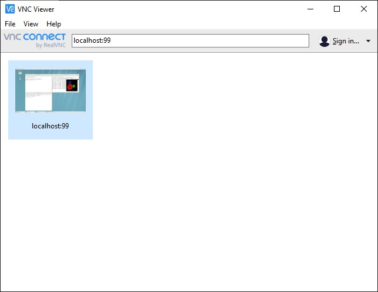
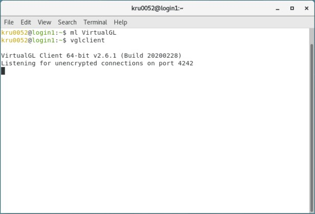
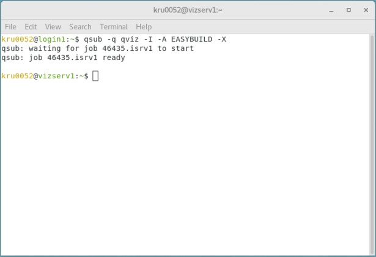
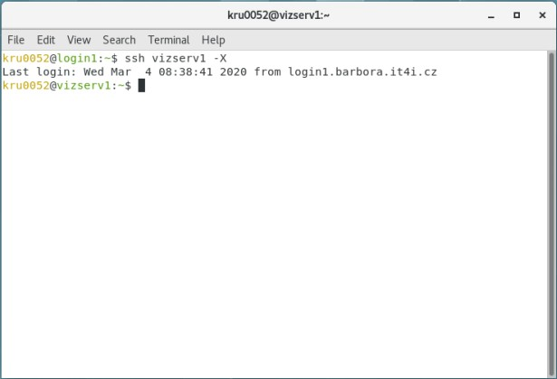
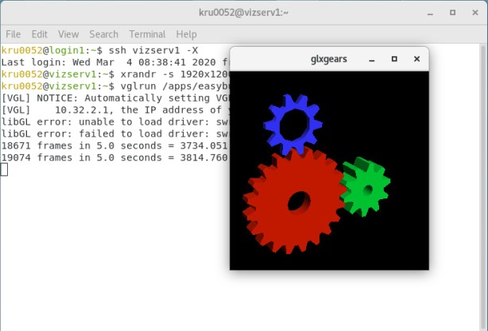

# VirtualGL

VirtualGL is an open source program that redirects the 3D rendering commands from Unix and Linux OpenGL applications to 3D accelerator hardware in a dedicated server and displays the rendered output interactively to a thin client located elsewhere on the network.

See the documentation [here][a].

!!! info
    VirtualGL is available on Barbora and Salomon.

## How to Use

**Run VNC**

* VNC Server

Read our documentation on [VNC server][1].

```console
Warning: No xauth data; using fake authentication data for X11 forwarding.
Last login: Tue Mar  3 14:20:18 2020 from vpn-kru0052.it4i.cz
                  ____             _
                 |  _ \           | |
                 | |_) | __ _ _ __| |__   ___  _ __ __ _
                 |  _ < / _` | '__| '_ \ / _ \| '__/ _` |
                 | |_) | (_| | |  | |_) | (_) | | | (_| |
                 |____/ \__,_|_|  |_.__/ \___/|_|  \__,_|


                  ...running on Red Hat Enterprise Linux 7.x

kru0052@login1:~$ vncserver :99

New 'login1.barbora.it4i.cz:99 (kru0052)' desktop is login1.barbora.it4i.cz:99

Starting applications specified in /home/kru0052/.vnc/xstartup
Log file is /home/kru0052/.vnc/login1.barbora.it4i.cz:99.log

kru0052@login1:~$
```

* VNC Client (your local machine)

```console
root@toshiba:~# ssh -L 5999:localhost:5999 kru0052@login1.barbora.it4i.cz -X
```

* Connect to a VNC server from a VNC client (your local machine)

```console
vncviewer localhost:99

```

Or via GUI.



!!! tip
    To resize the window scale, use the `xrandr -s 1920x1200` command.

**Run vglclient on the login server (use the terminal in the local machine VNC window)**

```console
kru0052@login1:~$ ml VirtualGL
kru0052@login1:~$ vglclient

VirtualGL Client 64-bit v2.6.1 (Build 20200228)
Listening for unencrypted connections on port 4242

```



**Execute an interactive job on vizserv (use another terminal in the local machine VNC window)**

```console
kru0052@login1:~$ qsub -q qviz -I -A EASYBUILD -X
qsub: waiting for job 44781.isrv1 to start
qsub: job 44781.isrv1 ready

kru0052@vizserv1:~$
```



**New SSH connection on vizserv - elimination of the PBS setting (use another terminal in the local machine VNC window)**

```console
kru0052@login1:~$ ssh vizserv1 -X
Last login: Tue Mar  3 13:54:33 2020 from login1.barbora.it4i.cz
kru0052@vizserv1:~$
```



**Run the graphical application**

```console
kru0052@vizserv1:~$ vglrun /apps/easybuild/glxgears
[VGL] NOTICE: Automatically setting VGL_CLIENT environment variable to
[VGL]    10.32.2.1, the IP address of your SSH client.
libGL error: unable to load driver: swrast_dri.so
libGL error: failed to load driver: swrast
17128 frames in 5.0 seconds = 3425.573 FPS
17251 frames in 5.0 seconds = 3450.128 FPS
...
```



## Examples for Remote Visualization on Barbora Cluster

<div align="center">
  <iframe  width="854" height="480" src="https://www.youtube.com/embed/BArIbIC_-24"></iframe>
</div>

[1]: ../../../general/accessing-the-clusters/graphical-user-interface/vnc/

[a]: https://www.virtualgl.org/
