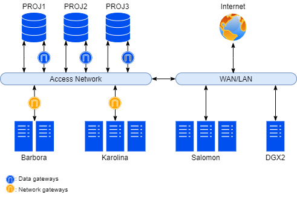

# PROJECT Data Storage

The PROJECT data storage is a central storage for projects'/users' data on IT4Innovations.
The PROJECT data storage is accessible from all IT4Innovations clusters and allows to share data amongst clusters.
The storage is intended to be used throughout the whole project's lifecycle.

## Technical Overview

The PROJECT storage consists of three equal file storages (blocks) called PROJ1, PROJ2, and PROJ3.
Each file storage implements GPFS file system exported via NFS protocol using three NFS servers.
File storages provide high-availability and redundancy.



| Specification     | Total              | Per Block           |
| ----------------- | -------------------|-------------------- |
| Protocol          | NFS over GPFS                            |
| Total capacity    | 15PB               | 5PB                 |
| Throughput        | 39GB/s             | 13GB/s              |
| IO Performance    | 57kIOPS            | 19kIOPS             |

## Accessing PROJECT

All aspects of allocation, provisioning, accessing, and using the PROJECT storage are driven by project paradigm.
Storage allocation and access to the storage are based on projects (i.e. computing resources allocations) and project membership.

A project directory (actually implemented as an independent fileset) is created for every active project.
Default limits (quotas), default file permissions, and ACLs are set.
The project directory life cycle strictly follows the project's life cycle.
The project directory is removed after the project's data expiration.

### POSIX File Access

!!!note "Mountpoints"
    PROJECT file storages are accessible at mountpoints `/mnt/proj1`, `/mnt/proj2`, and `/mnt/proj3`.

The PROJECT storage can be accessed via the following nodes:

| Cluster       | Node(s)                       |
| ------------- | ----------------------------- |
| Salomon       | Login                         |
| Barbora       | Login, Compute, Visualization |

To show the path to your project's directory on the PROJECT storage, use the `it4i-get-project-dir` command:

```console
$ it4i-get-project-dir OPEN-XX-XX
/mnt/proj3/open-XX-XX
```

### Project Quotas

The PROJECT storage enforces limits (quotas) on projects' usage (used capacity and allocated inodes).
Default quotas for capacity and amount of inodes per project are set by IT4Innovations.

| Project default quota |        |
| --------------------- | ------ |
| Space quota           | 20TB   |
| Inodes quota          | 5 mil. |

You can check the actual usage of the PROJECT storage (e.g. location of project directory, used capacity, allocated inodes, etc.) by executing the `it4ifsusage` command from the Login nodes' command line. The command lists all projects associated with the user.

```console
[vop999@login1.barbora ~]$ it4ifsusage
Type           Cluster / PID    File System    Space used    Space limit    Entries used    Entries limit    Last update
-------------  ---------------  -------------  ------------  -------------  --------------  ---------------  -------------------
User Quota     barbora          /home          11.1 MB       25.0 GB        122             500,000          2021-03-17 10:50:10
User Quota     salomon          /home          407.0 MB      250.0 GB       5,522           500,000          2021-03-17 11:20:09
User Quota     barbora          /scratch       256.5 GB      10.0 TB        169             10,000,000       2021-03-17 10:50:26
User Quota     salomon          /scratch       3.7 TB        100.0 TB       212,252         10,000,000       2021-03-17 11:21:11
User Quota     salomon          /scratch/temp  3.1 TB        N/A            50.328                           2021-03-17 11:21:27
User Quota     salomon          /scratch/work  2.8 TB        N/A            207,594                          2021-03-17 11:21:19
Project Quota  open-XX-XX       proj1          3.9 TB        20.0 TB        212,377         5,000,000        2021-03-17 11:20:02
Project Quota  open-YY-YY       proj3          9.5 MB        20.0 TB        182             5,000,000        2021-03-17 11:20:02
Project Quota  open-ZZ-ZZ       proj2          844.4 GB      20.0 TB        797             5,000,000        2021-03-17 11:20:03
```

The information can also be found in IT4Innovations' [SCS information system][b].

!!!note
    At this time, only PIs can see the quotas of their respective projects in IT4Innovations' SCS information system.
    We are working on making this information available to all users assigned to their projects.

#### Lifting Project Quotas

It is preferred that you request additional storage space allocation in advance in you application for computational resources.
Alternatively, if the project is already active, contact [IT4I support][a].

### ACL and File Permissions

Access to a project directory and containing files is restricted by Unix file permissions and file access control lists (ACLs).
Default file permissions and ACLs are set by IT4Innovations during project directory provisioning.

## Backup and Safety

!!!important "Data Backup"
    Data on the PROJECT storage is **not** backed up.

The PROJECT storage utilizes fully redundant design, redundant devices, highly available services, data redundancy, and snapshots. For increased data protection, disks in each disk array are connected in Distributed RAID6 with two hot-spare disks, meaning the disk array can recover full redundancy after two simultaneous disk failures.

However, the storage does not provide data backup, so we strongly recommend using the [CESNET storage][1] for making independent copies of your data.

### Snapshots

The PROJECT storage provides snapshot functionality. A snapshot represents a state of a filesystem at a particular point in time. Snapshots are created for all projects on fileset (i.e. project directory) level.
Snapshots are created every day, snapshots older than seven days are deleted.

Files in snapshots are accessible directly by users in the special subdirectory of each project directory named `.snapshots`.
Snapshots are read-only.

Snapshots' names have the `YYYY-MM-DD-hhmmss` format.

```console
[vop999@login1.salomon ~]# ls -al /mnt/proj3/open-XX-XX/.snapshots
total 4
dr-xr-xr-x.  2 root  root       4096 led 14 12:14 .
drwxrws---. 16 vop999 open-XX-XX 4096 led 20 16:36 ..
drwxrws---. 16 vop999 open-XX-XX 4096 led 20 16:36 2021-03-01-022441
drwxrws---. 16 vop999 open-XX-XX 4096 led 20 16:36 2021-03-02-022544
drwxrws---. 16 vop999 open-XX-XX 4096 led 20 16:36 2021-03-03-022949
drwxrws---. 16 vop999 open-XX-XX 4096 led 20 16:36 2021-03-04-023454
drwxrws---. 16 vop999 open-XX-XX 4096 led 20 16:36 2021-03-05-024152
drwxrws---. 16 vop999 open-XX-XX 4096 led 20 16:36 2021-03-06-020412
drwxrws---. 16 vop999 open-XX-XX 4096 led 20 16:36 2021-03-07-021446
```

<! --- (HA data replication?) -->
<! --- (balancing in case of overload (data migration?) -->

## Computing on PROJECT

!!!important "I/O Intensive Jobs"
    Stage files for intensive I/O calculations onto the SCRATCH storage.

The PROJECT storage is not primarily intended for computing and it is strongly recommended to avoid using it directly for computing in majority of cases.

On the other hand, the PROJECT storage is accessible from compute nodes and can be used for computing jobs with low I/O demands,
when copying data to other storage for computing is not feasible or efficient.
However, be aware of overloading the storage, as this will result in degraded performance for other users of the PROJECT storage or its unavailability.

For maximum performance, you should always copy the files of I/O intensive jobs onto the SCRATCH storage.
The files should be copied to SCRATCH from Login nodes before submitting the job.

<! --- See also: data storage policy on filesystems (link?) -->

<! --- ## Technical Specification -->

<! --- For a detailed technical specification, see the Technical Specification section. -->

## Summary

| PROJECT Storage      |                     |
| -------------------- | ------------------- |
| Mountpoint           | /mnt/proj{1,2,3}    |
| Capacity             | 15PB                |
| Throughput           | 39GB/s              |
| IO Performance       | 57kIOPS             |
| Default project space quota  | 20TB        |
| Default project inodes quota | 5 mil.      |

[1]: ../storage/cesnet-storage.md

[a]: mailto:support@it4i.cz
[b]: https://scs.it4i.cz/projects
