## Running Ansys

If not already logged, log to [rancher.cloud.e-infra.cz](https://rancher.cloud.e-infra.cz), see [Rancher](/containers-compute/rancher) section.

Following the steps below, you can run Ansys application. This application has persistent home directory, it means, that if you delete the application and later install the application again preserving its name, content of home directory will be preserved. It also possible to connect some storage from e-infra.

### Notes

* Default project had quota limit for 12 guaranteed CPUs and quota for 16 CPUs limit. Do not select more than 10 guaranteed CPUs and more than 14 CPUs limit. If needed more just [ask](mailto:k8s@ics.muni.cz). This may be increased in future so request for more CPUs can be made. 

* If you do not select `Customize Helm options before install` in **Install the Application** step, installation appears to fail but actually it works after some longer time.

### Select Application to Run

Ensure, you did not select any namespace and see `Only User Namespaces` (1) at the top of the Rancher page.

Navigate through `App & Marketplace` (2), `Charts` (3), limit charts only to `cerit-sc` (4) and select `Ansys` (5). See screenshot below.

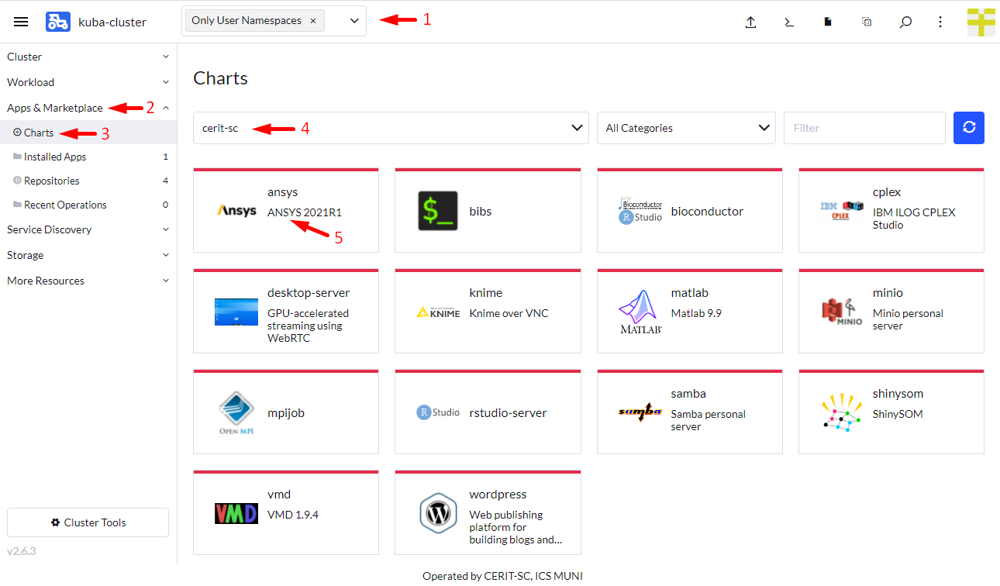

### Select Version of the Application

When you click on the chart, you can select version of application as shown below. Select `Chart Version`, you find exact Ansys version under `Application Version`. Versions can vary in time. Hit `Install` to continue.

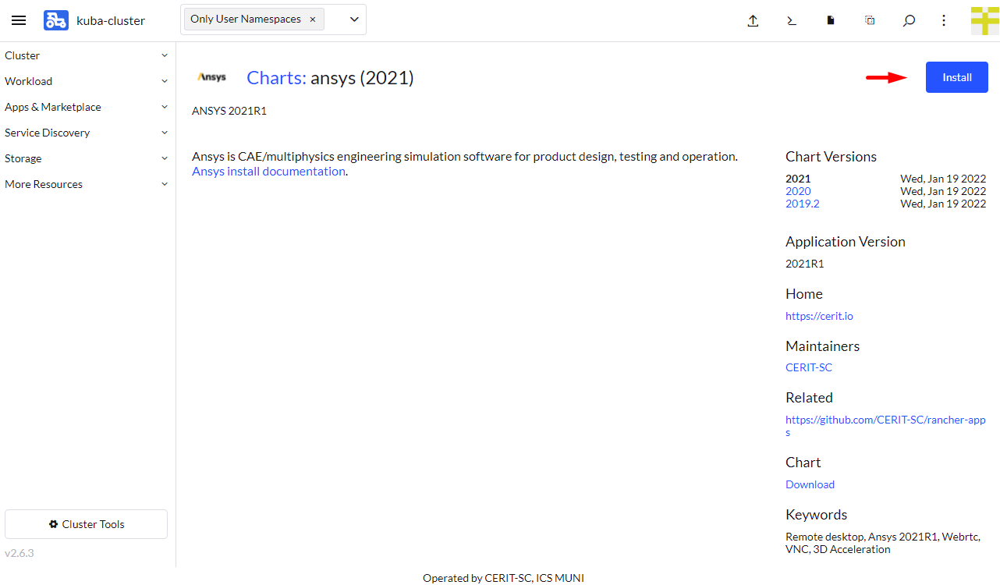

### Install the Application

Now you can install the Ansys application. In most cases, keep both `Namespace` (1) and `Name` (2) intact, but select `Customize Helm options before install` (3), however, you can select namespace as desired except `default`. The `default` namespace is available but it is not meant to be used. The `Name` will be in URL to access the application. The `Name` must be unique in the `Namespace`, i.e., you cannot run two or more instances with the same `Name` in the same `Namespace`. If you delete the application and later install the application again preserving its `Name`, content of home directory will be preserved. 

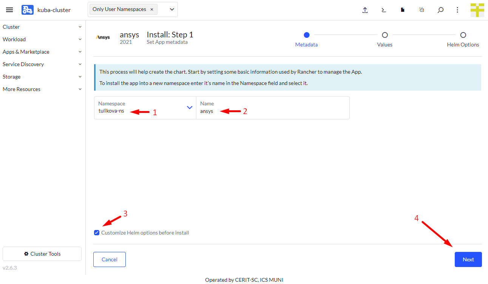

In the first part of the form, you select access display method. [VNC]((https://cs.wikipedia.org/wiki/Virtual_Network_Computing) method is default. You will need some vncview program [realvnc](https://www.realvnc.com/en/connect/download/viewer/) or `vncviewer` on most Linux distribution. On MacOS, just type `vnc://host` into the Safari browser, replace `host` according to instructions below. Do not hit `Install` until the form is completed. Using *VNC*, only software drawing is available, no 3D acceleration is possible.

If VNC is not selected, *WEBRTC* method is used. This option is still in beta version and not ready for production use, however, full 3D OpenGL acceleration is available.

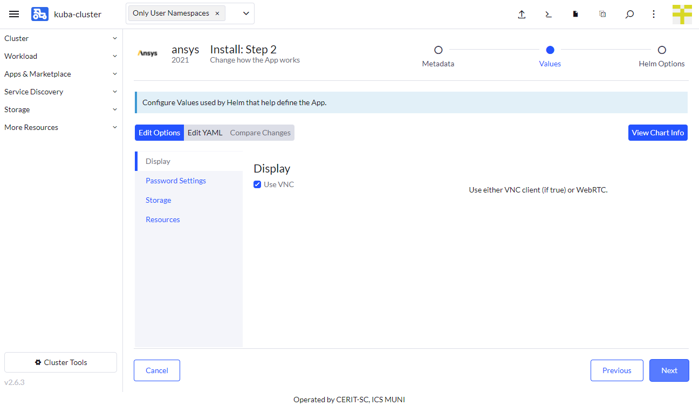

In the second part of the form, you select `password`. This password is used to login through VNC. If VNC is not selected, you need to fill also `username`, these credentials will be used in the browser to attach to the *WEBRTC* session.

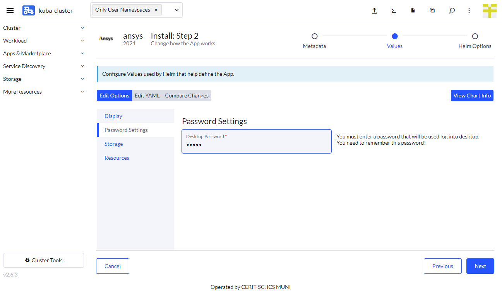

In the third part of the form, you select if you desire persistent home, i.e., home that will be preserved even if you uninstall the application. Note: persistent home is bound with application name from the very beginning of install form. It means, if you set name to `ansys`, persistent home will be bound with name `ansys`. If you select the name `ansys-0` next time, you get new home that is bound with the name `ansys-0`.

In this part, you can select **e-infra** storage to connect to the application. If you check `External Storage`, few more options appear. You can select storage and access credentials. Currently, only `storage-brno12-cerit.metacentrum.cz` is supported. Username is e-infra ([metacentrum](https://metavo.metacentrum.cz/)) login and password **is not** Metacentrum password, but different set by administrator, [ask](mailto:k8s@ics.muni.cz) if you need to set. We are preparing more convenient way. This storage is mounted to `/storage` directory.

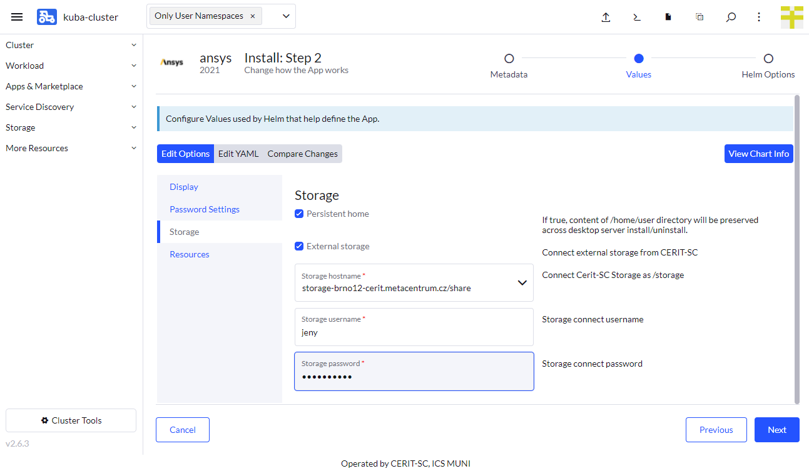

In the fourth part  of the form, you can select requested resources. This step is optional. `Minimum` CPU or RAM is guaranteed amount of CPU and RAM, system reserves these resources for the application. However, the application can exceed guaranteed resources up to `Maximum`. However, in this case, resources are not exclusive and can be shared among other applications. If the application exceeds `Maximum` CPU, it gets limited, if it exceeds `Maximum` RAM, it gets terminated (you will see OOMKill report) and restarted. See note above about maximum values.

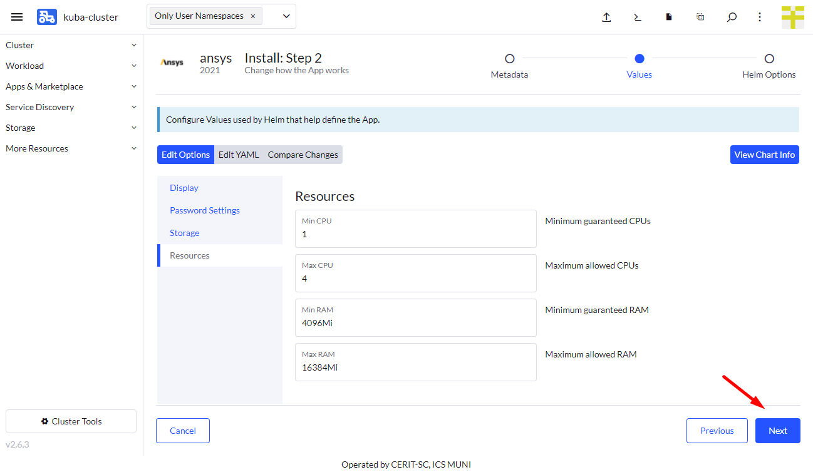

In the fifth part of the form, select timeout 1200 seconds, this is due to really large Ansys images. Finally, hit `Install`.

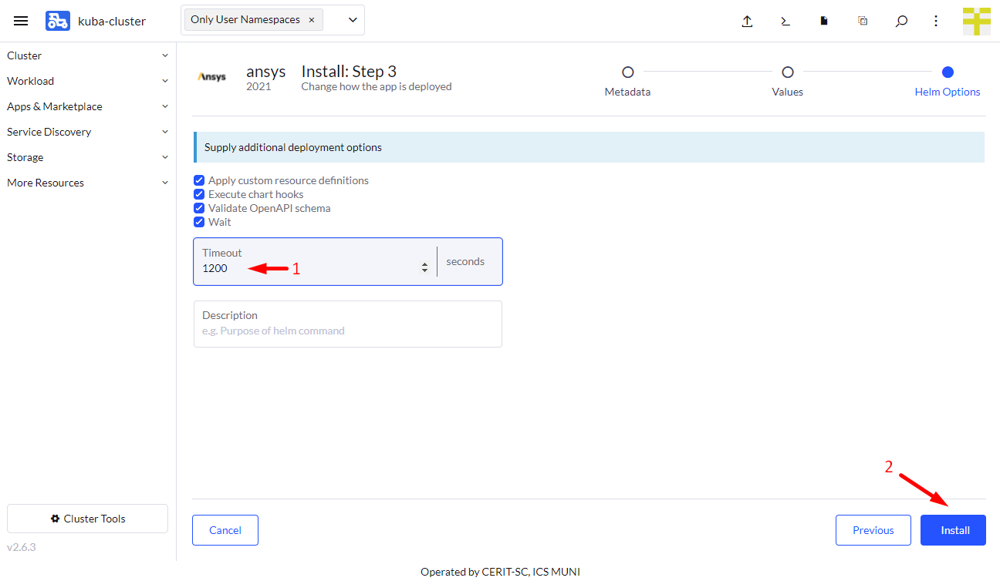

### Wait for Application to Start

When you hit `Install`, you will see installation log. Once you see `SUCCESS` (see screenshot below), the application is running. 

#### Notes

* It can take some time before application is ready as it downloads 20GB docker container, if it is not already cached, first start can tak up to 20 minutes.
* If filled password was not correct, it will be pending indefinitely. In such a case, delete application and start over.

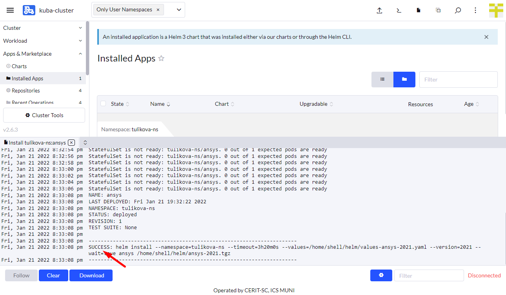

### Connect to the Running Instance

Once the application is running, for *VNC* version, navigate through `Service Discovery` (1) and `Services` (2), hover with mouse over `Target` (3) and depending on used browser, you should see target URL (4). Chrome browser shows it in the lower left corner. This is IP and port you need to pass to your `vncviewer` application or fill into the Safari navigation bar, e.g., `vnc://147.251.253.246`.

In case of *WEBRTC*, instead of `Services`, navigate to `Ingresses` (5) and you will see full URL to click on to start the *WEBRTC* connection.

*VNC* client will ask for the password. Type the password from the form. *WEBRTC* connection will ask for the username and password, those **are not** metacentrum username and password but the ones from the beginning of the form.

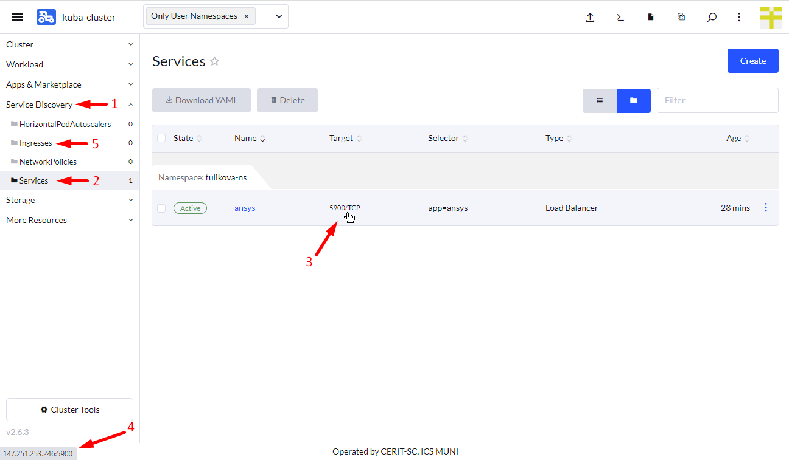

## Ansys

On the first login, desktop will look like this:
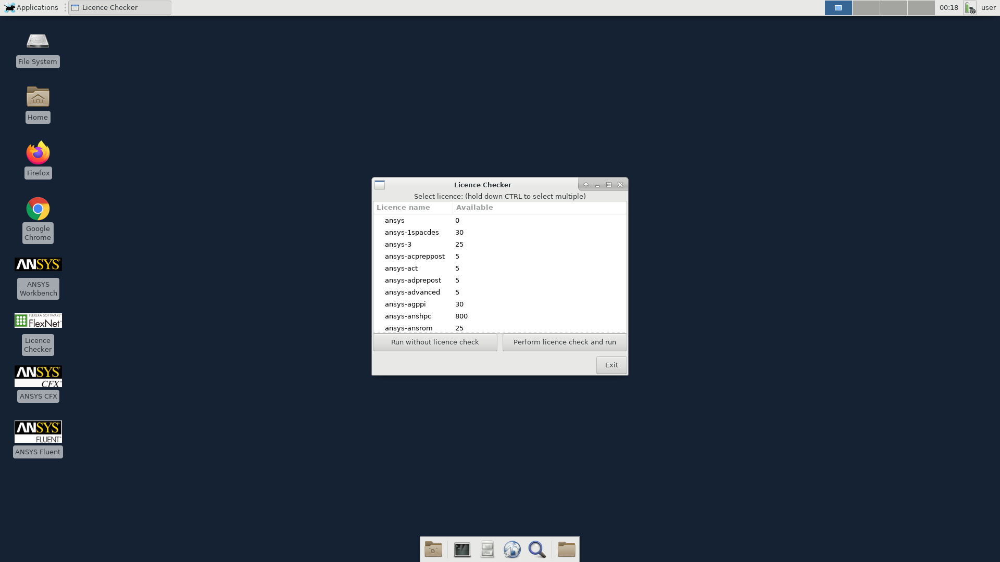

You see `licence checker` that is made to check available Ansys licences. You can select which licences you want to use. If there are no free licences, it will check periodically and once the licence is free, it will start fluent. Alternatively, you can start other part of Ansys using icons on desktop or using terminal.

## Delete Running Instance

If you feel you do not need the application anymore, you can delete it. Just navigate to `App & Marketplace` (1), `Installed Apps` (2), select the application (3) and hit `Delete` (4). The data in home directory is not deleted in case you check persistent home. Running the application again with the same `Name` restores access to the home directory folder.

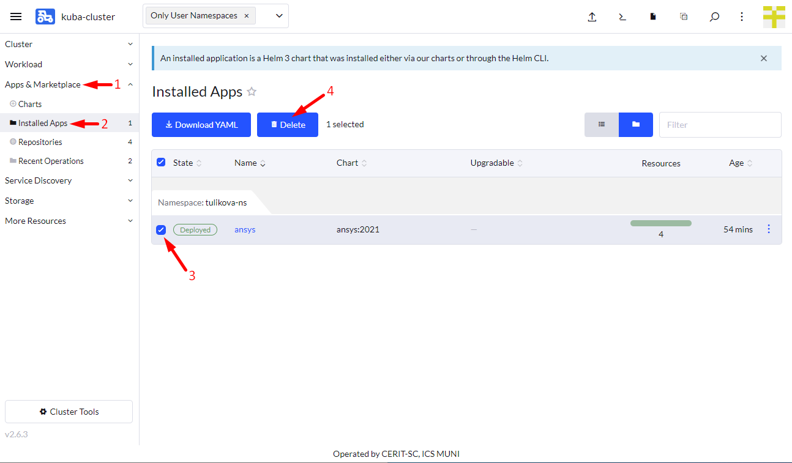
