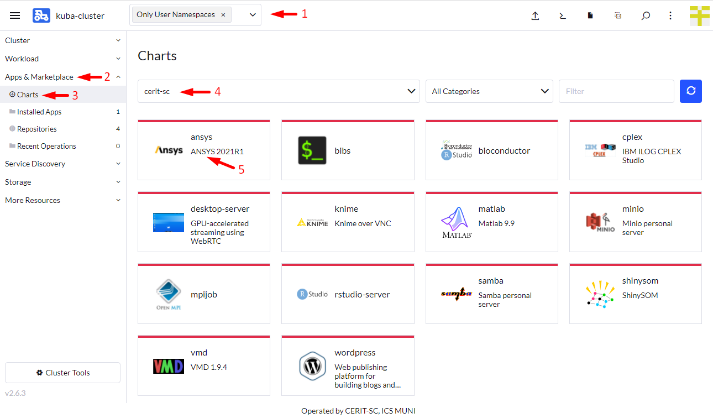

We prepared various applications that can be run as described in the next sections. Selection of application to run is common to all of them, follow the steps below to start them.

### Notes

* Default project had quota limit for 20 guaranteed CPUs and quota for 32 CPUs limit. Do not select more than 18 guaranteed CPUs and more than 28 CPUs limit. If needed more just [ask](mailto:k8s@ics.muni.cz). This may be increased in future so request for more CPUs can be made. 

* If you do not select `Customize Helm options before install` in **Install the Application** step, installation appears to fail but actually it works after some longer time.

### Select Application to Run

Ensure, you did not select any namespace and see `Only User Namespaces` (1) at the top of the Rancher page.

Navigate through `App & Marketplace` (2), `Charts` (3), limit charts only to `cerit-sc` (4) and select `Ansys` (5). See screenshot below, which is example of *Ansys* aplication to run.

The next sections explain in details how to run particular application.
