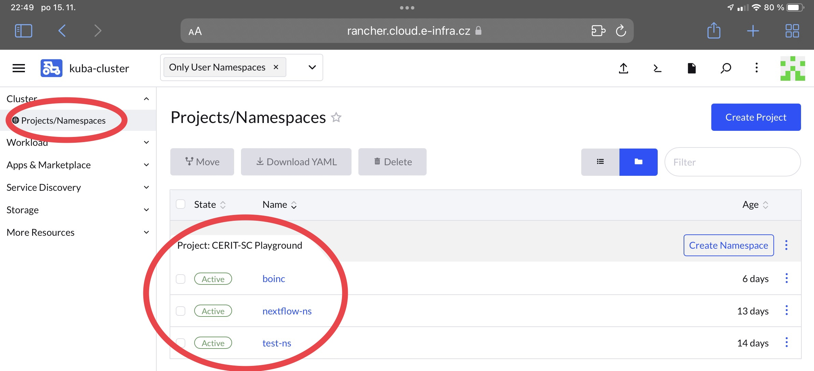
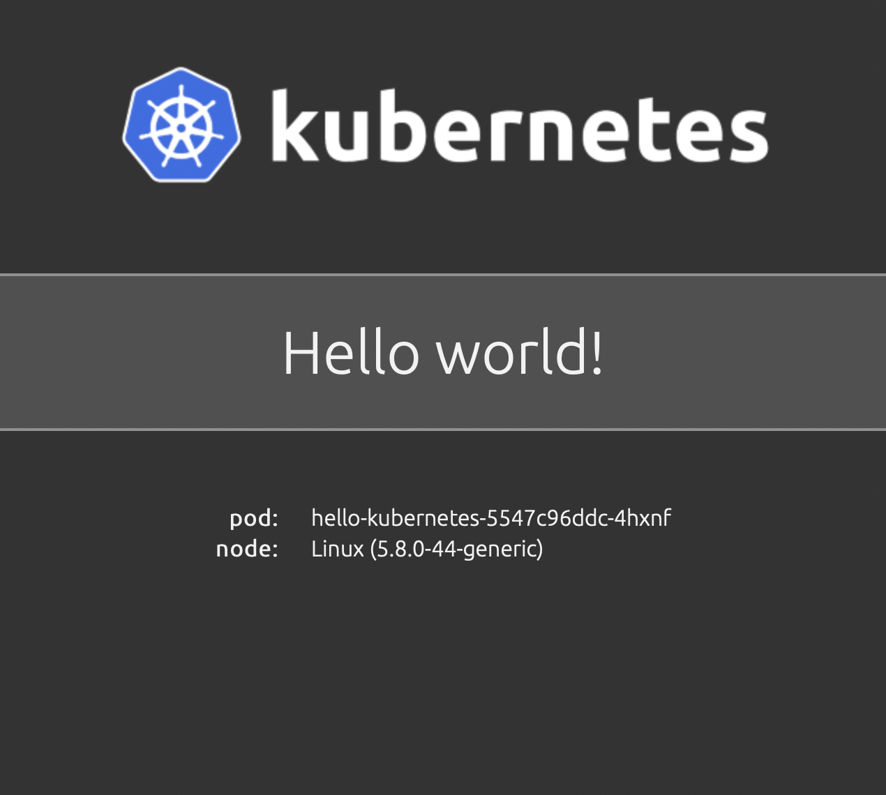
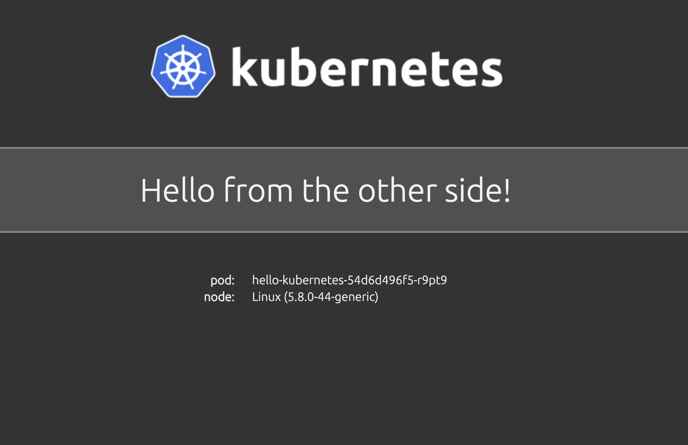

# Hello world tutorial

Here we provide a short tutorial on how to deploy a custom webserver in Kubernetes with `kubectl`. We shall use already existing example from [hello-kubernetes](https://github.com/paulbouwer/hello-kubernetes) but with a bit more explanation. This tutorial by far doesn't include everything that can be configured and done but rather provides first experience with Kubernetes.

We are going to deploy a simple web that runs from Docker image and displays "Hello world" together with `Pod` name and `node OS` information. 

*IMPORTANT*
Unless agreed beforehand, for personal projects and experiments you can use `kuba-cluster`. Here, you have to work in your namespace and its name is derived from your last name with added `-ns`. However, names are not unique and therefore we recommend to check yours on `Rancher` in the drop-down menu in the upper left corner `kuba-cluster` and `Project/Namespaces`.



## Create files

We have to create at least 3 Kubernetes resources to deploy the app -- `Deployment`, `Service`, `Ingress`.

### 1. Deployment
Create new directory, e.g. `hellok` and inside, create new file `deployment.yaml `with content:
```yaml
apiVersion: apps/v1
kind: Deployment
metadata:
  name: hello-kubernetes
spec:
  replicas: 3
  selector:
    matchLabels:
      app: hello-kubernetes
  template:
    metadata:
      labels:
        app: hello-kubernetes
    spec:
      securityContext:                                                          
        runAsUser: 1000
      containers:      
      - name: hello-kubernetes
        image: paulbouwer/hello-kubernetes:1.9
        ports:
        - containerPort: 8080
```
This example file is composed of fields:
- `.metadata` 
  - `.name` denotes deployment's name
- `.spec`
  - `.replicas` denotes number of replicated Pods that will be created
  - `.selector` field defines how the `Deployment` finds which `Pods` to manage. Here, a label defined in the `Pod` template is selected (`app: hello-kubernetes`), sophisticated selection rules are possible as long as the `Pod` template itself satisfies the rule
  - `.template`
    - `.metadata.labels` `Pods` are labeled here
    - `.spec` `Pod's` template specification
      -  `.containers` array defining containers that will run. Each item has to have `name, image`   
      -  `.containers.securityContext` defines under what user and optionally group, the container will run. *IMPORTANT* containers must be run under nonRoot user and group because of security. More in part about *PodSecurityPolicy* later

Complete reference docs for resources and their allowed fields and subfields is available [online](https://kubernetes.io/docs/reference/generated/kubernetes-api/v1.19/). Don't forget right indentation! 

### 2. Service
Secondly, we have to create `Service` which is abstract way to expose an application as a network service.

```yaml
apiVersion: v1
kind: Service
metadata:
  name: hello-kubernetes-svc
spec:
  type: ClusterIP
  ports:
  - name: hello-kubernetes-port                                                 
    port: 80                                                                    
    targetPort: 8080    
  selector:
    app: hello-kubernetes
```
This file creates a new `Service` object named "hello-kubernetes-svc", which targets TCP port 8080 on any `Pod` labeled `app=hello-kubernetes`. 

A Service can map any incoming port to a targetPort. By default, the targetPort is set to the same value as the port field. Default protocol is TCP but other supported protocols can be used too (UDP, HTTP, SCTP, PROXY).

### 3. Ingress

Lastly, we have to create `Ingress` which exposes HTTP and HTTPS routes from outside world to the cluster world. Traffic is controled by rules set in the resource.
It is possible to expose your deployments in [2 ways](/docs/kubectl-expose.html) but here we will use cluster LoadBalancer with creation of just new DNS name.
You can use whatever name you want but it has to fullfill 2 requirements:
- name is composed only from letters, numbers and '-'
- name ends with `.dyn.cloud.e-infra.cz`

The name is filled in `spec.rules.host` and in `spec.tls`. Before you use any name, check in browser it doesn't already exist. After creation, it takes a minute to create new DNS entry so your app will not be available right away at specified name, wait one minute.

```yaml
apiVersion: networking.k8s.io/v1                                                
kind: Ingress                                                                   
metadata:                                                                       
  name: hello-kubernetes-ingress                                                
  annotations:                                                                  
    kubernetes.io/ingress.class: "nginx"                                        
    kubernetes.io/tls-acme: "true"                                              
    cert-manager.io/cluster-issuer: "letsencrypt-prod"
spec:                                                                           
  tls:                                                                          
    - hosts:                                                                    
        - "test-hello.dyn.cloud.e-infra.cz"                                              
      secretName: test-hello-dyn-clout-e-infra-cz-tls                                    
  rules:                                                                        
  - host: "test-hello.dyn.cloud.e-infra.cz"
    http:                                                                       
      paths:                                                                    
      - backend:                                                                
          service:                                                              
            name: hello-kubernetes-svc                                          
            port:                                                               
              number: 80                                                      
        pathType: ImplementationSpecific
```

This example file is composed of fields:
- `.metadata` 
  - `.name` denotes name
  - `.annotations` ingress frequently uses annotations to configure options depending on ingress controller. We use `nginx` controller and possible annotations are listed [here](https://kubernetes.github.io/ingress-nginx/user-guide/nginx-configuration/annotations/). The ones used here are necessary for right functionality and they automatically create TLS ceritificate therefore you don't need to worry about HTTPS - it's provided automatically
 - `.spec` includes all information needed to configure a LB but most importantly, includes rules matched against all incoming requests
  - `.tls` ensures securing `Ingress`
    - `hosts` has to exactly match DNS name which will be used
    - `secretName` has to match DNS name but *all dots are substituted by '-' and -tls is added at the end*
  - `.rules` is the most important part
    - `host` is optional, if provided, rules apply to that host
    - `paths` (for example, `/testpath`), each of which has an associated backend defined with a `service.name` and a `service.port.name` or `service.port.number`. `service.port.number` is the port which is exposed by the service therefore in service denoted as `spec.ports.port`, similarly `service.ports.[i].name` is equivalent to `spec.ports.[i].name`. Path type can be specified, more about it [here](https://kubernetes.io/docs/concepts/services-networking/ingress/#path-types)

### 4. Create
Now, create all resources with using whole directory as an argument and specify your namespace 
```bash
kubectl apply -f hello-world -n [namespace]                     
deployment.apps/hello-kubernetes created
ingress.networking.k8s.io/hello-kubernetes-ingress created
service/hello-kubernetes-svc created
```

You can check status of deplyed resources with `kubectl get pods/services/ingress -n [namespace]` and when all of them are up and running, you can access the URL and you will be presented with sample page.


## Further customization
You can specify various fields in every resource's file, many of them not used here. One of more wanted features is passing environment variables into `Deployments` in case spawned containers need some. We will use one environment variable in our deployment to change displayed message. At the end, add new section `env` which will forward the value into the pod. Then, run again `kubectl apply -f hello-world -n [namespace]` to apply changes. When you access the website now, new message is displayed!

```yaml
apiVersion: apps/v1                                                                                                                                                                                         
kind: Deployment                                                                
metadata:                                                                       
  name: hello-kubernetes                                                        
spec:                                                                           
  replicas: 3                                                                   
  selector:                                                                     
    matchLabels:                                                                
      app: hello-kubernetes                                                     
  template:                                                                     
    metadata:                                                                   
      labels:                                                                   
        app: hello-kubernetes                                                   
    spec:                                                                       
      securityContext:                                                          
        runAsUser: 1000                                                         
      containers:                                                               
      - name: hello-kubernetes                                                  
        image: paulbouwer/hello-kubernetes:1.9                                  
        ports:                                                                  
        - containerPort: 8080                                                   
        env:                                                                    
        - name: MESSAGE                                                         
          value: Hello from the other side!
```



Other customization can include:
- creating a `Secret` (e.g. for password) and mounting it into the pod into the file
- creating a `ConfigMap` (e.g. for bigger configurations) and mounting into the pod
- creating a `PersistentVolumeClaim` (storage) from NFS (S3 #TODO) and mounting into the Pod
- creating resources of other types e.g. ReplicaSet, StatefulSet, DaemonSet


## Creating PersistentVolumeClaim
If you need to use some persistent storage, you can demand a NFS volume and mount it in `Deployment`. 

Example: create file `claim.yaml` with content
```yaml
apiVersion: v1                                                                                                                                                                                              
kind: PersistentVolumeClaim                                                     
metadata:                                                                       
  name: my-first-claim                                                               
spec:                                                                           
  accessModes:                                                                  
    - ReadWriteMany                                                             
  resources:                                                                    
    requests:                                                                   
      storage: 1Gi                                                              
  storageClassName: nfs-csi
```
The `spec.resources.requests` field has to be specified but doesn't really mean anything. Then perform `kubectl apply -f claim.yaml -n [namespace]`. You can check if everything went fine by running
```bash
kubectl get pvc -n [namespace]
NAME                                                               STATUS   VOLUME                                     CAPACITY   ACCESS MODES   STORAGECLASS   AGE
my-first-claim                                                    Bound    pvc-bcdcea2e-3019-409b-8b0f-18eb50d72c21   1Gi        RWX            csi-nfs        11d
```

The claim (and other mountable resources are done very similarly) is mounted into the `Deployment` in 2 steps:
- create field `volumes` under `spec.template`
- create field `volumeMounts` under `spec.template.spec.containers[container_which_will_have_pvc_mounted]`

A piece of relevant config. `Volumes` is a list of volumes to mount with at least `name` field and type of resource which will be mounted (here `persistentVolumeClaim`) together with its name (the one specified in PVC's `metadata.name`). `volumeMounts` mounts items from `volumes` in certain path inside container. In container, everything saved in path `/work` will persist and can be shared between multiple containers (one volume can be mount many times if its type is `ReadWriteMany` which NFS is)

```yaml
spec:                                                                           
  replicas: ...                                                                  
  selector:                                                                     
    matchLabels:                                                                
      ...                                                     
  template:                                                                     
    metadata:                                                                   
      labels:                                                                   
        ...                                                   
    spec:                                                                       
      containers:                                                               
        - name: flask-web                                                       
          image: alpine:3.8                                                     
          ports:                                                                
            - containerPort: 8888                                                                                                                                              
          volumeMounts:                                                                                                 
            - mountPath: /work                                                  
              name: shared-volume                                               
      volumes:                                                                                                                      
      - name: shared-volume                                                     
        persistentVolumeClaim:                                                  
          claimName: my-first-claim
```

## Pod Security Policy
For security reasons, not everything is allowed in `kuba-cluster`. 

List of (dis)allowed actions:
- Allow Privilege Escalation:  false
- Fs Group: must run as 1-65535
- User: must run as non root
- Supplemental groups: must run as 1-65535
- Volumes: can mount `configMap, emptyDir, projected, secret, downwardAPI, persistentVolumeClaim`

Any deployment that will attempt to run as root won't be created and will persist in state similar to (notice READY 0/3 and AVAILABLE 0, logs and describe would tell more)
```bash
NAME               READY   UP-TO-DATE   AVAILABLE   AGE
hello-kubernetes   0/3     3            0           7m8s
```

## Kubectl command
There are many useful `kubectl` commands that can be used to verify status of deployed resources or get information about them. To list some of the most handy:
- `kubectl get [resource]` provides basic information about resource e.g. if we query service, we can see IP address
```bash
 kubectl get service hello-kubernetes-svc -n [namespace]
NAME                   TYPE           CLUSTER-IP      EXTERNAL-IP       PORT(S)        AGE
hello-kubernetes-svc   LoadBalancer   10.43.124.251   147.251.253.243   80:31334/TCP   3h23m
```
- `kubectl describe [resource]` offers detailed information about resource (output is heavily trimmed)
```bash
kubectl describe pod hello-kubernetes -n test-ns
Name:         hello-kubernetes-5547c96ddc-4hxnf
Namespace:    test-ns
Priority:     0
Node:         kub-a10.priv.cerit-sc.cz/10.16.62.19
Start Time:   Tue, 23 Mar 2021 15:22:57 +0100
Labels:       app=hello-kubernetes
              pod-template-hash=5547c96ddc
Annotations:  cni.projectcalico.org/podIP: 10.42.2.25/32
              cni.projectcalico.org/podIPs: 10.42.2.25/32
              kubernetes.io/psp: global-restricted-psp
Status:       Running
IP:           10.42.2.25
IPs:
  IP:           10.42.2.25
Controlled By:  ReplicaSet/hello-kubernetes-5547c96ddc
...
```
- `kubectl get pods -n [namespace]` + `kubectl logs [pod_name] -n [namespace]` shows pod's logs if they were configured or any output occured. This combination is very useful for debugging.

```bash
kubectl get pods -n test-ns --context kuba-cluster 
NAME                                READY   STATUS    RESTARTS   AGE
hello-kubernetes-5547c96ddc-4hxnf   1/1     Running   0          3h19m
hello-kubernetes-5547c96ddc-856pp   1/1     Running   0          3h19m
hello-kubernetes-5547c96ddc-9dtxp   1/1     Running   0          3h19m
 astralmiau@vega  ~/work/test-psp  kubectl logs hello-kubernetes-5547c96ddc-4hxnf -n test-ns 

> hello-kubernetes@1.9.0 start /usr/src/app
> node server.js

Listening on: http://hello-kubernetes-5547c96ddc-4hxnf:8080
::ffff:10.42.3.0 - - [23/Mar/2021:14:24:06 +0000] "GET / HTTP/1.1" 200 650 "-" "Mozilla/5.0 (Macintosh; Intel Mac OS X 10_15_6) AppleWebKit/605.1.15 (KHTML, like Gecko) Version/14.0.3 Safari/605.1.15"
```

More combinations can be found in [extensive kubectl cheat sheet](https://kubernetes.io/docs/reference/kubectl/cheatsheet/)
