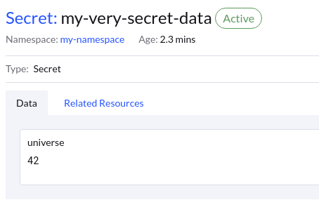

Once you have a Kubernetes App configured you are likely to store its YAML files into a git repository for version control purpouses.
Here however we encounter a problem - secrets. Storing secret YAMLs in git is a bad idea because if someone gains access to our
git repository they will be able to view the secrets in plaintext.

The following article explains how to store Kubernetes Secrets in git securely.

## Prerequisites
- Namespace on your cluster
- kubectl
- kubeseal

## Kubeseal installation

To store secrets securely you will need a program called `kubeseal`. This program can be downloaded as a standalone binary from this [GitHub repository](https://github.com/bitnami-labs/sealed-secrets/releases).

## How to store your secrets

First you will need a YAML file defining your secret such as this (note that the secret data must be base64 encoded):

``` yaml title="Secret definition" linenums="1"
apiVersion: v1
kind: Secret
metadata:
  name: my-very-secret-data
  namespace: my-namespace
type: Opaque
data:
  universe: NDIK
```

Now you will transform your secret into a `Sealed Secret`, this means that your secret data will be encrypted using a randomly selected key, this key will then be encrypted using Kubernetes' public encryption key and appended to the sealed secret. At this point only Kubernetes will be able to decrypt the secret's content using its private decryption key and therefore it is safe to store the sealed secret inside a git repository.

You can transform your secret into a sealed secret by issuing this command:

`kubeseal --controller-namespace sealed-secrets-operator < my-secret.yaml > sealed-secret.json`

Now you should have a `sealed-secret.json` file in your working directory, the contents of this file should look something like this:

``` json
{
  "kind": "SealedSecret",
  "apiVersion": "bitnami.com/v1alpha1",
  "metadata": {
    "name": "my-very-secret-data",
    "namespace": "my-namespace",
    "creationTimestamp": null
  },
  "spec": {
    "template": {
      "metadata": {
        "name": "my-very-secret-data",
        "namespace": "my-namespace",
        "creationTimestamp": null
      },
      "type": "Opaque",
      "data": null
    },
    "encryptedData": {
      "universe": "AgDJ9G4B918NCylKcFjY1j7vISrQvi+vOF38qZ+a8XyANUI3Qbif/BMw20zbAN9LnsQgQnTF8wxffgCSbENztfbVegNoTS6QhfXKYI3olaAmRa1Fntq2K2Lrw23dfVKhxuASX3XLq/mIM2ujF7Q7VuzRYERCHSOIyRNdTZLhwv0SCRGLUu/xBGxGhQSYy1M+ZAyjSIFtF3DgDYeMwy4uuaBHm8FE7BRp+wTfAPZcT8q9j0P1GokiWIv+GZpNia4WINazigO7PnHZzgQcPtap5K/Ekp53CN20SZ1tf2EBL4OatbHS2+/y7q3zv3KkwWNus+1aDj4yvZkNPP50AshW+Sqx0O7STdzc7Svl33flUrsJosm35uY/WwvfNqvdWTs0AN68BeBtWOCapC5USFum1wGuMb5BCi16cmDgcdaJ0Ii+uAszsh9TfwhFxfvz9ep2Pu0FWPgPliEIC1DumqpNm5RUA484Uq4nscfqqG7YpVqm9pnX59NUgBDDTeLoLCHh+u+SlcVYJtoNoN18t0FYqkNXAUDpRWGwjbwHr2C3/8YdFAOo7vr1OxOQNLpK080GSIrVQElUJlrazBQ801aq3kwDI1s7XYCXyKjljldnt1oz37sBIr6wTeOuQcsw4GbgNY87Ha1o19uLyoZyg8hv0xK5dZGbCHl6P4zZgI96zCadUE6Eg/bn6bqKZYgsJuPkyub2oJo="
    }
  }
}
```

Now you can apply your sealed secret by using `kubectl` like so:

`kubectl apply -f sealed-secret.json -n my-namespace`

You should now see your secret unencrypted inside your namespace.



## Security

Along with the encryption key, the secret's name and desired namespace are also encrypted and added to the `Sealed Secret`. This ensures that the sealed secret can only be installed into the originally intended namespace. This prevents malicious users from applying your sealed secret into their namespace to view the decrypted data.
