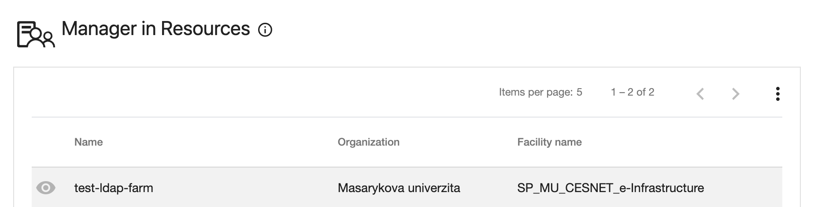
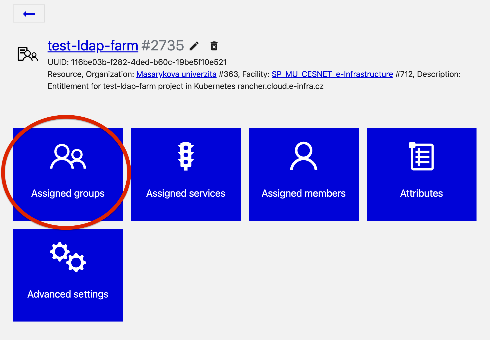
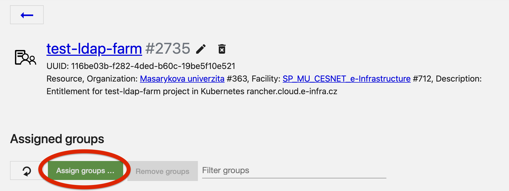

In Kubernetes cluster we differentiate between 2 types of projects:
- individual project
- group project

Everybody who signs into the [Rancher instance](https://rancher.cloud.e-infra.cz) is assigned his/her default individual project (more information [here](/containers/rancher/)) with default quotas described [here](/Containers/rancher/quotas). 

## Requesting Group Project
We are preparing a convenient request form, it will be available at this page when ready. In the meantime, if you need a group project, you have to contat us at  <a href="mailto:k8s@ics.muni.cz">k8s@ics.muni.cz</a>. By default, group project is assigned (and so its namespace) 64 CPUs *request, limit* and 256GB Memory *request, limit*. 

When asking for a project, please include in in the email following information:
- name of the new project
- desired resource quota (if default is enough, you don't have to include the information and we will use defaults)
- person responsible for the project (name + UCO)
- if group to be assigned is in *MU* or *CESNET* Perun (see following section for explanation)

If you don't have a group yet and you want to use:
- *CESNET* Perun
  - include information you request a new group as well
- *MU* Perun
  - you have to create group yourself, see [tutorial](https://it.muni.cz/sluzby/sprava-skupin-a-pristupu/navody/jak-vytvorit-skupiny)

## Access Control
We need the name of responsible person for project access control. It is up to you (or selected person from your group) to manage people allowed to access the project. Even if you know name of the existing group you would like to use from Perun, you have to assign it yourself.

As a part of the process, we prepare *a resource* in Identity Management System Perun. However, there exist multiple instances of Perun - MU Perun and CESNET Perun. Information about which Perun you use is crucial for ensuring functionality of the whole setup. Once we prepare the Perun resource, a responsible person is assigned an administrator role at this resource. This means that the person can add another people as administrators, assign allowed groups on the resource or add members. In order to enable access for specific Perun group, a responsible person (=an administrator) must assign desired group on the resource. 

### Assigning Group
1. Log into either [MU Perun](https://perun.aai.muni.cz) or [CESNET Perun](https://perun.aai.cesnet.cz).
2. Scroll on the home page until you see table `Manager in Resources`.

3. Click on the resource with same name as the requested project name.
4. Click on `Assigned Groups`.

5. Click on `Assign Groups`, write groupname into the search bar and select desired group.

6. Click `Next`, leave all options as they are and click `Assign group`. 
7. It takes 5-10 minutes to propagate the change so you have to wait for a bit. After 10 minutes, the change should be propagated so you can log out and back into Rancher or just refresh the page. You (and all group  members) should now see the project.

## Requesting Larger Individual Project
We are preparing a convenient request form, it will be available at this page when ready. In the meantime, if you need a larger project for your own use, you have to contat us at <a href="mailto:k8s@ics.muni.cz">k8s@ics.muni.cz</a>.

In your email, please include following information:
- name of the new project
- desired resource quota 
