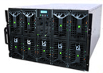

# Compute Nodes

## Node Configuration

Anselm is a cluster of x86-64 Intel-based nodes built with the Bull Extreme Computing bullx technology. The cluster contains four types of compute nodes.

### Compute Nodes Without Accelerators

* 180 nodes
* 2880 cores in total
* two Intel Sandy Bridge E5-2665, 8-core, 2.4GHz processors per node
* 64 GB of physical memory per node
* one 500GB SATA 2,5” 7,2 krpm HDD per node
* bullx B510 blade servers
* cn[1-180]

### Compute Nodes With a GPU Accelerator

* 23 nodes
* 368 cores in total
* two Intel Sandy Bridge E5-2470, 8-core, 2.3GHz processors per node
* 96 GB of physical memory per node
* one 500GB SATA 2,5” 7,2 krpm HDD per node
* GPU accelerator 1x NVIDIA Tesla Kepler K20m per node
* bullx B515 blade servers
* cn[181-203]

### Compute Nodes With a MIC Accelerator

* 4 nodes
* 64 cores in total
* two Intel Sandy Bridge E5-2470, 8-core, 2.3GHz processors per node
* 96 GB of physical memory per node
* one 500GB SATA 2,5” 7,2 krpm HDD per node
* MIC accelerator 1x Intel Phi 5110P per node
* bullx B515 blade servers
* cn[204-207]

### Fat Compute Nodes

* 2 nodes
* 32 cores in total
* 2 Intel Sandy Bridge E5-2665, 8-core, 2.4GHz processors per node
* 512 GB of physical memory per node
* two 300GB SAS 3,5” 15krpm HDD (RAID1) per node
* two 100GB SLC SSD per node
* bullx R423-E3 servers
* cn[208-209]


**Anselm bullx B510 servers**

### Compute Node Summary

| Node type                    | Count | Range       | Memory | Cores       | Queues                                    |
| ---------------------------- | ----- | ----------- | ------ | ----------- | --------------------------------------    |
| Nodes without an accelerator | 180   | cn[1-180]   | 64GB   | 16 @ 2.4GHz | qexp, qprod, qlong, qfree, qprace, qatlas |
| Nodes with a GPU accelerator | 23    | cn[181-203] | 96GB   | 16 @ 2.3GHz | qnvidia, qexp                             |
| Nodes with a MIC accelerator | 4     | cn[204-207] | 96GB   | 16 @ 2.3GHz | qmic, qexp                                |
| Fat compute nodes            | 2     | cn[208-209] | 512GB  | 16 @ 2.4GHz | qfat, qexp                                |

## Processor Architecture

Anselm is equipped with Intel Sandy Bridge processors Intel Xeon E5-2665 (nodes without accelerators and fat nodes) and Intel Xeon E5-2470 (nodes with accelerators). The processors support Advanced Vector Extensions (AVX) 256-bit instruction set.

### Intel Sandy Bridge E5-2665 Processor

* eight-core
* speed: 2.4 GHz, up to 3.1 GHz using Turbo Boost Technology
* peak performance:  19.2 GFLOP/s per core
* caches:
  * L2: 256 KB per core
  * L3: 20 MB per processor
* memory bandwidth at the level of the processor: 51.2 GB/s

### Intel Sandy Bridge E5-2470 Processor

* eight-core
* speed: 2.3 GHz, up to 3.1 GHz using Turbo Boost Technology
* peak performance:  18.4 GFLOP/s per core
* caches:
  * L2: 256 KB per core
  * L3: 20 MB per processor
* memory bandwidth at the level of the processor: 38.4 GB/s

Nodes equipped with Intel Xeon E5-2665 CPU have a set PBS resource attribute cpu_freq = 24, nodes equipped with Intel Xeon E5-2470 CPU have set PBS resource attribute cpu_freq = 23.

```console
$ qsub -A OPEN-0-0 -q qprod -l select=4:ncpus=16:cpu_freq=24 -I
```

In this example, we allocate 4 nodes, 16 cores at 2.4GHhz per node.

Intel Turbo Boost Technology is used by default, you can disable it for all nodes of job by using the cpu_turbo_boost resource attribute.

```console
$ qsub -A OPEN-0-0 -q qprod -l select=4:ncpus=16 -l cpu_turbo_boost=0 -I
```

## Memmory Architecture

The cluster contains three types of compute nodes.

### Compute Nodes Without Accelerators

* 2 sockets
* Memory Controllers are integrated into processors.
  * 8 DDR3 DIMMs per node
  * 4 DDR3 DIMMs per CPU
  * 1 DDR3 DIMMs per channel
  * Data rate support: up to 1600MT/s
* Populated memory: 8 x 8 GB DDR3 DIMM 1600 MHz

### Compute Nodes With a GPU or MIC Accelerator

* 2 sockets
* Memory Controllers are integrated into processors.
  * 6 DDR3 DIMMs per node
  * 3 DDR3 DIMMs per CPU
  * 1 DDR3 DIMMs per channel
  * Data rate support: up to 1600MT/s
* Populated memory: 6 x 16 GB DDR3 DIMM 1600 MHz

### Fat Compute Nodes

* 2 sockets
* Memory Controllers are integrated into processors.
  * 16 DDR3 DIMMs per node
  * 8 DDR3 DIMMs per CPU
  * 2 DDR3 DIMMs per channel
  * Data rate support: up to 1600MT/s
* Populated memory: 16 x 32 GB DDR3 DIMM 1600 MHz
