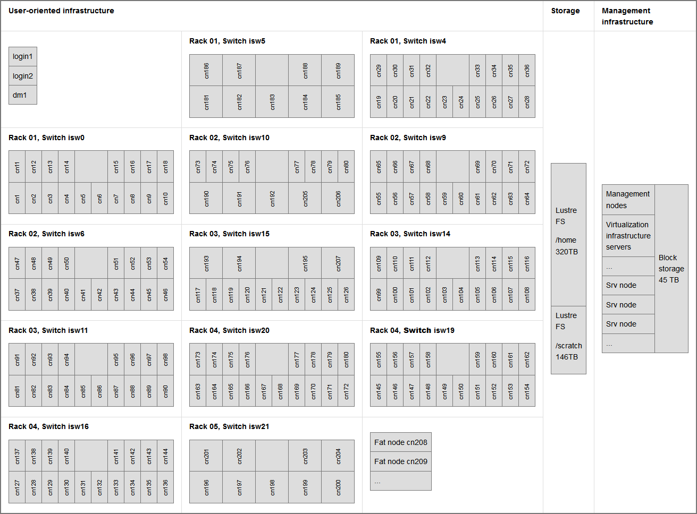

# Hardware Overview

The Anselm cluster consists of 209 computational nodes named cn[1-209] of which 180 are regular compute nodes, 23 are GPU Kepler K20 accelerated nodes, 4 are MIC Xeon Phi 5110P accelerated nodes, and 2 are fat nodes. Each node is a powerful x86-64 computer, equipped with 16 cores (two eight-core Intel Sandy Bridge processors), at least 64 GB of RAM, and a local hard drive. User access to the Anselm cluster is provided by two login nodes login[1,2]. The nodes are interlinked through high speed InfiniBand and Ethernet networks. All nodes share a 320 TB /home disk for storage of user files. The 146 TB shared /scratch storage is available for scratch data.

The Fat nodes are equipped with a large amount (512 GB) of memory. Virtualization infrastructure provides resources to run long-term servers and services in virtual mode. Fat nodes and virtual servers may access 45 TB of dedicated block storage. Accelerated nodes, fat nodes, and virtualization infrastructure are available [upon request][a] from a PI.

Schematic representation of the Anselm cluster. Each box represents a node (computer) or storage capacity:

The cluster compute nodes cn[1-207] are organized within 13 chassis.

There are four types of compute nodes:

* 180 compute nodes without an accelerator
* 23 compute nodes with a GPU accelerator - an NVIDIA Tesla Kepler K20m
* 4 compute nodes with a MIC accelerator - an Intel Xeon Phi 5110P
* 2 fat nodes - equipped with 512 GB of RAM and two 100 GB SSD drives

[More about Compute nodes][1].

GPU and accelerated nodes are available upon request, see the [Resources Allocation Policy][2].

All of these nodes are interconnected through fast InfiniBand and Ethernet networks.  [More about the Network][3].
Every chassis provides an InfiniBand switch, marked **isw**, connecting all nodes in the chassis, as well as connecting the chassis to the upper level switches.

All of the nodes share a 360 TB /home disk for storage of user files. The 146 TB shared /scratch storage is available for scratch data. These file systems are provided by the Lustre parallel file system. There is also local disk storage available on all compute nodes in /lscratch.  [More about Storage][4].

User access to the Anselm cluster is provided by two login nodes login1, login2, and data mover node dm1. [More about accessing the cluster][5].

The parameters are summarized in the following tables:

| **In general**                              |                                              |
| ------------------------------------------- | -------------------------------------------- |
| Primary purpose                             | High Performance Computing                   |
| Architecture of compute nodes               | x86-64                                       |
| Operating system                            | Linux (CentOS)                               |
| [**Compute nodes**][1]                      |                                              |
| Total                                       | 209                                          |
| Processor cores                             | 16 (2 x 8 cores)                             |
| RAM                                         | min. 64 GB, min. 4 GB per core               |
| Local disk drive                            | yes - usually 500 GB                         |
| Compute network                             | InfiniBand QDR, fully non-blocking, fat-tree |
| w/o accelerator                             | 180, cn[1-180]                               |
| GPU accelerated                             | 23, cn[181-203]                              |
| MIC accelerated                             | 4, cn[204-207]                               |
| Fat compute nodes                           | 2, cn[208-209]                               |
| **In total**                                |                                              |
| Total theoretical peak performance  (Rpeak) | 94 TFLOP/s                                   |
| Total max. LINPACK performance  (Rmax)      | 73 TFLOP/s                                   |
| Total amount of RAM                         | 15.136 TB                                    |

| Node             | Processor                               | Memory | Accelerator          |
| ---------------- | --------------------------------------- | ------ | -------------------- |
| w/o accelerator  | 2 x Intel Sandy Bridge E5-2665, 2.4 GHz | 64 GB  | -                    |
| GPU accelerated  | 2 x Intel Sandy Bridge E5-2470, 2.3 GHz | 96 GB  | NVIDIA Kepler K20m   |
| MIC accelerated  | 2 x Intel Sandy Bridge E5-2470, 2.3 GHz | 96 GB  | Intel Xeon Phi 5110P |
| Fat compute node | 2 x Intel Sandy Bridge E5-2665, 2.4 GHz | 512 GB | -                    |

For more details, refer to [Compute nodes][1], [Storage][4], and [Network][3].

[1]: compute-nodes.md
[2]: ../general/resources-allocation-policy.md
[3]: network.md
[4]: storage.md
[5]: ../general/shell-and-data-access.md

[a]: https://support.it4i.cz/rt
