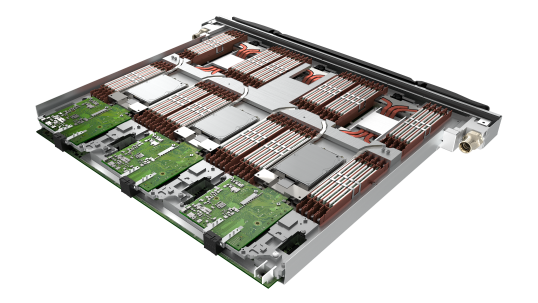
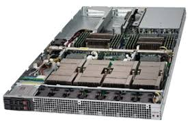
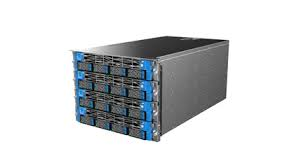
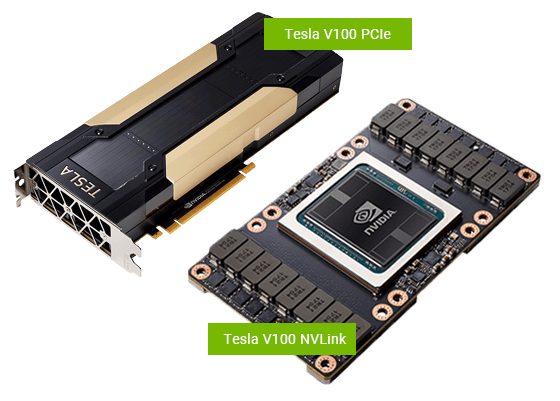

# Compute Nodes

Barbora is a cluster of x86-64 Intel-based nodes built with the BullSequana Computing technology. The cluster contains three types of compute nodes.

## Compute Nodes Without Accelerators

* 192 nodes
* 6912 cores in total
* 2x Intel Cascade Lake 6240, 18-core, 2.6 GHz processors per node
* 192 GB DDR4 2933MT/s of physical memory per node (12x 16 GB)
* BullSequana X1120 blade servers
* 2995,2 GFLOP/s per compute node
* 1x 1 GB Ethernet
* 1x HDR100 IB port
* 3 computes nodes per X1120 blade server
* cn[1-192]

## Compute Nodes With a GPU Accelerator

* 8 nodes
* 192 cores in total
* two Intel Skylake Gold 6126, 12-core, 2.6 GHz processors per node
* 192 GB DDR4 2933MT/s with ECC of physical memory per node (12x 16 GB)
* 4x GPU accelerator NVIDIA Tesla V100-SXM2 per node
* Bullsequana X410-E5 NVLink-V blade servers
* 1996,8 GFLOP/s per compute nodes
* GPU-tp-GPU All-to-All NVLINK 2.0, GPU-Direct
* 1 GB Ethernet
* 2x HDR100 IB ports
* cn[193-200]

## Fat Compute Node

* 1x BullSequana X808 server
* 128 cores in total
* 8 Intel Skylake 8153, 16-core, 2.0 GHz, 125W
* 6144 GiB DDR4 2667MT/s of physical memory per node (92x 64 GB)
* 2x HDR100 IB port
* 8192 GFLOP/s
* cn[201]

## Compute Node Summary

| Node type                    | Count | Range       | Memory  | Cores         | Queues                     |
| ---------------------------- | ----- | ----------- | ------  | -----------   | -------------------------- |
| Nodes without an accelerator | 189   | cn[1-189]   | 192GB   | 36 @ 2.6 GHz  | qexp, qprod, qlong, qfree  |
| Nodes with a GPU accelerator | 8     | cn[190-197] | 192GB   | 24 @ 2.6 GHz  | qnvidia                    |
| Fat compute nodes            | 1     | cn[198]     | 6144GiB | 128 @ 2.0 GHz | qfat                       |

## Processor Architecture

Barbora is equipped with Intel Cascade Lake processors Intel Xeon 6240 (nodes without accelerators), Intel Skylake Gold 6126 (nodes with accelerators) and Intel Skylake Platinum 8153.

### Intel [Cascade Lake 6240][d]

Cascade Lake core is largely identical to that of [Skylake's][a]. For in-depth detail of the Skylake core/pipeline see [Skylake (client) § Pipeline][b].

Xeon Gold 6240 is a 64-bit 18-core x86 multi-socket high performance server microprocessor set to be introduced by Intel in late 2018. This chip supports up to 4-way multiprocessing. The Gold 6240, which is based on the Cascade Lake microarchitecture and is manufactured on a 14 nm process, sports 2 AVX-512 FMA units as well as three Ultra Path Interconnect links. This microprocessor, which operates at 2.6 GHz with a TDP of 150 W and a turbo boost frequency of up to 3.9 GHz, supports up 1 TB of hexa-channel DDR4-2933 ECC memory.

* **Family**: Xeon Gold
* **Cores**: 18
* **Threads**: 36
* **L1I Cache**: 576 KiB, 18x32 KiB, 8-way set associative
* **L1D Cache**: 576 KiB, 18x32 KiB, 8-way set associative, write-back
* **L2 Cache**: 18 MiB, 18x1 MiB, 16-way set associative, write-back
* **L3 Cache**: 24.75 MiB, 18x1.375 MiB, 11-way set associative, write-back
* **Instructions**: x86-64, MOVBE, MMX, SSE, SSE2, SSE3, SSSE3, SSE4.1, SSE4.2, POPCNT, AVX, AVX2, AES, PCLMUL, FSGSBASE, RDRND, FMA3, F16C, BMI, BMI2, VT-x, VT-d, TXT, TSX, RDSEED, ADCX, PREFETCHW, CLFLUSHOPT, XSAVE, SGX, MPX, AVX-512 (New instructions for [Vector Neural Network Instructions][c])
* **Frequency**: 2.6 GHz
* **Max turbo**: 3.9 GHz
* **Process**: 14 nm
* **TDP**: 140+ W

### Intel [Skylake Gold 6126][e]

Xeon Gold 6126 is a 64-bit dodeca-core x86 multi-socket high performance server microprocessor introduced by Intel in mid-2017. This chip supports up to 4-way multiprocessing. The Gold 6126, which is based on the server configuration of the Skylake microarchitecture and is manufactured on a 14 nm+ process, sports 2 AVX-512 FMA units as well as three Ultra Path Interconnect links. This microprocessor, which operates at 2.6 GHz with a TDP of 125 W and a turbo boost frequency of up to 3.7 GHz, supports up to 768 GiB of hexa-channel DDR4-2666 ECC memory.

* **Family**: Xeon Gold
* **Cores**: 12
* **Threads**: 24
* **L1I Cache**: 384 KiB, 12x32 KiB, 8-way set associative
* **L1D Cache**: 384 KiB,	12x32 KiB, 8-way set associative, write-back
* **L2 Cache**: 12 MiB, 12x1 MiB, 16-way set associative,	write-back
* **L3 Cache**: 19.25 MiB, 14x1.375 MiB, 11-way set associative, write-back
* **Instructions**: x86-64, MOVBE, MMX, SSE, SSE2, SSE3, SSSE3, SSE4.1, SSE4.2, POPCNT, AVX, AVX2, AES, PCLMUL, FSGSBASE, RDRND, FMA3, F16C, BMI, BMI2, VT-x, VT-d, TXT, TSX, RDSEED, ADCX, PREFETCHW, CLFLUSHOPT, XSAVE, SGX, MPX, AVX-512
* **Frequency**: 2.6 GHz
* **Max turbo**: 3.7 GHz
* **Process**: 14 nm
* **TDP**: 125 W

### Intel [Skylake Platinum 8153][f]

Xeon Platinum 8153 is a 64-bit 16-core x86 multi-socket highest performance server microprocessor introduced by Intel in mid-2017. This chip supports up to 8-way multiprocessing. The Platinum 8153, which is based on the server configuration of the Skylake microarchitecture and is manufactured on a 14 nm+ process, sports 2 AVX-512 FMA units as well as three Ultra Path Interconnect links. This microprocessor, which operates at 2 GHz with a TDP of 125 W and a turbo boost frequency of up to 2.8 GHz, supports up to 768 GiB of hexa-channel DDR4-2666 ECC memory.

* **Family**: Xeon Platinum
* **Cores**: 16
* **Threads**: 32
* **L1I Cache**: 512 KiB, 16x32 KiB, 8-way set associative
* **L1D Cache**: 512 KiB, 16x32 KiB, 8-way set associative, write-back
* **L2 Cache**: 16 MiB, 16x1 MiB, 16-way set associative, write-back
* **L3 Cache**: 22 MiB, 16x1.375 MiB, 11-way set associative, write-back
* **Instructions**: x86-64, MOVBE, MMX, SSE, SSE2, SSE3, SSSE3, SSE4.1, SSE4.2, POPCNT, AVX, AVX2, AES, PCLMUL, FSGSBASE, RDRND, FMA3, F16C, BMI, BMI2, VT-x, VT-d, TXT, TSX, RDSEED, ADCX, PREFETCHW, CLFLUSHOPT, XSAVE, SGX, MPX, AVX-512
* **Frequency**: 2.0 GHz
* **Max turbo**: 2.8 GHz
* **Process**: 14 nm
* **TDP**: 125 W

## GPU Accelerator

Barbora is equipped with an [NVIDIA Tesla V100-SXM2][g] accelerator.

|NVIDIA Tesla V100-SXM2||
| --- | --- |
| GPU Architecture | NVIDIA Volta |
| NVIDIA Tensor| Cores: 640 |
| NVIDIA CUDA® Cores | 5 120 |
| Double-Precision Performance | 7.8 TFLOP/s |
| Single-Precision Performance | 15.7 TFLOP/s |
| Tensor Performance | 125 TFLOP/s |
| GPU Memory | 16 GB HBM2 |
| Memory Bandwidth | 900 GB/sec |
| ECC | Yes |
| Interconnect Bandwidth | 300 GB/sec |
| System Interface | NVIDIA NVLink |
| Form Factor | SXM2 |
| Max Power Consumption | 300 W |
| Thermal Solution | Passive |
| Compute APIs | CUDA, DirectCompute,OpenCLTM, OpenACC |

[a]: https://en.wikichip.org/wiki/intel/microarchitectures/skylake_(server)#Core
[b]: https://en.wikichip.org/wiki/intel/microarchitectures/skylake_(client)#Pipeline
[c]: https://en.wikichip.org/wiki/x86/avx512vnni
[d]: https://en.wikichip.org/wiki/intel/xeon_gold/6240
[e]: https://en.wikichip.org/wiki/intel/xeon_gold/6126
[f]: https://en.wikichip.org/wiki/intel/xeon_platinum/8153
[g]: https://images.nvidia.com/content/technologies/volta/pdf/tesla-volta-v100-datasheet-letter-fnl-web.pdf
