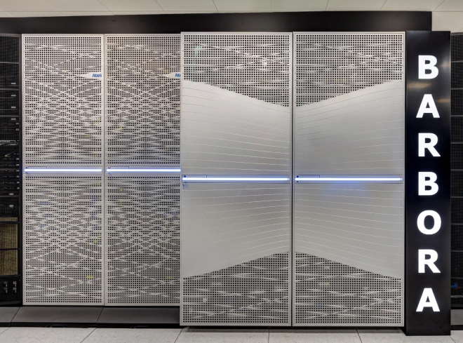

# Introduction

Welcome to Barbora supercomputer cluster. The Barbora cluster consists of 201 compute nodes, totaling 7232 compute cores with 44544 GB RAM, giving over 848 TFLOP/s theoretical peak performance.

Nodes are interconnected through a fully non-blocking fat-tree InfiniBand network, and are equipped with Intel Cascade Lake processors. A few nodes are also equipped with NVIDIA Tesla V100-SXM2 Read more in [Hardware Overview][1].

The cluster runs with an operating system compatible with the Red Hat [Linux family][a]. We have installed a wide range of software packages targeted at different scientific domains. These packages are accessible via the [modules environment][2].

The user data shared file-system and job data shared file-system are available to users.

The [PBS Professional Open Source Project][b] workload manager provides [computing resources allocations and job execution][3].

Read more on how to [apply for resources][4], [obtain login credentials][5] and [access the cluster][6].

[1]: hardware-overview.md
[2]: ../environment-and-modules.md
[3]: ../general/resources-allocation-policy.md
[4]: ../general/applying-for-resources.md
[5]: ../general/obtaining-login-credentials/obtaining-login-credentials.md
[6]: ../general/shell-and-data-access.md

[a]: http://upload.wikimedia.org/wikipedia/commons/1/1b/Linux_Distribution_Timeline.svg
[b]: https://www.pbspro.org/
