# PuTTY (Windows)

## Windows PuTTY Installer

We recommend you to download "**A Windows installer for everything except PuTTYtel**" with **Pageant** (SSH authentication agent) and **PuTTYgen** (PuTTY key generator) which is available [here][a].

!!! note
    "Pageant" is optional.

    "Change Password for Existing Private Key" is optional.

## PuTTY - How to Connect to the IT4Innovations Cluster

* Run PuTTY
* Enter Host name and Save session fields with login address and browse Connection -  SSH - Auth menu. The _Host Name_ input may be in the format **"username@clustername.it4i.cz"** so you do not have to type your login each time. In this example, we will connect to the Salomon cluster using **"salomon.it4i.cz"**.

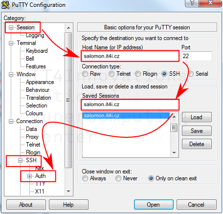

* Category - Connection -  SSH - Auth:
      Select Attempt authentication using Pageant.
      Select Allow agent forwarding.
      Browse and select your private key file.

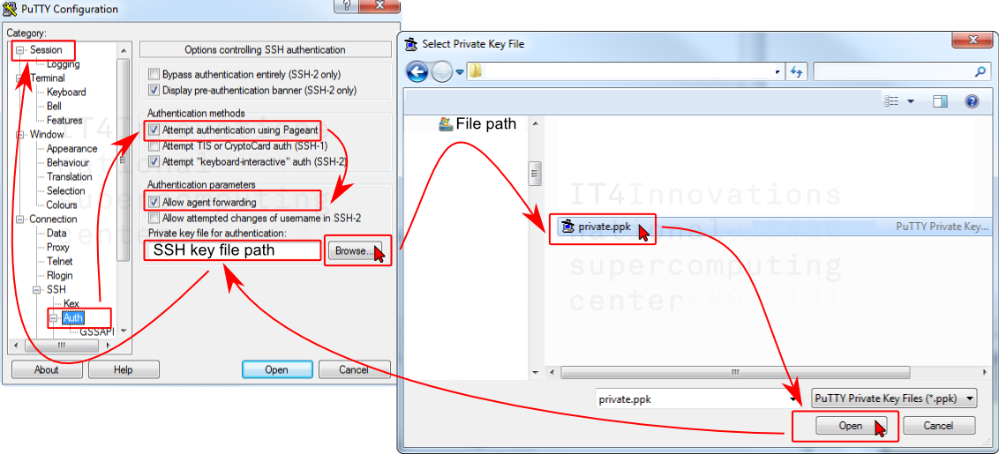

* Return to Session page and Save selected configuration with _Save_ button.

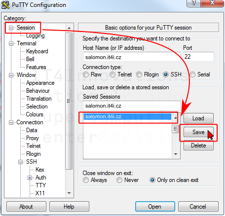

* Now you can log in using _Open_ button.

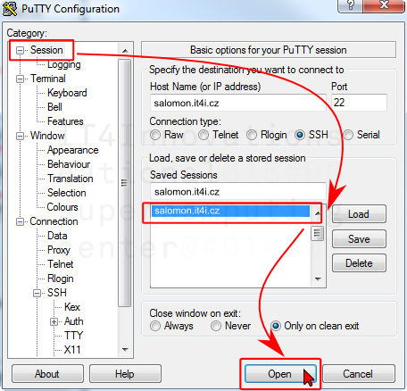

* Enter your username if the _Host Name_ input is not in the format "username@salomon.it4i.cz".
* Enter passphrase for selected private key file if Pageant **SSH authentication agent is not used.**

## Another PuTTY Settings

* Category - Windows - Translation - Remote character set and select **UTF-8**.
* Category - Terminal - Features and select **Disable application keypad mode** (enable numpad)
* Save your configuration in the Session - Basic options for your PuTTY section with the _Save_ button.

## Pageant SSH Agent

Pageant holds your private key in memory without needing to retype a passphrase on every login.

* Run Pageant.
* On Pageant Key List press _Add key_ and select your private key (id_rsa.ppk).
* Enter your passphrase.
* Now you have your private key in memory without needing to retype a passphrase on every login.

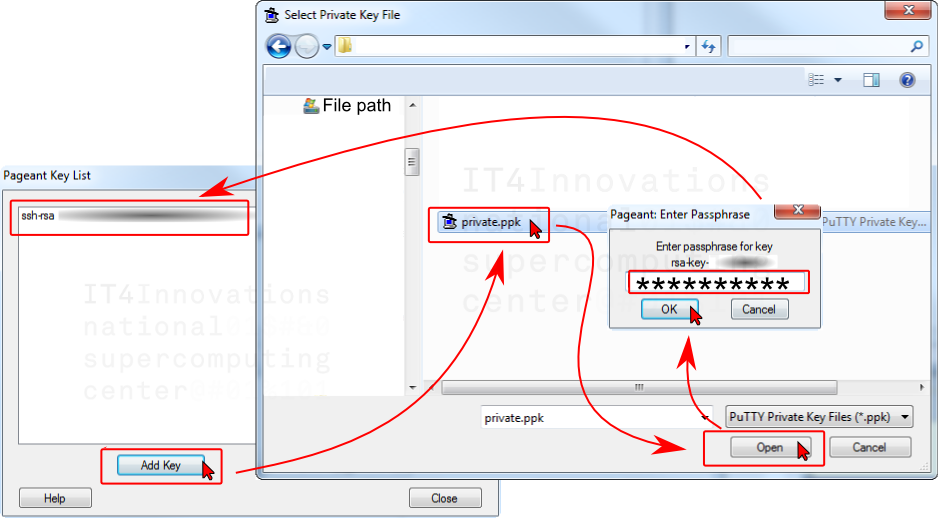

## PuTTY Key Generator

PuTTYgen is the PuTTY key generator. You can load in an existing private key and change your passphrase or generate a new public/private key pair.

### Change Password for Existing Private Key

You can change the password of your SSH key with "PuTTY Key Generator". Make sure to back up the key.

* Load your private key file with _Load_ button.
* Enter your current passphrase.
* Change key passphrase.
* Confirm key passphrase.
* Save your private key with the _Save private key_ button.

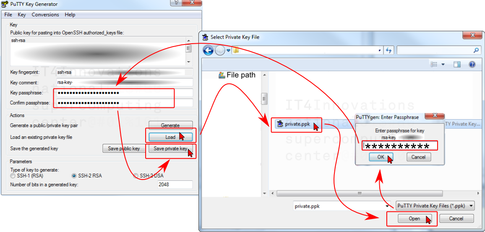

### Generate a New Public/Private Key

You can generate an additional public/private key pair and insert public key into authorized_keys file for authentication with your own private key.

* Start with _Generate_ button.

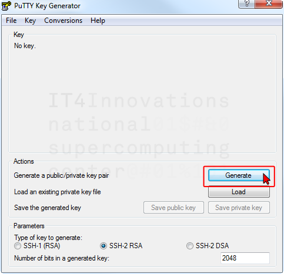

* Generate some randomness.

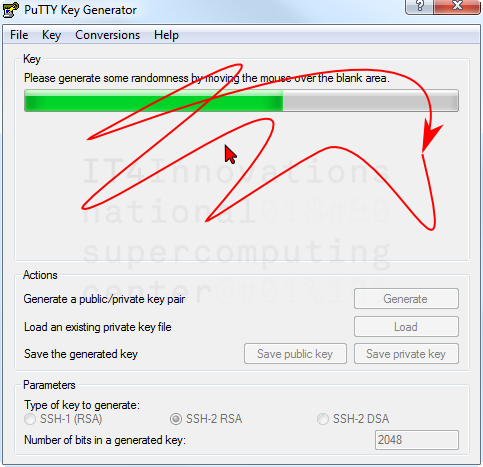

* Wait.

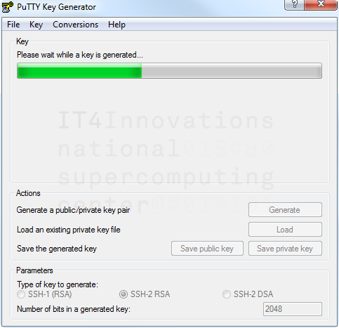

* Enter a comment for your key using the 'username@organization.example.com' format.
      Enter a key passphrase, confirm it and save your new private key in the _ppk_ format.

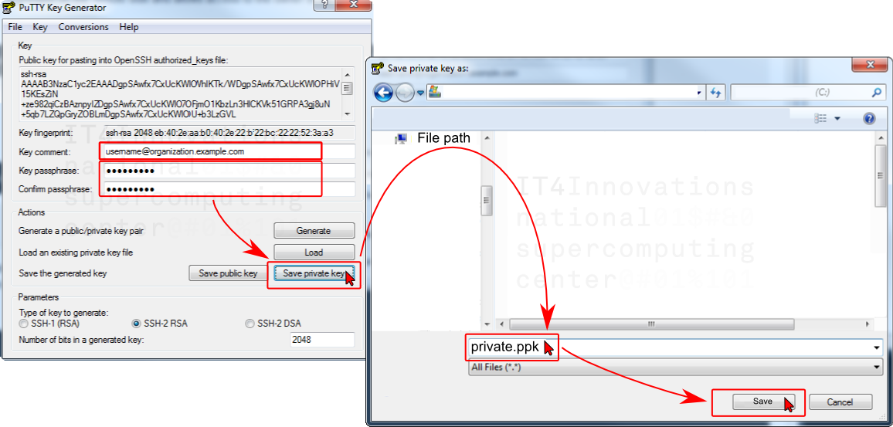

* Save the public key with the _Save public key_ button.
      You can copy public key out of the ‘Public key for pasting into the authorized_keys file’ box.

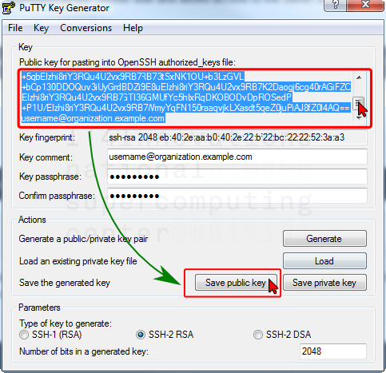

* Export the private key in the OpenSSH format "id_rsa" using Conversion - Export OpenSSH key

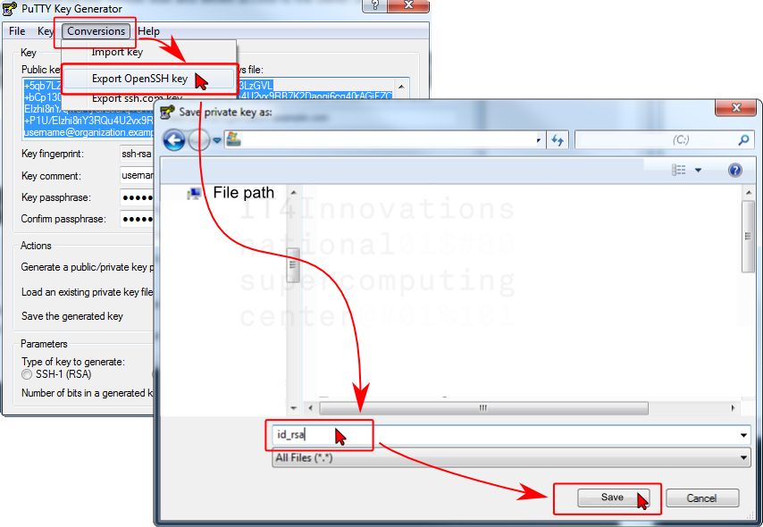

## Managing Your SSH Key

To manage your SSH key for authentication to clusters, see the [SSH Key Management][3] section.

[1]: ./ssh-key-management.md

[1]: #putty
[2]: ssh-keys.md#how-to-add-your-own-key
[3]: ./ssh-key-management.md

[a]: http://www.chiark.greenend.org.uk/~sgtatham/putty/download.html
