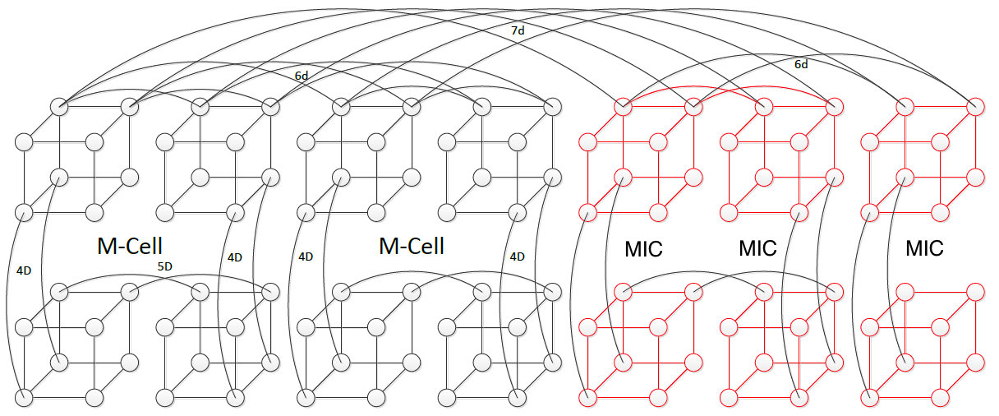
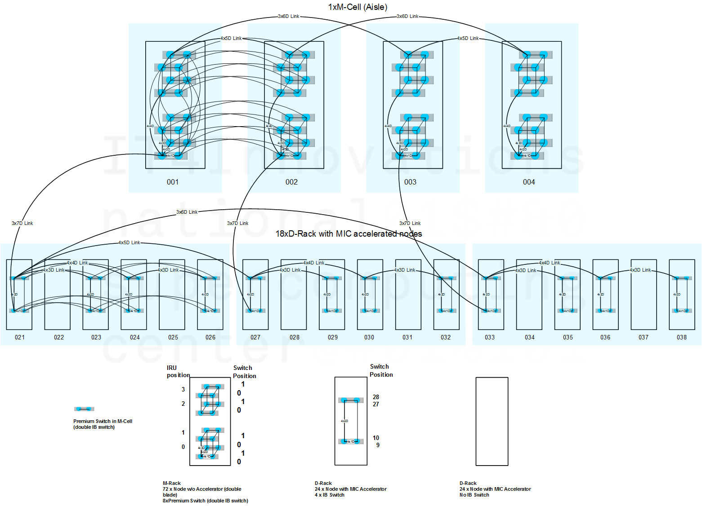

# 7D Enhanced Hypercube

| Node type                            | Count | Short name       | Long name                | Rack  |
| ------------------------------------ | ----- | ---------------- | ------------------------ | ----- |
| M-Cell compute nodes w/o accelerator | 576   | cns1 -cns576     | r1i0n0 - r4i7n17         | 1-4   |
| compute nodes MIC accelerated        | 432   | cns577 - cns1008 | r21u01n577 - r37u31n1008 | 21-38 |

## IB Topology

