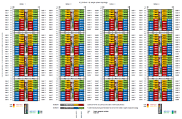
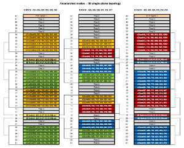

# IB Single-Plane Topology

A complete M-Cell assembly consists of four compute racks. Each rack contains 4 physical IRUs - Independent rack units. Using one dual socket node per one blade slot leads to 8 logical IRUs. Each rack contains 4 x 2 SGI ICE X IB Premium Blades.

The SGI ICE X IB Premium Blade provides the first level of interconnection via dual 36-port Mellanox FDR InfiniBand ASIC switch with connections as follows:

* 9 ports from each switch chip connect to the unified backplane, to connect the 18 compute node slots
* 3 ports on each chip provide connectivity between the chips
* 24 ports from each switch chip connect to the external bulkhead, for a total of 48

## IB Single-Plane Topology - ICEX M-Cell

Each color in each physical IRU represents one dual-switch ASIC switch.

[IB single-plane topology - ICEX Mcell.pdf][1]

## IB Single-Plane Topology - Accelerated Nodes

Each of the 3 inter-connected D racks is equivalent to one half of the M-Cell rack. 18 x D rack with MIC accelerated nodes [r21-r38] are equivalent to 3 M-Cell racks as shown in the [7D Enhanced Hypercube][2] diagram.

As shown in a diagram [IB Topology][3]

* Racks 21, 22, 23, 24, 25, 26 are equivalent to one M-Cell rack.
* Racks 27, 28, 29, 30, 31, 32 are equivalent to one M-Cell rack.
* Racks 33, 34, 35, 36, 37, 38 are equivalent to one M-Cell rack.

[IB single-plane topology - Accelerated nodes.pdf][4]

[1]: ../src/IB_single-plane_topology_-_ICEX_Mcell.pdf
[2]: 7d-enhanced-hypercube.md
[3]: 7d-enhanced-hypercube.md#ib-topology)
[4]: ../src/IB_single-plane_topology_-_Accelerated_nodes.pdf
