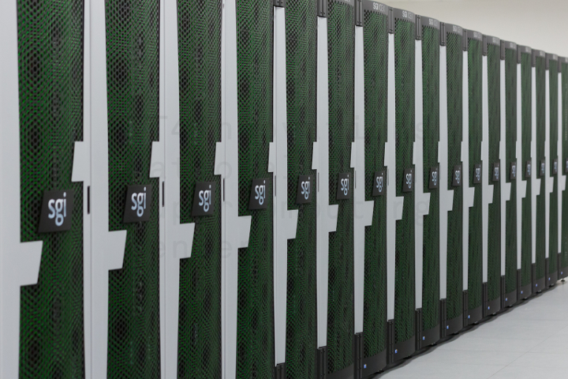
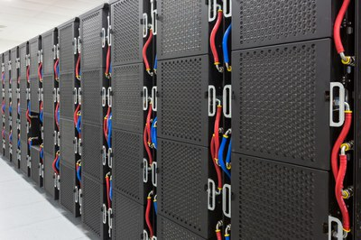
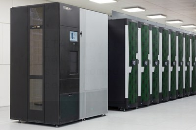
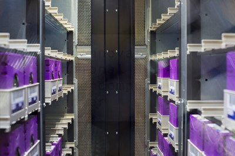

# Introduction

Welcome to Salomon supercomputer cluster. The Salomon cluster consists of 1009 compute nodes, totaling 24192 compute cores with 129 TB RAM and giving over 2 PFLOP/s theoretical peak performance. Each node is a powerful x86-64 computer equipped with 24 cores and at least 128 GB RAM. Nodes are interconnected through a 7D Enhanced hypercube InfiniBand network and are equipped with Intel Xeon E5-2680v3 processors. The Salomon cluster consists of 576 nodes without accelerators and 432 nodes equipped with Intel Xeon Phi MIC accelerators. Read more in [Hardware Overview][1].

The cluster runs with a [CentOS Linux][a] operating system, which is compatible with the Red Hat [Linux family][b].

## Water-Cooled Compute Nodes With MIC Accelerators

## Tape Library T950B

[1]: hardware-overview.md

[a]: http://www.bull.com/bullx-logiciels/systeme-exploitation.html
[b]: http://upload.wikimedia.org/wikipedia/commons/1/1b/Linux_Distribution_Timeline.svg
