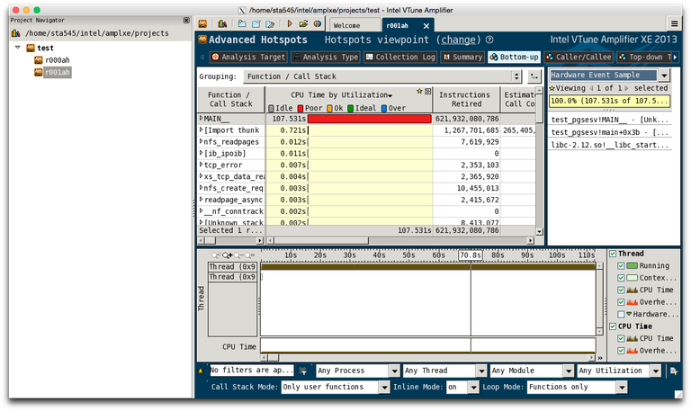

# Intel VTune Amplifier XE

## Introduction

Intel*®* VTune™ Amplifier, part of Intel Parallel studio, is a GUI profiling tool designed for Intel processors. It offers a graphical performance analysis of single core and multithreaded applications. A highlight of the features:

* Hotspot analysis
* Locks and waits analysis
* Low-level specific counters, such as branch analysis and memory bandwidth
* Power usage analysis - frequency and sleep states.



## Installed Versions

For the current list of installed versions, use:

```console
$ ml av VTune
```

## Usage

To profile an application with VTune Amplifier, special kernel modules need to be loaded. The modules are not loaded on the login nodes, thus direct profiling on login nodes is not possible. By default, the kernel modules are not loaded on compute nodes either. In order to have the modules loaded, you need to specify the `vtune=version` PBS resource at job submit. The version is the same as for the environment module. For example, for VTune/2016_update1, use:

```console
$ qsub -q qexp -A OPEN-0-0 -I -l select=1,vtune=2020_update3
```

After that, you can verify the modules `sep*`, `pax`, and `vtsspp` are present in the kernel:

```console
$ lsmod | grep -e sep -e pax -e vtsspp
    vtsspp 362000 0
    sep3_15 546657 0
    pax 4312 0
```

To launch the GUI, first load the module:

```console
$ ml VTune/2020_update3
```

and launch the GUI:

```console
$ $ amplxe-gui
```

The GUI will open in a new window. Click on *New Project...* to create a new project. After clicking OK, a new window with project properties will appear.  At *Application:*, select the path to the binary you want to profile (the binary should be compiled with the `-g` flag). Some additional options, such as command line arguments, can be selected. At *Managed code profiling mode:* select `Native` (unless you want to profile managed mode .NET/Mono applications). After clicking OK, your project is created.

To run a new analysis, click *New analysis...*. You will see a list of possible analyses. Some of them will not be possible on the current CPU (e.g. Intel Atom analysis is not possible on Sandy Bridge CPU), the GUI will show an error box if you select the wrong analysis. For example, select *Advanced Hotspots*. Clicking on *Start* will start profiling of the application.

## Remote Analysis

VTune Amplifier also allows a form of remote analysis. In this mode, data for analysis is collected from the command line without GUI, and the results are then loaded to GUI on another machine. This allows profiling without interactive graphical jobs. To perform a remote analysis, launch the GUI somewhere, open the new analysis window and then click the *Command line* button in the bottom right corner. It will show the command line needed to perform the selected analysis.

The command line will look like this:

```console
amplxe-cl -collect advanced-hotspots -app-working-dir /home/$USER/tmp -- /home/$USER/tmp/sgemm
```

Copy the line to clipboard and then you can paste it in your jobscript or in the command line. After the collection is run, open the GUI once again, click the menu button in the upper right corner, and select *Open > Result...*. The GUI will load the results from the run.

## References

1. [Intel® VTune™ Amplifier Support][a]
1. [Amplifier Help Linux][b]

[a]: https://software.intel.com/en-us/intel-vtune-amplifier-xe-support/documentation
[b]: https://software.intel.com/en-us/amplifier_help_linux
