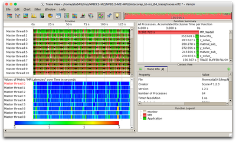

# Vampir

## Introduction

Vampir is a commercial trace analysis and visualization tool. It works with traces in OTF and OTF2 formats. It does not have the functionality to collect traces, so you need to use a trace collection tool (such as [Score-P][1]) first to collect the traces.



## Installed Versions

For the current list of installed versions, use:

```console
$ ml av Vampir
```

## User Manual

To find the detailed user manual in PDF format, type

```console
$ ls $EBROOTVAMPIR/doc/vampir-manual.pdf
```

## References

1. [Web site][a]

[1]: score-p.md

[a]: https://www.vampir.eu
