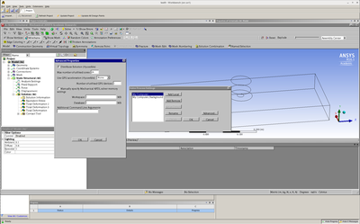

# Workbench

## Workbench Batch Mode

It is possible to run Workbench scripts in a batch mode. You need to configure solvers of individual components to run in parallel mode. Open your project in Workbench. Then, for example, in *Mechanical*, go to *Tools - Solve Process Settings...*.



Enable the *Distribute Solution* checkbox and enter the number of cores (e.g. 72 to run on two Barbora nodes). If you want the job to run on more than 1 node, you must also provide a so called MPI appfile. In the *Additional Command Line Arguments* input field, enter:

```console
    -mpifile /path/to/my/job/mpifile.txt
```

Where /path/to/my/job is the directory where your project is saved. We will create the file mpifile.txt programmatically later in the batch script. For more information, refer to \*ANSYS Mechanical APDL Parallel Processing\* \*Guide\*.

Now, save the project and close Workbench. We will use this script to launch the job:

```bash
    #!/bin/bash
    #PBS -l select=2:ncpus=128
    #PBS -q qprod
    #PBS -N test9_mpi_2
    #PBS -A OPEN-0-0


    # change the working directory
    DIR=/scratch/project/PROJECT_ID/$PBS_JOBID
    mkdir -p "$DIR"
    cd "$DIR" || exit

    echo Running on host `hostname`
    echo Time is `date`
    echo Directory is `pwd`
    echo This jobs runs on the following nodes:
    echo `cat $PBS_NODEFILE`

    ml ANSYS/21.1-intel-2018a

    #### Set number of processors per host listing
    procs_per_host=24
    #### Create MPI appfile
    echo -n "" > mpifile.txt
    for host in `cat $PBS_NODEFILE`
    do
      echo "-h $host -np $procs_per_host $ANSYS160_DIR/bin/ansysdis161 -dis" > mpifile.txt
    done

    #-i input.dat includes the input of analysis in APDL format
    #-o file.out is output file from ansys where all text outputs will be redirected
    #-p the name of license feature (aa_r=ANSYS Academic Research, ane3fl=Multiphysics(commercial), aa_r_dy=Academic AUTODYN)

    # prevent using scsif0 interface on accelerated nodes
    export MPI_IC_ORDER="UDAPL"
    # spawn remote process using SSH (default is RSH)
    export MPI_REMSH="/usr/bin/ssh"

    runwb2 -R jou6.wbjn -B -F test9.wbpj
```

The solver settings are saved in the solvehandlers.xml file, which is not located in the project directory. Verify your solved settings when uploading a project from your local computer.
