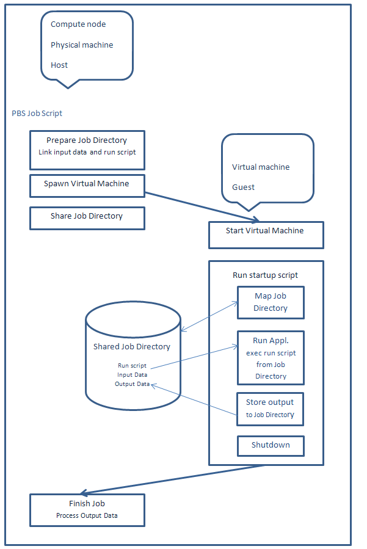

# Virtualization

<!--
musime proverit
-->

Running virtual machines on compute nodes.

## Introduction

There are situations when our clusters' environment is not suitable for user's needs:

* Application requires a different operating system (e.g. Windows) or it is not available for Linux;
* Application requires a different versions of base system libraries and tools;
* Application requires specific setup (installation, configuration) of a complex software stack;
* Application requires privileged access to the operating system;
* ... and combinations of the above cases.

The solution for these cases is **virtualization**. Clusters' environment allows to run virtual machines on compute nodes. Users can create their own images of the operating system with a specific software stack and run instances of these images as virtual machines on compute nodes. Run of virtual machines is provided by the standard mechanism of [Resource Allocation and Job Execution][1].

Solution is based on QEMU-KVM software stack and provides hardware-assisted x86 virtualization.

## Limitations

Clusters' infrastructure and environment were s not designed for virtualization. Compute nodes, storages, and infrastructure is intended and optimized for running HPC jobs. This implies suboptimal configuration of virtualization and limitations.

Clusters' virtualization does not provide the performance and all features of a native environment. There is significant a performance hit (degradation) in I/O performance (storage, network). The virtualization is not suitable for I/O (disk, network) intensive workloads.

Virtualization has some drawbacks, as well. It is not so easy to set up an efficient solution.

The solution described in the [HOWTO][2] section is suitable for single node tasks; it does not introduce virtual machine clustering.

!!! note
    Consider virtualization as a last resort solution for your needs.

!!! warning
    Consult use of virtualization with IT4Innovations' support.

For running a Windows application (when the source code and Linux native application are not available), consider use of Wine, Windows compatibility layer. Many Windows applications can be run using Wine with less effort and better performance than when using virtualization.

## Licensing

IT4Innovations does not provide any licenses for operating systems and software of virtual machines. Users are (in accordance with [Acceptable use policy document][a]) fully responsible for licensing all software running on virtual machines on clusters. Be aware of complex conditions of licensing software in virtual environments.

!!! note
    Users are responsible for licensing OS (e.g. MS Windows) and all software running on their virtual machines.

## Howto

### Virtual Machine Job Workflow

We propose this job workflow:



Our recommended solution is that the job script creates a distinct shared job directory, which makes a central point for data exchange between cluster's environment, compute node (host) (e.g. HOME, SCRATCH, local scratch, and other local or cluster file systems), and virtual machine (guest). The job script links or copies input data and instructions on what to do (run script) for the virtual machine to the job directory and the virtual machine process input data according to the instructions in the job directory and store output back to the job directory. We recommend that the virtual machine is running in a so called [snapshot mode][3], the image is immutable - it does not change, so one image can be used for many concurrent jobs.

### Procedure

1. Prepare the image of your virtual machine
1. Optimize the image of your virtual machine for cluster's virtualization
1. Modify your image for running jobs
1. Create a job script for executing the virtual machine
1. Run jobs

### Prepare Image of Your Virtual Machine

You can either use your existing image or create a new image from scratch.

QEMU currently supports these image types or formats:

* raw
* cloop
* cow
* qcow
* qcow2
* vmdk - VMware 3 & 4, or 6 image format, for exchanging images with that product
* vdi - VirtualBox 1.1 compatible image format, for exchanging images with VirtualBox.

You can convert your existing image using the `qemu-img convert` command. Supported formats of this command are: `blkdebug blkverify bochs cloop cow dmg file ftp ftps host_cdrom host_device host_floppy http https nbd parallels qcow qcow2 qed raw sheepdog tftp vdi vhdx vmdk vpc vvfat`.

We recommend using an advanced QEMU native image format qcow2.

More about QEMU images [here][b].

### Optimize Image of Your Virtual Machine

Use virtio devices (for the disk/drive and the network adapter) and install virtio drivers (paravirtualized drivers) into the virtual machine. There is a significant performance gain when using virtio drivers. For more information, see [Virtio Linux][c] and [Virtio Windows][d].

Disable all unnecessary services and tasks. Restrict all unnecessary operating system operations.

Remove all unnecessary software and files.

Remove all paging space, swap files, partitions, etc.

Shrink your image. (It is recommended to zero all free space and reconvert the image using `qemu-img`.)

### Modify Your Image for Running Jobs

Your image should contian an operating system startup script. The startup script should run the application and when the application exits, run shutdown or quit the virtual machine.

We recommend that the startup script:

* maps Job Directory from host (from compute node);
* runs script (we call it "run script") from Job Directory and waits for application's exit;
  * for management purposes if the run script does not exist wait for some time period (few minutes);
* shutdowns/quits OS.

For Windows operating systems, we suggest using a Local Group Policy Startup script; for Linux operating systems, use the rc.local, runlevel init script, or similar service.

Example startup script for the Windows virtual machine:

```bat
@echo off
set LOG=c:\startup.log
set MAPDRIVE=z:
set SCRIPT=%MAPDRIVE%\run.bat
set TIMEOUT=300

echo %DATE% %TIME% Running startup script>%LOG%

rem Mount share
echo %DATE% %TIME% Mounting shared drive>>%LOG%
net use z: \\10.0.2.4\qemu >>%LOG% 2>&1
dir z:\ >>%LOG% 2>&1
echo. >>%LOG%


if exist %MAPDRIVE%\ (
  echo %DATE% %TIME% The drive "%MAPDRIVE%" exists>>%LOG%

  if exist %SCRIPT% (
    echo %DATE% %TIME% The script file "%SCRIPT%"exists>>%LOG%
    echo %DATE% %TIME% Running script %SCRIPT%>>%LOG%
    set TIMEOUT=0
    call %SCRIPT%
  ) else (
    echo %DATE% %TIME% The script file "%SCRIPT%"does not exist>>%LOG%
  )

) else (
  echo %DATE% %TIME% The drive "%MAPDRIVE%" does not exist>>%LOG%
)
echo. >>%LOG%

timeout /T %TIMEOUT%

echo %DATE% %TIME% Shut down>>%LOG%
shutdown /s /t 0
```

The example startup script maps a shared job script as a drive z: and looks for a run script called run.bat. If the run script is found, it is run, otherwise it waits for 5 minutes, then shuts down the virtual machine.

### Create Job Script for Executing Virtual Machine

Create the job script according to the recommended [Virtual Machine Job Workflow][4].

Example job for the Windows virtual machine:

```bat
    #/bin/sh

    JOB_DIR=/scratch/$USER/win/${PBS_JOBID}

    #Virtual machine settings
    VM_IMAGE=~/work/img/win.img
    VM_MEMORY=49152
    VM_SMP=16

    # Prepare job dir
    mkdir -p ${JOB_DIR} && cd ${JOB_DIR} || exit 1
    ln -s ~/work/win .
    ln -s /scratch/$USER/data .
    ln -s ~/work/win/script/run/run-appl.bat run.bat

    # Run virtual machine
    export TMPDIR=/lscratch/${PBS_JOBID}
    module add qemu
    qemu-system-x86_64
      -enable-kvm
      -cpu host
      -smp ${VM_SMP}
      -m ${VM_MEMORY}
      -vga std
      -localtime
      -usb -usbdevice tablet
      -device virtio-net-pci,netdev=net0
      -netdev user,id=net0,smb=${JOB_DIR},hostfwd=tcp::3389-:3389
      -drive file=${VM_IMAGE},media=disk,if=virtio
      -snapshot
      -nographic
```

The job script links application data (win), input data (data), and run script (run.bat) into the job directory and runs the virtual machine.

Example run script (run.bat) for the Windows virtual machine:

```doscon
    z:
    cd winappl
    call application.bat z:data z:output
```

The run script runs the application from the shared job directory (mapped as drive z:), processes the input data (z:data) from the job directory, and stores output to the job directory (z:output).

### Run Jobs

Run jobs as usual, see [Resource Allocation and Job Execution][1]. Use only full node allocation for virtualization jobs.

### Running Virtual Machines

Virtualization is enabled only on compute nodes, virtualization does not work on login nodes.

Load the QEMU environment module:

```console
$ module add qemu
```

Get help:

```console
$ man qemu
```

Run the virtual machine (simple):

```console
$ qemu-system-x86_64 -hda linux.img -enable-kvm -cpu host -smp 16 -m 32768 -vga std -vnc :0
$ qemu-system-x86_64 -hda win.img   -enable-kvm -cpu host -smp 16 -m 32768 -vga std -localtime -usb -usbdevice tablet -vnc :0
```

You can access the virtual machine via the VNC viewer (the `-vnc` option) connecting to the IP address of the compute node. For VNC, you must use a VPN network.

Install the virtual machine from the ISO file:

```console
$ qemu-system-x86_64 -hda linux.img -enable-kvm -cpu host -smp 16 -m 32768 -vga std -cdrom linux-install.iso -boot d -vnc :0
$ qemu-system-x86_64 -hda win.img   -enable-kvm -cpu host -smp 16 -m 32768 -vga std -localtime -usb -usbdevice tablet -cdrom win-install.iso -boot d -vnc :0
```

Run the virtual machine using optimized devices, user network back-end with sharing and port forwarding, in snapshot mode

```console
$ qemu-system-x86_64 -drive file=linux.img,media=disk,if=virtio -enable-kvm -cpu host -smp 16 -m 32768 -vga std -device virtio-net-pci,netdev=net0 -netdev user,id=net0,smb=/scratch/$USER/tmp,hostfwd=tcp::2222-:22 -vnc :0 -snapshot
$ qemu-system-x86_64 -drive file=win.img,media=disk,if=virtio -enable-kvm -cpu host -smp 16 -m 32768 -vga std -localtime -usb -usbdevice tablet -device virtio-net-pci,netdev=net0 -netdev user,id=net0,smb=/scratch/$USER/tmp,hostfwd=tcp::3389-:3389 -vnc :0 -snapshot
```

Port forwarding allows you to access the virtual machine via SSH (Linux) or RDP (Windows) connecting to the IP address of the compute node (and port 2222 for SSH). You must use a VPN network).

!!! note
    Keep in mind, that if you use virtio devices, you must have virtio drivers installed on your virtual machine.

### Networking and Data Sharing

For a networking virtual machine, we suggest using a (default) user network back-end (sometimes called slirp). This network back-end NATs virtual machines and provides useful services for virtual machines as DHCP, DNS, SMB sharing, port forwarding.

In default configuration, IP network 10.0.2.0/24 is used, host has IP address 10.0.2.2, DNS server 10.0.2.3, SMB server 10.0.2.4 and virtual machines obtain address from range 10.0.2.15-10.0.2.31. Virtual machines have access to cluster's network via NAT on the compute node (host).

Simple network setup:

```console
$ qemu-system-x86_64 ... -net nic -net user
```

(It is default when no `-net` options are given.)

Simple network setup with sharing and port forwarding (obsolete but simpler syntax, lower performance):

```console
$ qemu-system-x86_64 ... -net nic -net user,smb=/scratch/$USER/tmp,hostfwd=tcp::3389-:3389
```

Optimized network setup with sharing and port forwarding:

```console
$ qemu-system-x86_64 ... -device virtio-net-pci,netdev=net0 -netdev user,id=net0,smb=/scratch/$USER/tmp,hostfwd=tcp::2222-:22
```

### Advanced Networking

#### Internet Access

Sometimes, your virtual machine needs an access to internet (install software, updates, software activation, etc.). We suggest using Virtual Distributed Ethernet (VDE) enabled QEMU with SLIRP running on the login node tunneled to the compute node. Note that this setup has very low performance, the worst performance of all described solutions.

Load the VDE enabled QEMU environment module (unload the standard QEMU module first if necessary):

```console
$ module add qemu/2.1.2-vde2
```

Create a virtual network switch:

```console
$ vde_switch -sock /tmp/sw0 -mgmt /tmp/sw0.mgmt -daemon
```

Run a SLIRP daemon over the SSH tunnel on the login node and connect it to the virtual network switch:

```console
$ dpipe vde_plug /tmp/sw0 = ssh login1 $VDE2_DIR/bin/slirpvde -s - --dhcp &
```

Run QEMU using the VDE network back-end, connect to the created virtual switch.

Basic setup (obsolete syntax)

```console
$ qemu-system-x86_64 ... -net nic -net vde,sock=/tmp/sw0
```

Setup using a Virtio device (obsolete syntax):

```console
$ qemu-system-x86_64 ... -net nic,model=virtio -net vde,sock=/tmp/sw0
```

Optimized setup:

```console
$ qemu-system-x86_64 ... -device virtio-net-pci,netdev=net0 -netdev vde,id=net0,sock=/tmp/sw0
```

#### TAP Interconnect

Both the user and the VDE network back-end have low performance. For fast interconnect (10 Gbit/s and more) of the compute node (host) and the virtual machine (guest), we suggest using the Linux kernel TAP device.

Clusters provide the TAP device tap0 for your job. TAP interconnect does not provide any services (like NAT, DHCP, DNS, SMB, etc.) just raw networking, so you should provide your services if you need them.

To enable the TAP interconect feature, you need to specify the `virt_network=True` PBS resource at job submit.

```console
$ qsub ... -l virt_network=True
```

Run QEMU with TAP network back-end:

```console
$ qemu-system-x86_64 ... -device virtio-net-pci,netdev=net1 -netdev tap,id=net1,ifname=tap0,script=no,downscript=no
```

Interface tap0 has IP address 192.168.1.1 and network mask 255.255.255.0 (/24). In the virtual machine, use an IP address from range 192.168.1.2-192.168.1.254. For your convenience, some ports on tap0 interface are redirected to a higher numbered ports, so you as a non-privileged user can provide services on these ports.

Redirected ports:

* DNS UDP/53-&gt;UDP/3053, TCP/53-&gt;TCP/3053
* DHCP UDP/67-&gt;UDP/3067
* SMB TCP/139-&gt;TCP/3139, TCP/445-&gt;TCP/3445).

You can configure the virtual machine's IP address statically or dynamically. For dynamic addressing provide your DHCP server on port 3067 of tap0 interface, you can also provide your DNS server on port 3053 of tap0 interface for example:

```console
$ dnsmasq --interface tap0 --bind-interfaces -p 3053 --dhcp-alternate-port=3067,68 --dhcp-range=192.168.1.15,192.168.1.32 --dhcp-leasefile=/tmp/dhcp.leasefile
```

You can also provide your SMB services (on ports 3139, 3445) to obtain high performance data sharing.

Example smb.conf (not optimized):

```console
$ cat smb.conf

    [global]
    socket address=192.168.1.1
    smb ports = 3445 3139

    private dir=/tmp/qemu-smb
    pid directory=/tmp/qemu-smb
    lock directory=/tmp/qemu-smb
    state directory=/tmp/qemu-smb
    ncalrpc dir=/tmp/qemu-smb/ncalrpc
    log file=/tmp/qemu-smb/log.smbd
    smb passwd file=/tmp/qemu-smb/smbpasswd
    security = user
    map to guest = Bad User
    unix extensions = no
    load printers = no
    printing = bsd
    printcap name = /dev/null
    disable spoolss = yes
    log level = 1
    guest account = USER
    [qemu]
    path=/scratch/USER/tmp
    read only=no
    guest ok=yes
    writable=yes
    follow symlinks=yes
    wide links=yes
    force user=USER
```

(Replace USER with your login name.)

Run SMB services

```console
$ smbd -s /tmp/qemu-smb/smb.conf
```

A virtual machine can have more than one network interface controller and can use more than one network back-end. So, you can combine, for example, a network back-end and a TAP interconnect.

### Snapshot Mode

In snapshot mode, the image is not written, changes are written to a temporary file (and discarded after the virtual machine exits). **It is a strongly recommended mode for running your jobs.** Set the `TMPDIR` environment variable to a local scratch directory for temporary files placement:

```console
$ export TMPDIR=/lscratch/${PBS_JOBID}
$ qemu-system-x86_64 ... -snapshot
```

### Windows Guests

For Windows guests, we recommend these options:

```console
$ qemu-system-x86_64 ... -localtime -usb -usbdevice tablet
```

[1]: ../../general/job-submission-and-execution.md
[2]: #howto
[3]: #snapshot-mode
[4]: #virtual-machine-job-workflow

[a]: http://www.it4i.cz/acceptable-use-policy.pdf
[b]: http://en.wikibooks.org/wiki/QEMU/Images
[c]: http://www.linux-kvm.org/page/Virtio
[d]: http://www.linux-kvm.org/page/WindowsGuestDrivers/Download_Drivers
