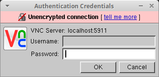
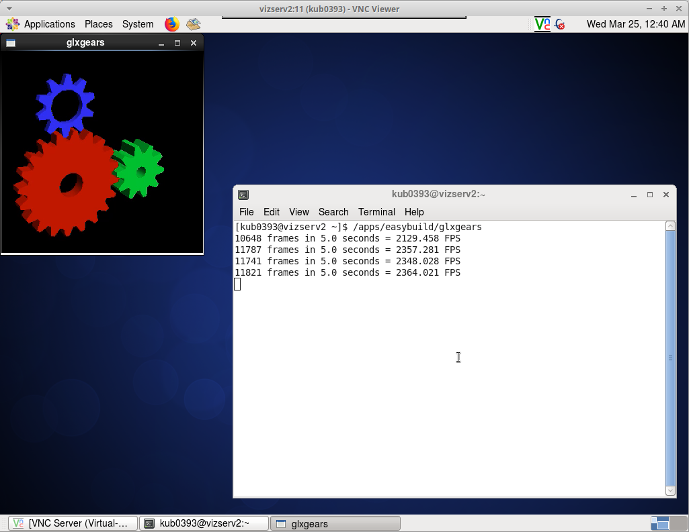
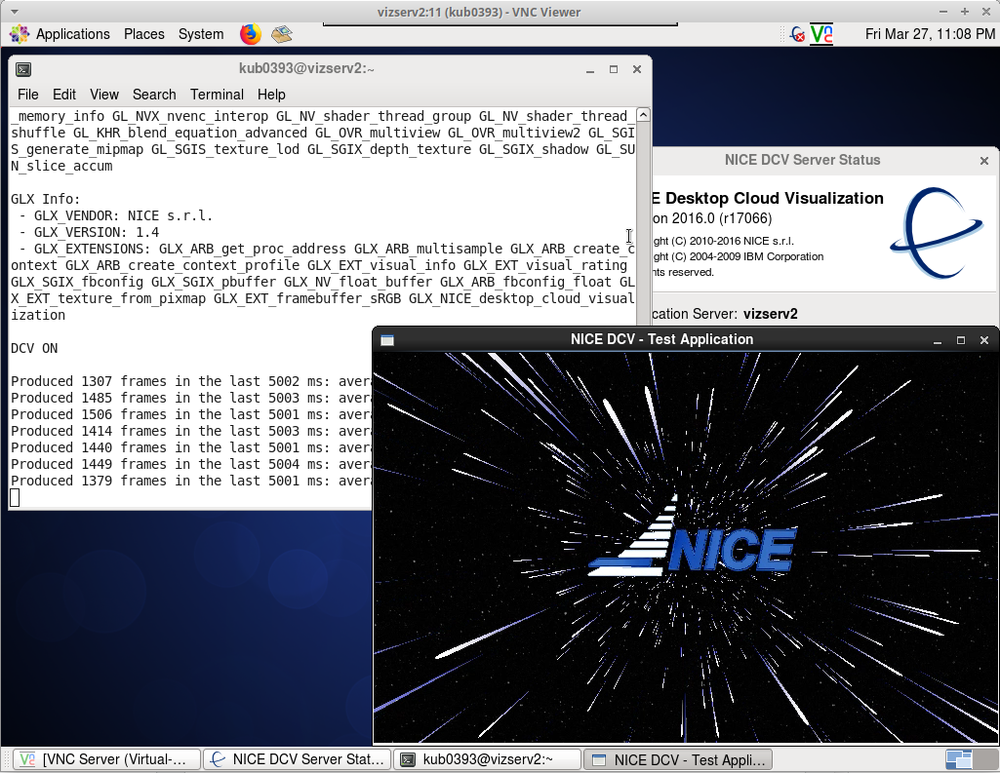
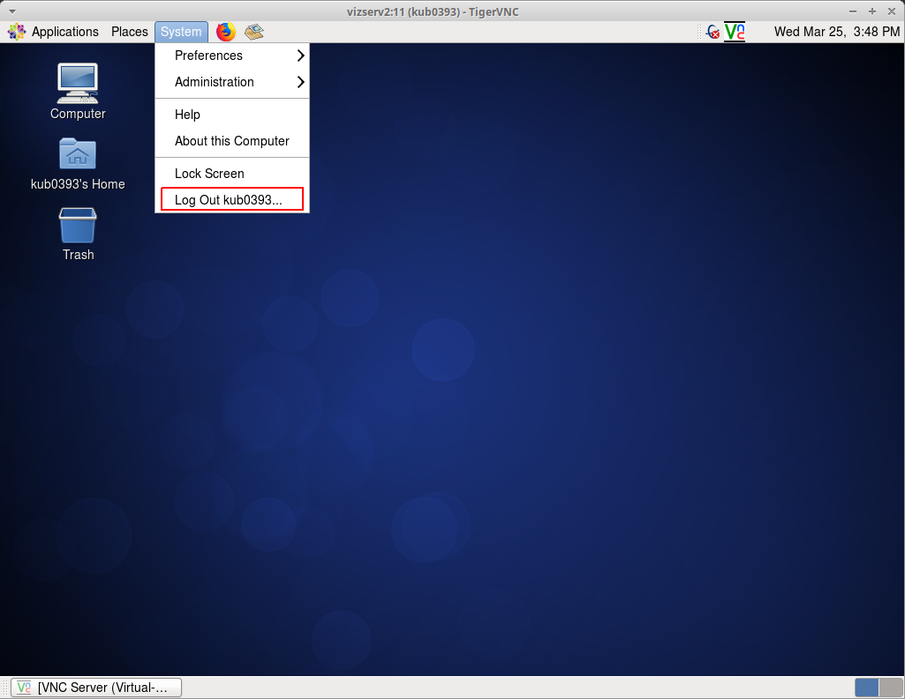

# NICE DCV

**Install NICE DCV** (user-computer)

* [Overview][a]
* [Download][b]

**Install VPN client** [VPN Access][1]

## How to Use

Read the documentation on [VNC server][3].

**Run VNC**

* Login to Barbora

```console
[username@yourPC]$ ssh -i path/to/your_id_rsa user@login1.Barbora.it4i.cz
```

* Run a Job on Barbora

```console
[user@login1]$ qsub -I -q qviz -A OPEN-XX-XX -l select=1:ncpus=4:host=vizserv1,walltime=04:00:00 -N Vizserver1
```

or

```console
[user@login1]$ qsub -I -q qviz -A OPEN-XX-XX -l select=1:ncpus=4:host=vizserv2,walltime=04:00:00 -N Vizserver2
```

You are connected to Vizserv1(2) now.

```console
[yourusername@vizserv2 ~]$
```

**VNC Server**

* Create a VNC Server Password

!!! note
    A VNC server password should be set before the first login to VNC server. Use a strong password.

```console
[yourusername@vizserv2 ~]$ vncpasswd
password:
verify:
```

* Check the display number of the connected users

```console
[yourusername@vizserv2 ~]$ ps aux | grep Xvnc | sed -rn 's/(\s) .*Xvnc.* (\:[0-9]+) .*/\1 \2/p'
username :15
username :61
.....
```

!!! note
    The VNC server runs on port 59xx, where xx is the display number. To get your port number, simply add 5900 + display number, in our example 5900 + 11 = 5911. **Calculate your own port number and use it instead of 5911 from examples below**.

* Start your remote VNC server

!!! note
    Choose the display number which is different from other users display number. Also remember that display number should be lower or equal 99.

```console
[yourusername@vizserv2 ~]$ vncserver :11 -geometry 1600x900 -depth 24
Running applications in /etc/vnc/xstartup
VNC Server signature: f0-3d-df-ee-6f-a4-b1-62
Log file is /home/yourusername/.vnc/vizserv2:11.log
New desktop is vizserv2:11 (195.113.250.204:11)
```

* Check the display number

```console
[yourusername@vizserv2 ~]$ ps aux | grep Xvnc | sed -rn 's/(\s) .*Xvnc.* (\:[0-9]+) .*/\1 \2/p'
username :15
username :61
yourusername :11
.....
```

!!! note
    You started a new VNC server. The server is listening on port 5911 (5900 + 11 = 5911).

Your VNC server is listening on port 59xx, in our example on port 5911.

**VNC Client (your local machine)**
You are going to connect your local machine to remote VNC server.

* Create the SSH tunnel (on your local machine) for port 59xx and for the range of ports 7300-7305.

```console
[username@yourPC]$ ssh -i path/to/your_id_rsa -TN -f user@vizserv2.barbora.it4i.cz -L 5911:localhost:5911 -L 7300:localhost:7300 -L 7301:localhost:7301 -L 7302:localhost:7302 -L 7303:localhost:7303 -L 7304:localhost:7304 -L 7305:localhost:7305
```

To create an SSH tunnel on Windows, download the [PuTTY installer][d] and follow the instructions in the [VNC server][3] section.

* Run NICE DCV or one of the recommended clients on your local machine. Recommended clients are [TightVNC][f] or [TigerVNC][g] (free, open source, available for almost any platform).

* Fill in the localhost:59xx address, click Connect, and enter the password.




**Test the OpenGL functionality on Vizserv**

* Run the command in the VNC terminal

```console
[kub0393@vizserv2 ~]$ /apps/easybuild/glxgears
```



**Test the NICE DCV functionality**

* Run the command in VNC terminal

```console
[kub0393@vizserv2 ~]$ dcvtest
```



## Stop the Service Correctly After Finishing Work

**On VNC server site**

* Logout from your local VNC window



**On your local machine**

* Find the Process ID (PID) of your SSH tunel

```console
[username@yourPC]$ netstat -natp | grep 5911
(Not all processes could be identified, non-owned process info
will not be shown, you would have to be root to see it all.)
tcp        0      0 127.0.0.1:5911          0.0.0.0:*               LISTEN      5675/ssh
tcp6       0      0 ::1:5911                :::*                    LISTEN      5675/ssh
```

or

```console
[username@yourPC]$ lsof -i :5911
COMMAND  PID USER    FD   TYPE DEVICE SIZE/OFF NODE NAME
ssh     5675  user    5u  IPv6 571419      0t0  TCP ip6-localhost:5911 (LISTEN)
ssh     5675  user    6u  IPv4 571420      0t0  TCP localhost:5911 (LISTEN)
```

!!! note
    PID in our example is 5675. You also need to use the correct port number for both commands above. In this example, the port number is 5911. Your PID and port number may differ.

* Kill the process

```console
[username@yourPC]$ kill 5675
```

* If on Windows, close Putty.

[1]: ../../general/accessing-the-clusters/vpn-access.md
[2]: ../../general/accessing-the-clusters/shell-access-and-data-transfer/putty.md
[3]: ../../general/accessing-the-clusters/graphical-user-interface/vnc.md

[a]: https://aws.amazon.com/hpc/dcv/
[b]: https://www.nice-dcv.com/2016-0.html
[c]: https://winscp.net/eng/download.php
[d]: https://www.chiark.greenend.org.uk/~sgtatham/putty/latest.html
[e]: https://vpn.it4i.cz/user
[f]: http://www.tightvnc.com
[g]: http://sourceforge.net/apps/mediawiki/tigervnc/index.php?title=Main_Page
