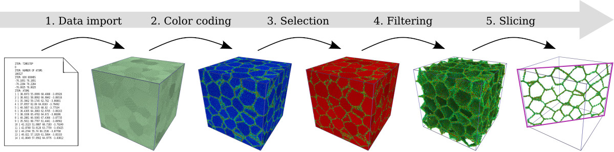

# Ovito

[OVITO][a] is a visualization and analysis software for output data generated in molecular dynamics, atomistic Monte-Carlo and other particle-based simulations.

## Introduction

A central aim of OVITO as a data visualization and analysis solution is to provide a maximum of flexibility – and, at the same time, ease-of-use – to support you in extracting meaningful information from simulation outputs.  To achieve this goal, OVITO is based on a powerful data pipeline technology depicted below. The software offers a wide range of basic visualization and analysis functions (building blocks), which you can assemble to a sequence of processing steps. These operations, which are all configurable, will then be applied to the simulation data in real-time by the software. The outcome of the data pipeline is finally displayed on screen, may be rendered to an output image for publication, or exported to output data files.



The dynamic pipeline concept makes it possible for you to change and adjust the sequence of applied operations at any time. In other words, OVITO enables you to work in a non-destructive manner with a dataset as all manipulation steps can easily be revoked. You can adjust the order of filter and manipulation operations, their parameters, and also the input data itself –the program will re-evaluate the pipeline and update the display in real-time. Thanks to intelligent data caching and parallelization techniques implemented in OVITO, this all happens without interrupting your workflow.

For more information, see the [User Manual][b]

### Installed Version

For the list of installed versions, use:

```console
$ ml av ovito
```

## Getting Started

The visualization software requires [graphical user interface][1] or [virtual network computing][2] software.

[1]: ../../general/accessing-the-clusters/graphical-user-interface/x-window-system.md
[2]: ../../general/accessing-the-clusters/graphical-user-interface/vnc.md

[a]: https://www.ovito.org/
[b]: https://www.ovito.org/docs/current/
