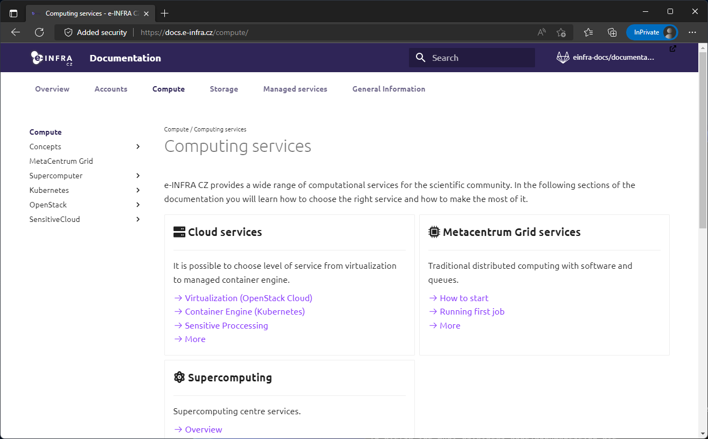
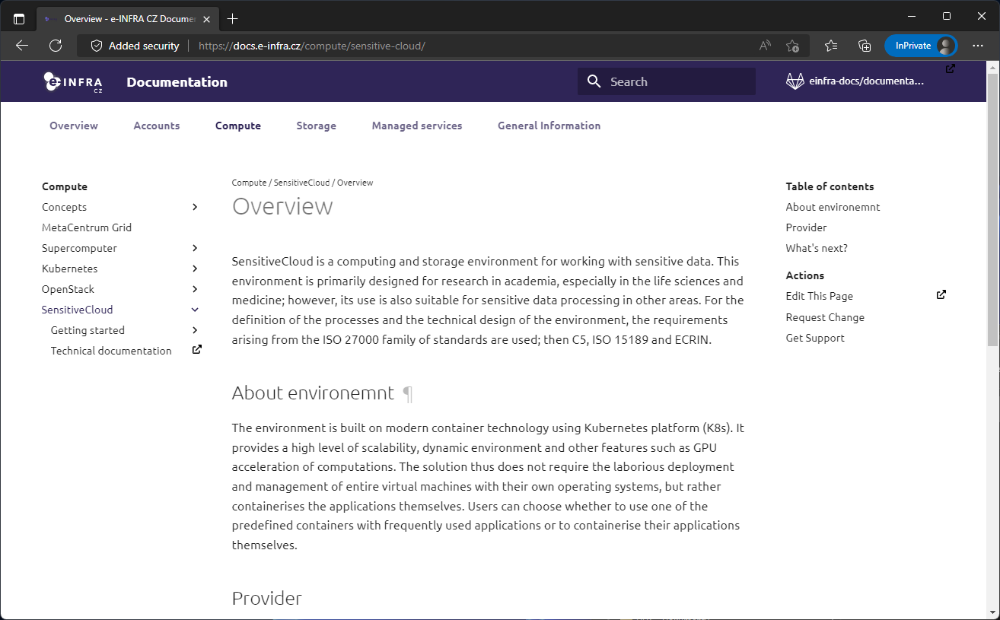
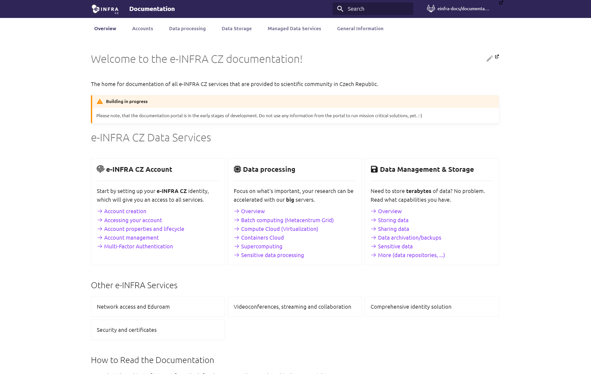

# Documentation style

This section focuses on the best practise of usage of various components (code blocks, notes, diagrams, ...) used within the documentation.

!!! note
    The section is work in progress, please, be patient.

### Metadata

Every page might have the metadata modyfing how page is rendered or what information the page has.
For example, it is possible to simulate page layouts or store authors.  

## Page Layouts

The e&#8209;INFRA&#160;CZ recognizes three types of page layout:

=== "SignPost"

    { loading=lazy width="49.9%" align=left }
    SignPost's role is to introduce the depth of each topic. It should easily categorize main structure of the topic.
    __SignPost's primary feature__ is that it has removed **Table of concents** on the right side.


    __Usage:__
    Copy this on beggining of each page to hide ToC
    ``` markdown 
    ---
    hide:
      - toc
    ---
    ```

=== "Standard"

    { loading=lazy width="49.9%" align=left }   
    Standard page is default template and it's used for standard documentation pages.

=== "Overview"

    { loading=lazy width="49.9%" align=left }   
    Used only for 'special' ocassions such as home page. It has both navigation menu and table of content hidden, providing wide space for content.

    __Usage:__
    Copy this on beggining of the page to create overview layout
    ``` markdown 
    ---
    hide:
      - toc
      - nav
    ---
    ```

## Authors

If you want to be featured as maintainer of the page use this in metadata:
``` markdown
---
authors
  - <github_username>
  - ...
---
```

## Hiding breadcrumbs

It is possible to hide __breadcrumbs__ by adding to metadata:
``` markdown
---
hide:
  - breadcrumbs
---
```