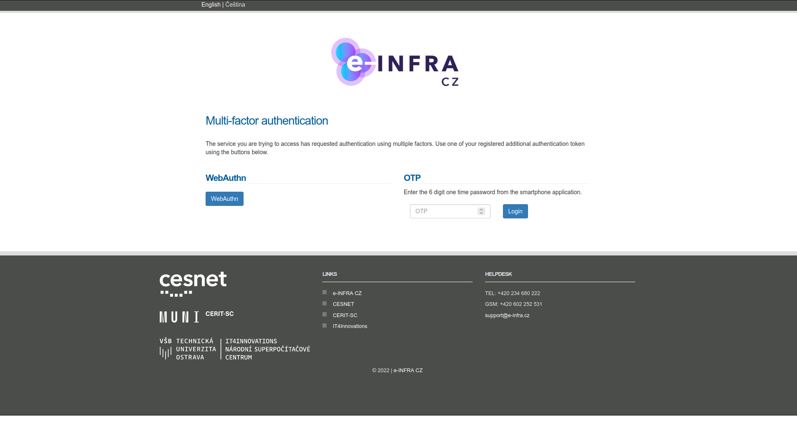

# Perform MFA

## When is MFA required?

MFA is required at login if **the service you are accessing requires it**.
This is usually true for the services which works with sensitive data or
when you want to manage your MFA settings.

You can also **enable MFA for all services**, which effectively
means verifying it every time you log in with your e-INFRA CZ Account. This 
setting can be enabled in your [e-INFRA CZ User Profile](https://profile.e-infra.cz/profile/settings/auth).

## Performing MFA verification at login

The first steps of login process are the same. You select your home
organization and log in with your home organization account, or you choose
*e-INFRA CZ password* (if you have one) and log in using your
username and password.

Then there is an additional step, in which you verify one of your
[registered MFA tokens](./setup.md#add-first-token). The prompt looks like on the following
screenshot.

Both options *TOTP* and *WebAuthn* are displayed, and you must pick the one
based on the type of MFA token you registered and have available at the
moment. You can have both types of tokens registered, in such a case you can
choose any of the options.

You will be displayed an error message if you cannot fulfil MFA
requirement - e.g. you don't have any registered tokens or verification fails.

### MFA from your home organization login

If you perform MFA during the login process within the context of your home
organization account and information about it is released to us by the identity
provider component, then you are not required to perform MFA again in the
context of your e-INFRA CZ Account. **This is currently supported only by the
Masaryk University**.

You are **still required to register at least one MFA token
within your e-INFRA CZ Account**. This is necessary to make sure, that you
won't lose access to your e-INFRA CZ Account in case your affiliation to 
home organization is changed.

Please note, that MFA tokens registered within your home organization
account are not managed by us, and we can't offer you any support in case of
you losing the access to your home organization account.

It is also *not advised to register the same MFA tokens* in your home
organization account and e-INFRA CZ Account *unless they are really your
personal tokens*. For example if the token is a physical USB token provided
by your employer, then you might lose access to your e-INFRA CZ
Account when your employment ends, and you return the USB token to the employer.
