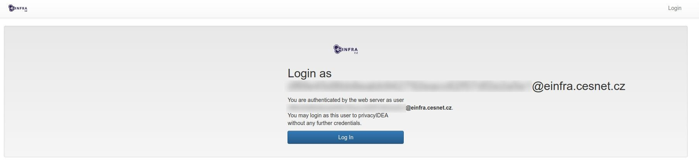
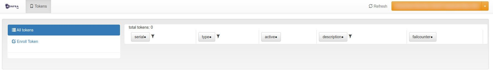
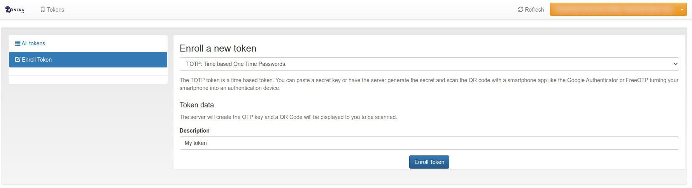
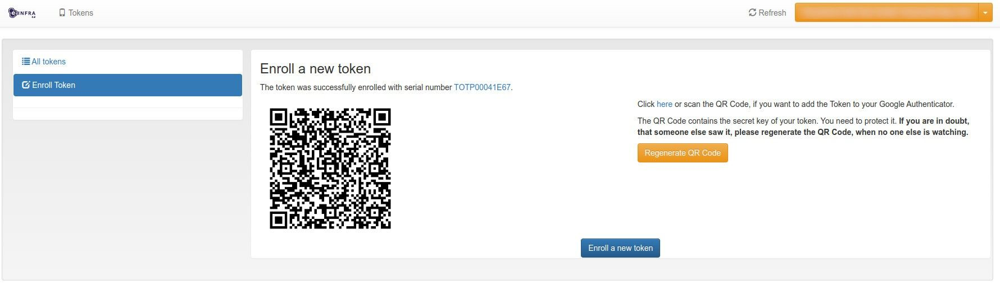
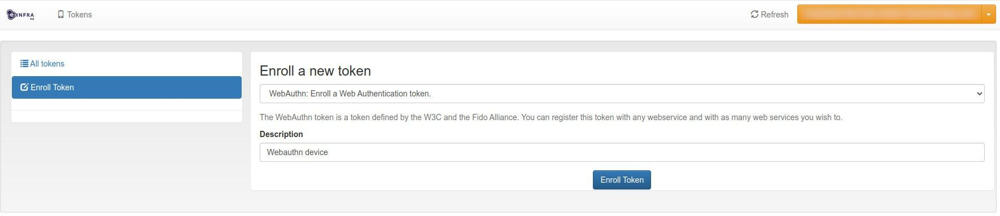
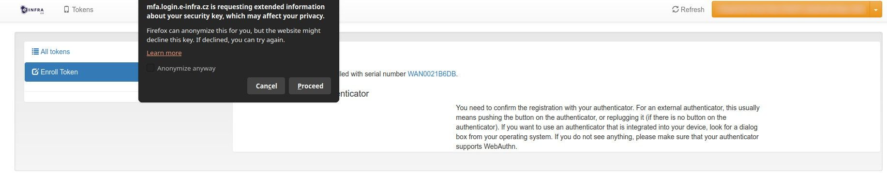
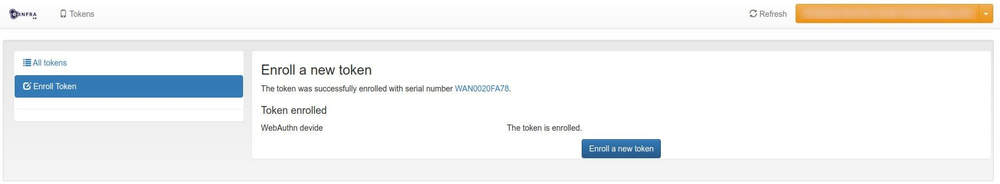
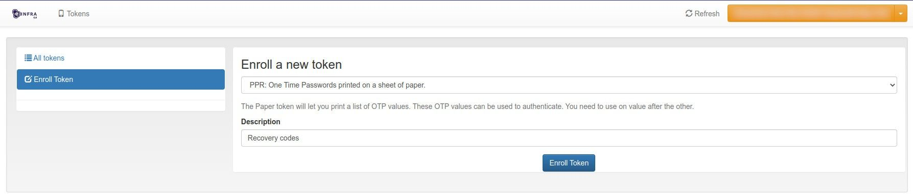
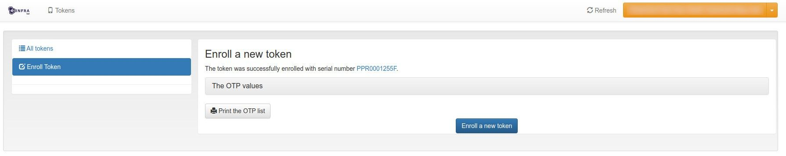
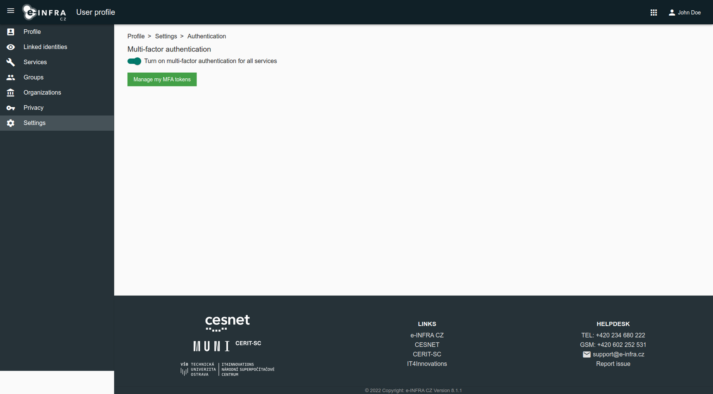

# Set up MFA

Before you start using Multi-Factor Authentication, you **need to register 
at least one authentication token**. **The first one has to be a TOTP app**, 
then you can register any arbitrary number of TOTP apps or WebAuthn 
authenticators. You can read more about the both methods in [MFA overview](/account/mfa/#available-methods-of-mfa-verification).

!!! warning
    Once you add your first token you will need to perform MFA at login
    whenever you want to add/remove another tokens or otherwise change MFA
    related settings.

## Add first token

1. Go to the token management page
   * Either directly visit [https://mfa.login.e-infra.cz](https://mfa.login.e-infra.cz) or
   * visit [e-INFRA CZ User Profile](https://profile.e-infra.cz/), select 
     *Settings > Authentication* and click on *Manage my MFA tokens*
2. Sign in with your e-INFRA CZ Account
3. Enter the token management application (privacyIDEA) by clicking on *Log in*
    
4. Click on *Enroll Token* in the left menu 
    
5. If not selected, **select TOTP** and enter the description of your first
   token and confirm it by clicking *Enroll Token* 
    
6. You will see a QR code with a shared secret. Scan the QR code with your 
   TOTP app.  If you are enrolling from the mobile phone that has 
   installed a TOTP app, click on *Here* in the text next to the QR code. 
   Shared secret will be transferred via link.  You do not have to 
   back up the QR code or the link - you can register more TOTP apps later, 
   using a different QR code.   

!!! warning ""
    **Next time you sign in at [https://mfa.login.e-infra.cz](https://mfa.login.e-infra.cz) 
    you will have to perform Multi-Factor Authentication with your first 
    token.**

## Add more tokens

1. Click on *Enroll Token* in the left menu. If you opened the page 
   on a WebAuthn capable device, choose token type WebAuthn, enter a 
   description (e.g. "Work laptop") and continue by clicking *Enroll token*.
    
    
2. A dialog window from the web browser or from the operating system pops up,
   asking for confirmation.  Push the button on your physical 
   authenticator, confirm by fingerprint when on smartphone or perform 
   another required action depending on the device. In the picture you can 
   see the variant for Ubuntu 22.04 (USB authenticator). 
    
3. If the registration was successful, a confirmation about added token 
   appears. 
    
4. You may add arbitrary number of TOTP apps and WebAuthn devices. **We 
   highly recommend adding at least two devices and at least one of them 
   with TOTP app.**

## Recovery codes

To prevent losing access to your e-INFRA CZ Account in case you lose all 
registered devices, it is possible to **generate one-time recovery codes**, 
which you can securely store or print out.

1. Click on *Enroll Token*
    
2. As a type choose `PPR: One Time Passwords printed on sheet of paper`, enter 
   description and click on *Enroll Token*
    
3. See recovery codes by clicking on *The OTP Values* box. You can also print 
   them out or download as PDF by clicking on *Print the OTP list*.
    

## Enable/Disable MFA for all services

Multi-Factor Authentication is performed if it is **required by the service you 
are accessing** or if it is **set to be required for all services** in your 
account settings.

To enabled (force) MFA for all services go to your [e-INFRA CZ User Profile](https://profile.e-infra.cz/profile/settings/auth)
and toggle *Turn on multi-factor authentication for all services* switch at 
*Settings > Authentication* page. You can disable it again using the same switch.

