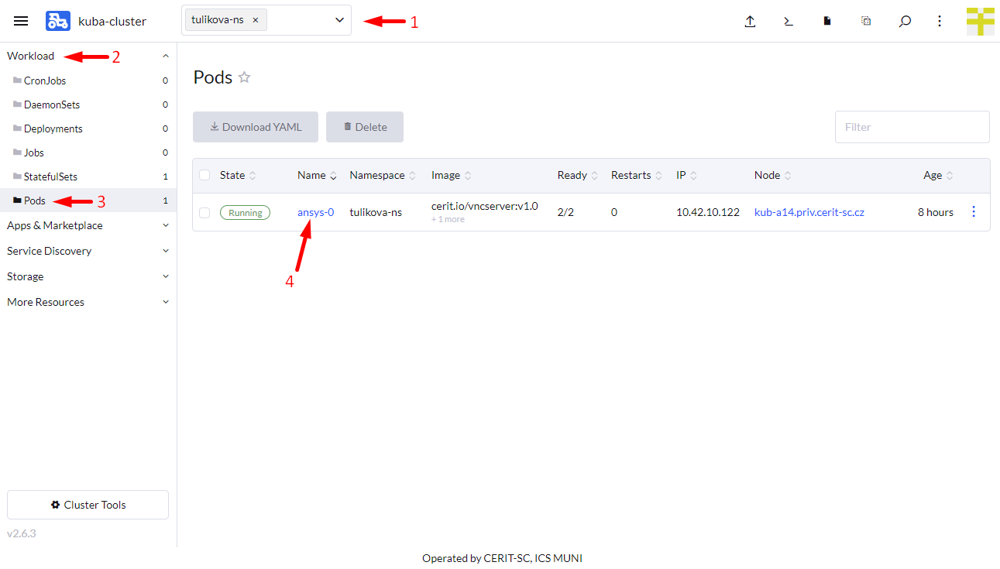
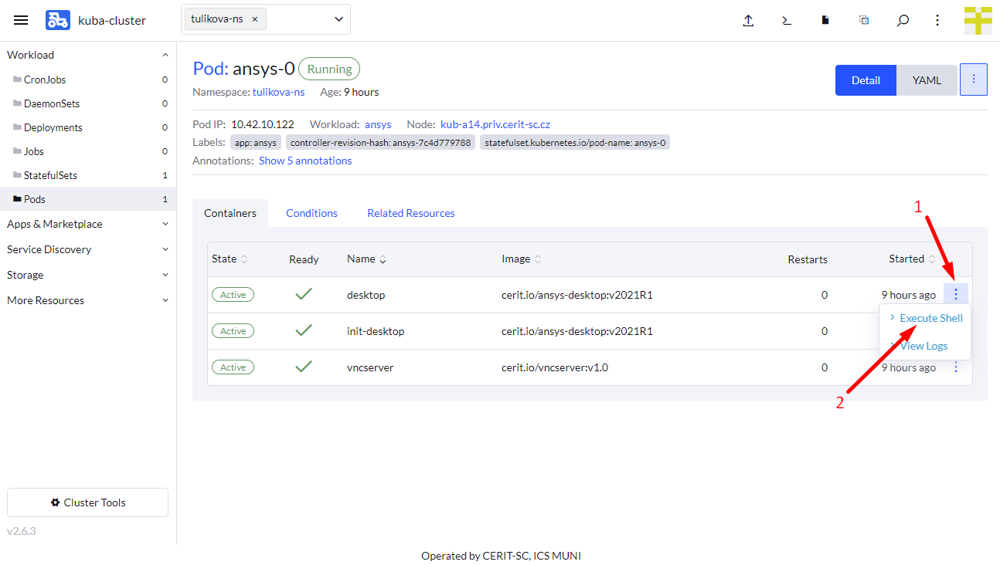
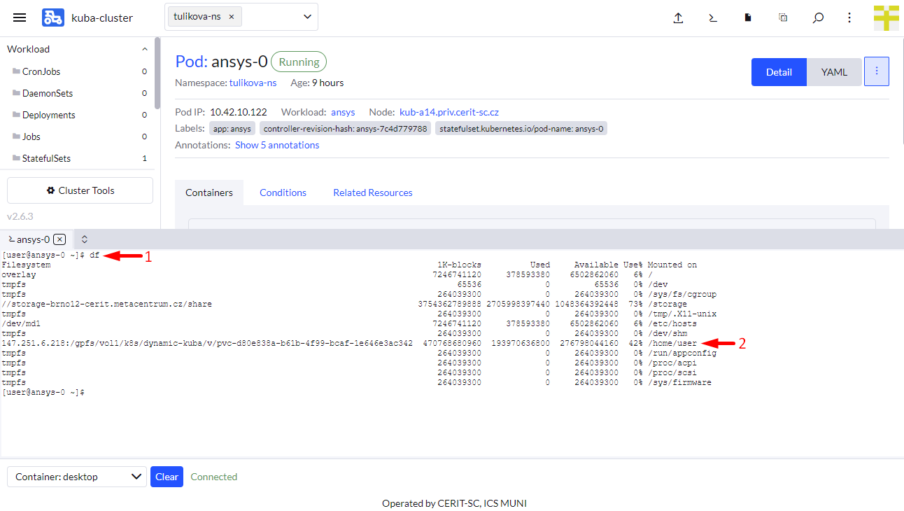
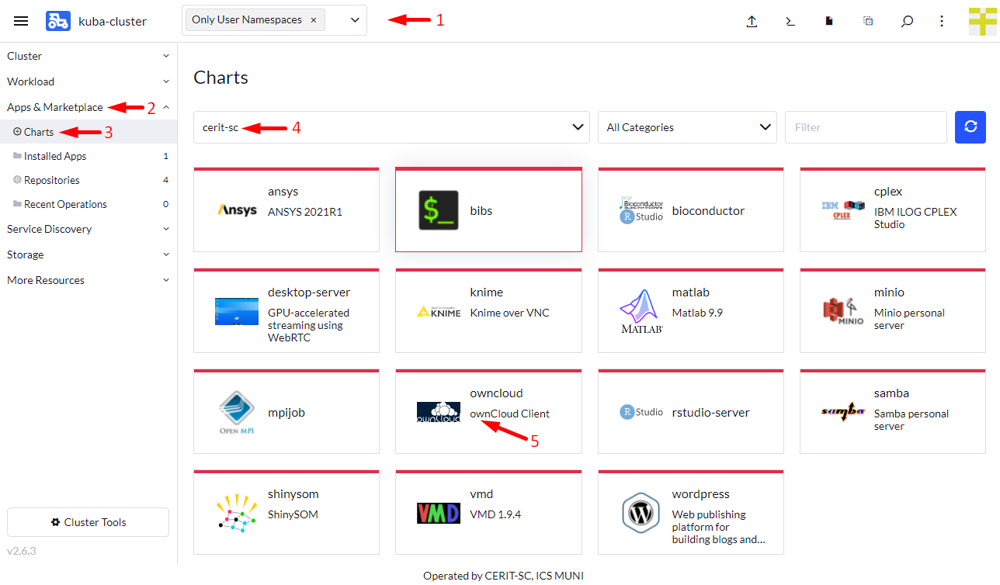
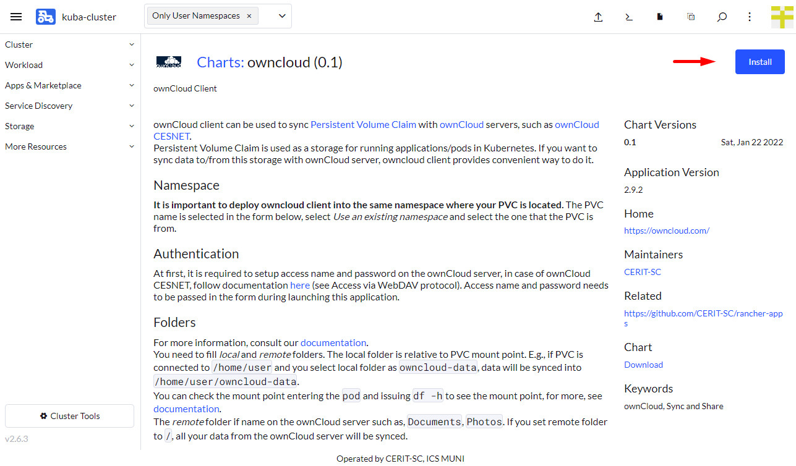
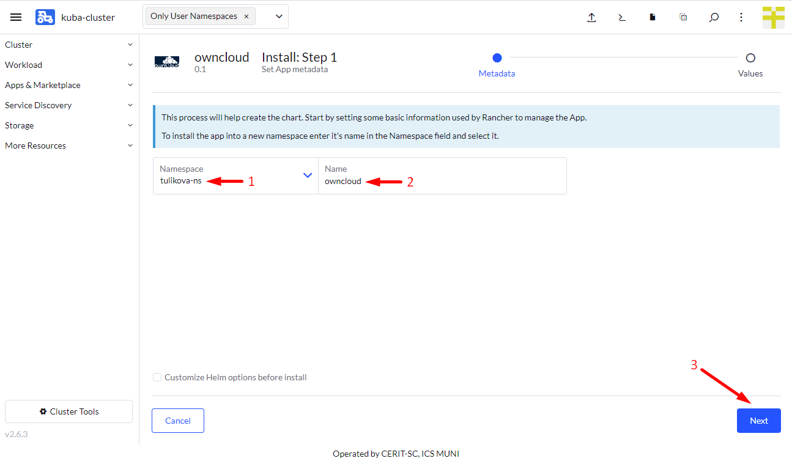
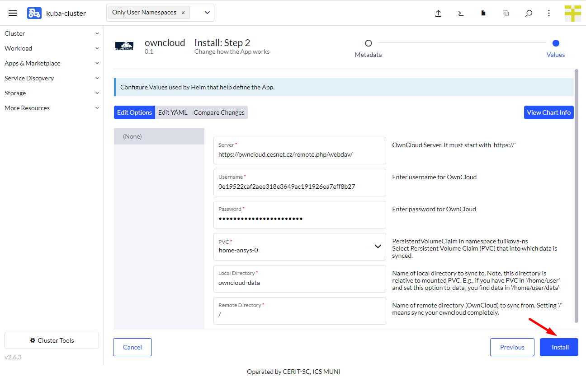
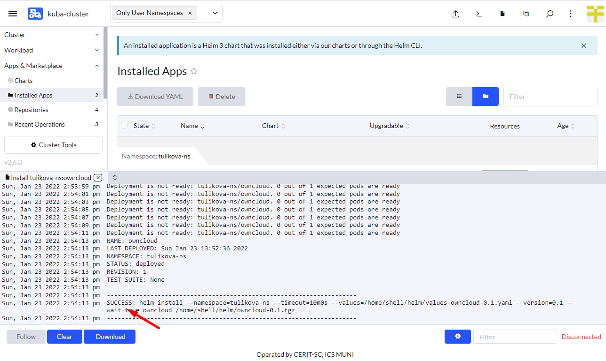
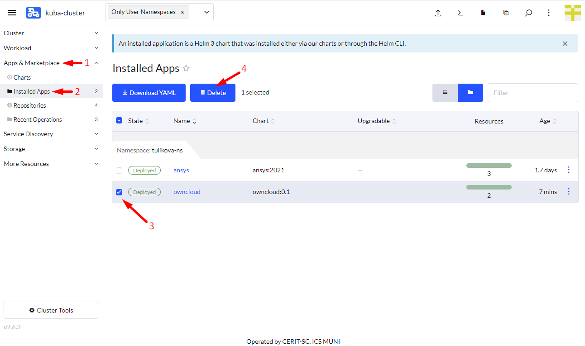

## Running ownCloud Client

If not already logged, log to [rancher.cloud.e-infra.cz](https://rancher.cloud.e-infra.cz), see [Rancher](/containers-compute/rancher) section.

Following the steps below, you can run ownCloud client application. This application is meant to share and sync data between a pod (another running application) and ownCloud server, e.g., [owncloud.cesnet.cz](https://owncloud.cesnet.cz).

### Notes

* Important prerequisite: application pod needs to use [PVC](pvc.html) in order to ownCloud client can sync data into the pod. If no PVC is used, no sync is possible.
  * For most applications here it is possible to select *persistent home* which implies using *PVC*.

### Check Your Application

Select your `Namespace` (1),  navigate through `Workload` (2), `Pods` (3), and name of the application (4), e.g., `ansys-0` -- click on the name. See screenshot below.

Click on vertical dots (1) and select Execute Shell (2). 

Issue `df` command in the new *terminal area* (1) and check you see some remote file system connected to home (2) or somewhere else.

### Select Application to Run

Ensure, you did not select any namespace and see `Only User Namespaces` (1) at the top of the Rancher page.

Navigate through `App & Marketplace` (2), `Charts` (3), limit charts only to `cerit-sc` (4) and select `ownCloud` (5). See screenshot below.

### Select Version of Application

When you click on the chart, hit `Install` to continue.

### Install Application

Now you can install the ownCloud application. In most cases, keep both `Namespace` (1) and `Name` (2) intact, however, you can select namespace as desired except `default`. The `default` namespace is available but it is not meant to be used. The `Name` will be in URL to access the application. The `Name` must be unique in the `Namespace`, i.e., you cannot run two or more instances with the same `Name` in the same `Namespace`. If you delete the application and later install the application again preserving its `Name`, content of home directory will be preserved. 

In the first part of the form, you select ownCloud server, for [owncloud.cesnet.cz](https://owncloud.cesnet.cz) keep default value. Fill in `username` and `password`. You can find [here](https://du.cesnet.cz/en/navody/start#access_via_webdav_protocol) (see Access via WebDAV protocol) how to obtain those for `owncloud.cesnet.cz`. Select `PVC` that you want to sync to and from. In most cases, `PVC` containing name `home` is connected to `/home/user` while `PVC` containing name `storage` is connected to `/storage`.

Fill in `Local Directory`. This is relative directory to connected `PVC`. E.g., if you set the `Local Directory` to `owncloud-data` and select "home" `PVC`, your data is synced into `/home/user/owncloud-data`. 

Fill in `Remote Directory`, `/` means that all remote files and directories will be synced, or you can type particular directory or path from the ownCloud server such as `documents`.

### Wait for Application to Start

When you hit `Install`, you will see installation log. Once you see `SUCCESS` (see screenshot below), the application is running. 

Once this application is running, you will not see anything special except data is synced.

## Delete Running Instance

If you feel you do not need the application anymore, you can delete it. Just navigate to `App & Marketplace` (1), `Installed Apps` (2), select the application (3) and hit `Delete` (4). The data in home directory is not deleted in case you check persistent home. Running the application again with the same `Name` restores access to the home directory folder.

